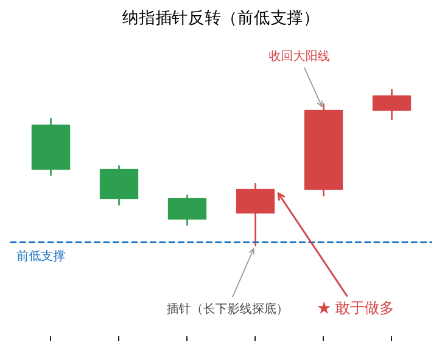

# 纳指插针反转：前低支撑处应敢于做多

## 行情复盘（2026-08-30）

- **品种**：纳指（NQ）
- **走势**：往下插了一根针（长下影线快速探底），随后马上收回一根大阳线。
- **位置**：插针正好落在前一个低点附近。

## 为什么理应做多

1. **插针 → 空头力竭**：长下影线说明价格探底后遭遇强买盘、被迅速推回，空头力量衰竭。
2. **快速收回大阳线 → 多头反击**：插针后马上收回大阳线，是多方承接有力、主动反击的信号。
3. **前低附近 → 二次探底支撑确认**：插针落在前一个低点附近，等于回踩前低不破，支撑有效性进一步增强。

## 结论

插针（长下影线）+ 前低支撑 + 快速收回大阳线，是典型的看涨反转信号，理应敢于做多。

> 「插针」即 **Pinbar**，系统的形态定义、判定标准与左右眼结构详见 [Pinbar（插针线）笔记](../../策略研究/2026-10-01-Pinbar-插针线-裸K线交易法第四章.md)。
