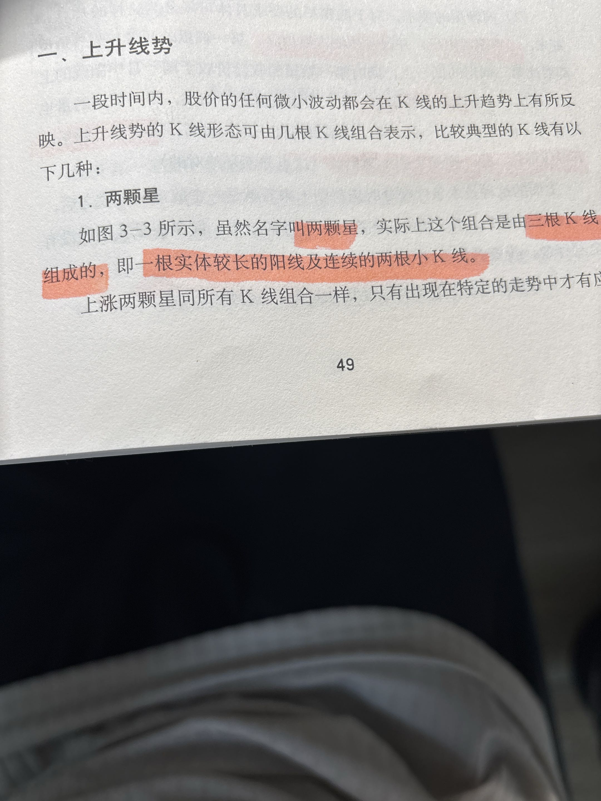
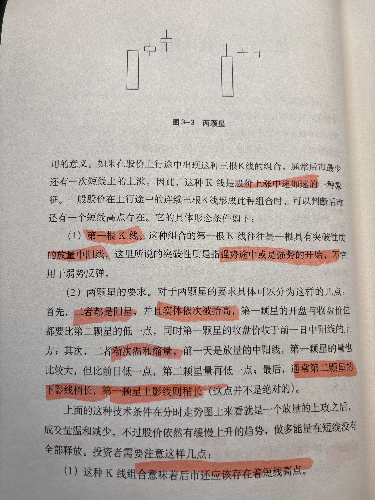
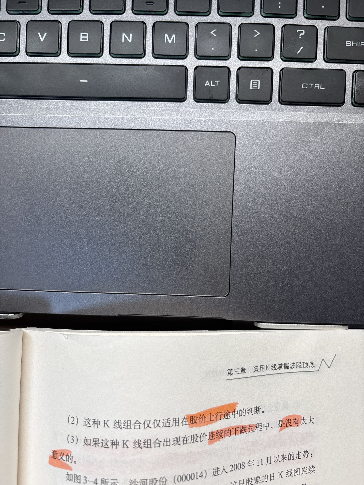
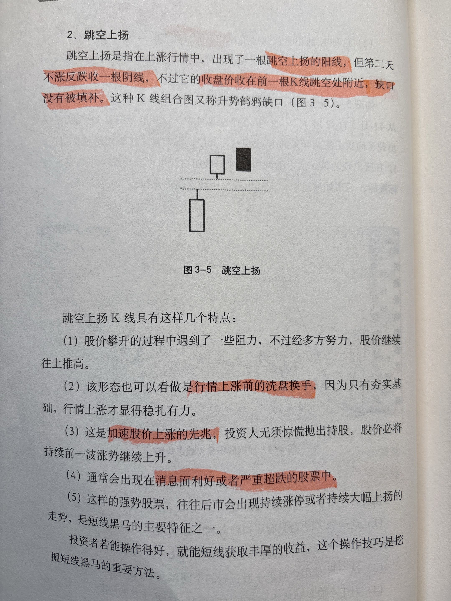
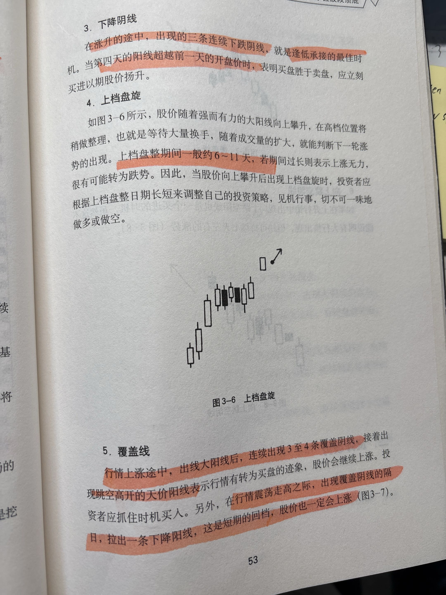
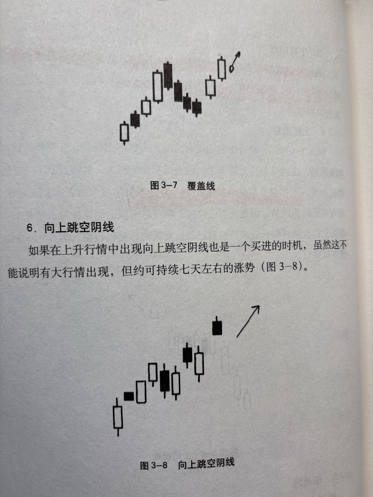

# 上升趋势中的 K 线组合形态

> 来源：《波段猎金》。本文由书页照片整理，具体量化条件请对照原书核对。

上升趋势的 K 线形态可由几根 K 线组合表示，比较典型的有以下几种。这些 K 线组合只有在特定的走势中才有意义。

## 1. 上涨两颗星

- **组成**：一根实体中阳线 + 连续两根十字星（小星线）。
- **条件**：上行途中连续三根 K 线形成此种组合（两颗星的具体位置与量能要求待核对原书）。
- **含义**：放量上攻之后量温和减少，但股价依然有缓慢上升的趋势，可判断后市还有一个短线高点存在。
- **适用**：弱势反弹。

## 2. 跳空上扬

- **形态**：上涨行情中出现一根跳空上扬的阳线，第二天股价回落到这根 K 线跳空处附近获得支撑。
- **缺口类型**：OCR 识别不清（原书有命名），待核对原书。
- **特点**：股价稳步上升过程中遇到一些阻力，经多方努力后股价继续上行。

## 3. 上档盘旋

- **形态**：股价随强而有力的大阳线向上攀升后，在高档位置稍作整理。
- **判断**：盘整时间短 → 可判断下一轮涨势出现；盘整时间过长 → 上涨无力，很可能下跌。
- **策略**：根据上档盘整日期长短调整投资策略，见机行事，切不可一味做多或做空。

## 4. 覆盖线（待补充）

- OCR 识别到「图3-7 覆盖线」，但该形态正文未拍全，待补充（配图见下方「向上跳空阴线」页顶部）。

## 5. 向上跳空阴线

- **形态**：上升行情中出现向上跳空的阴线。
- **含义**：也是一个买进时机；虽不能说明有大行情出现，但约可持续七天左右的涨势。
