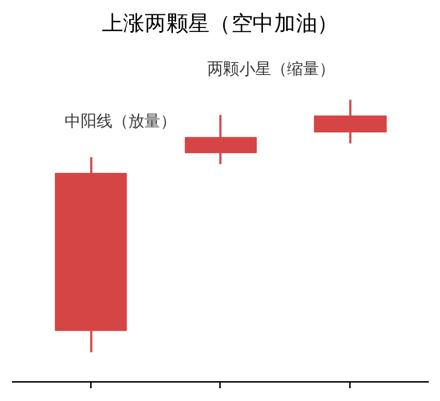
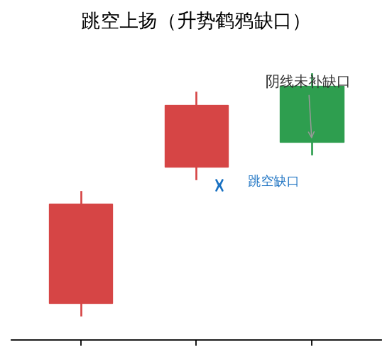
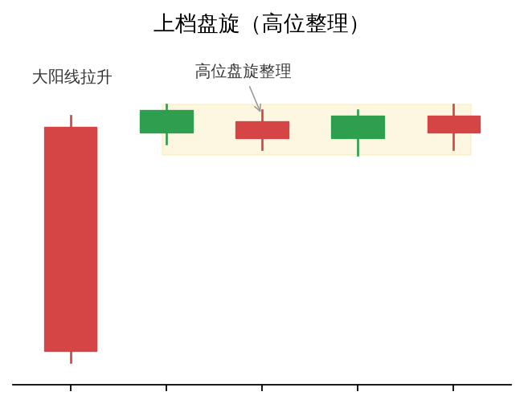
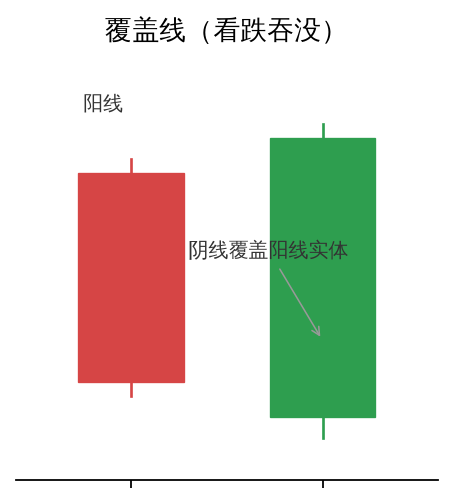
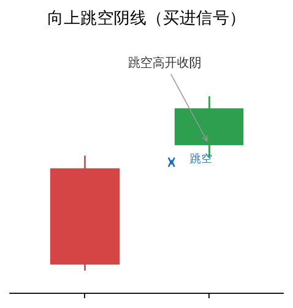

# 上升趋势中的 K 线组合形态

> 来源：《波段猎金》。上升趋势的 K 线形态可由几根 K 线组合表示，这些组合只有在特定的走势中才有意义。以下形态多出现在上涨行情中，含义各有不同——有看涨持续，也有看跌警示。

## 1. 上涨两颗星（空中加油形态）

- **组成**：一根中长阳线 + 两根并排的小实体 K 线（十字星、小阴线或小阳线）。
- **位置**：上涨初期或中期。
- **量价要求**：首日阳线明显放量（较前日放大 30% 以上）；两颗星阶段成交量逐渐萎缩（缩至首日量的 50% 以下）。
- **含义**：多方力量主导后进入短暂蓄势，属于「空中加油」，后市看涨、可能加速上涨。
- **操作**：突破两颗星高点时可加仓；跌破首根阳线最低点则止损。
- **注意**：首日需是突破性质的中阳线，**不适用于弱势反弹**；若大阳线不放量、小线形反而放量，研判可靠性下降。三根小 K 线则称「上涨三颗星」，含义相同。

## 2. 跳空上扬（升势鹤鸦缺口）

- **别名**：升势鹤鸦缺口（「鹤」喻阳线，「鸦」喻阴线）。
- **组成**：上涨趋势中出现一根跳空上扬的阳线（留下向上缺口），第二天不涨反跌拉出阴线，但收盘收在前一天跳空处附近，**缺口没有被填补**。
- **含义**：攀升中遇到阻力，但多方克服挫折继续推高；可视为上涨前的洗盘换手。
- **位置**：涨势初期、中期。
- **后续**：①盘整后再度上扬；②短暂调整后发力上攻，均预示继续攀升。
- **操作**：放量突破形态最高价是跟进买入信号；跌破缺口则走势转弱、考虑离场；止损可设形态最低点。
- **注意**：缺口出现后盘整时间越长、基础越牢固，后期上涨力度越大；阴线缩量越小越好（筹码未大量卖出）。

## 3. 上档盘旋（高位整理）

- **形态**：股价随强而有力的大阳线向上攀升后，在高档位置稍作整理。
- **判断**：盘整时间短 → 可判断下一轮涨势出现；盘整时间过长 → 上涨无力，很可能下跌。
- **策略**：根据上档盘整日期长短调整投资策略，见机行事，切不可一味做多或做空。

## 4. 覆盖线（看跌吞没）

- **组成**：两根 K 线。上升趋势中，第一根阳线后，第二根阴线实体完全覆盖（吞没）前一根阳线实体——阴线开盘高于阳线收盘、收盘低于阳线开盘。
- **含义**：潜在趋势反转信号。上升趋势中出现，预示多头减弱、空头增强，是**卖出信号**。
- **信号强弱**：实体越长、影线越短，信号越强；成交量明显放大时信号更可靠。
- **注意**：长期上涨后的高位出现可靠性高，上涨途中出现可能只是短期回调；需结合成交量、均线、MACD 等验证。

## 5. 向上跳空阴线（买进信号）

- **形态**：上升行情中出现向上跳空但收阴的 K 线（跳空高开、收盘走低，但仍高于前一日收盘）。
- **含义**：是一个买进时机；虽不能说明有大行情出现，但约可持续七天左右的涨势。
