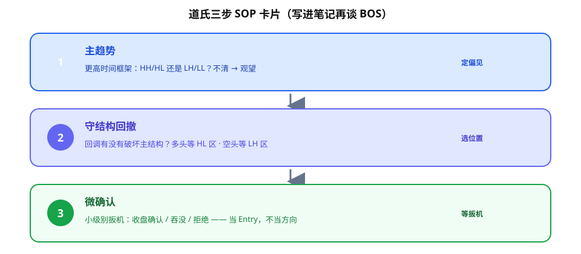
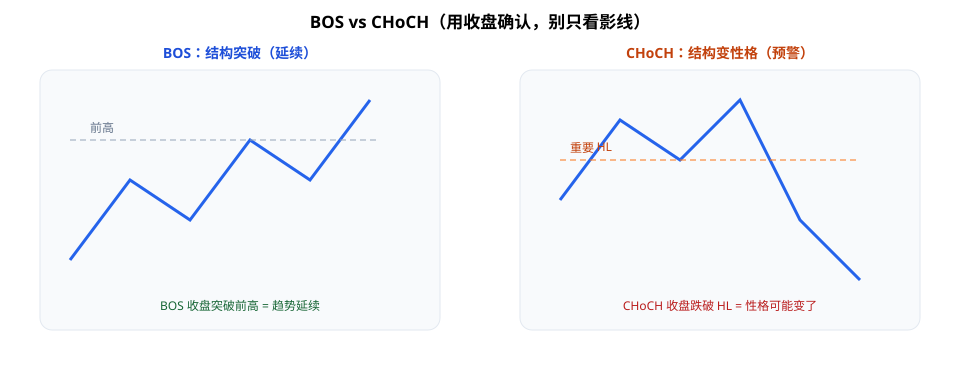
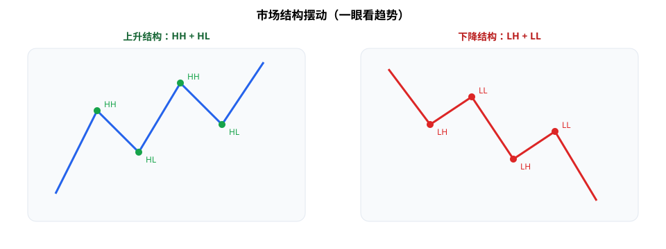
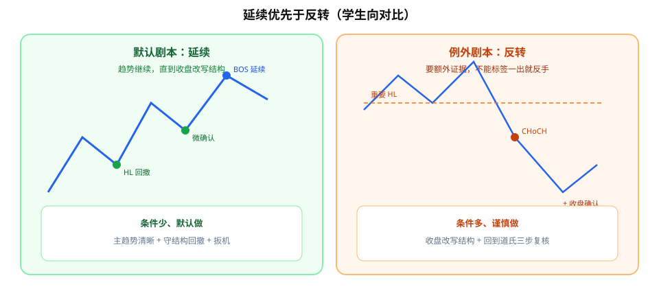

SMC 圈子里 **BOS（Break of Structure）**、**CHoCH（Change of Character）** 很火，但往前翻一层，骨架往往还是道氏那套：**主趋势 → 顺应结构的回调 → 微观确认**。

用学生视角说：先别急着背英文缩写。问自己三句就够——**大级别往哪走？回调有没有破坏结构？小级别有没有给扳机？** 先把这三步写进 SOP，再谈破位标签，不容易被术语带着跑。



**读图**

- 三张卡片从上到下：① 主趋势定偏见 → ② 守结构回撤选位置 → ③ 微确认等扳机。
- 右边短标签（定偏见 / 选位置 / 等扳机）是给学生贴墙用的口诀。
- BOS/CHoCH 先别出场；没有这三步，标签只是装饰。



**读图**

- 左：顺着原趋势收盘突破前高 → **BOS**，常当延续强化。
- 右：收盘跌破重要 HL → **CHoCH**，性格可能变了，但仍要回到三步复核，不是立刻满仓反手。
- 两边都强调：**用收盘确认，别只看影线**。



**读图**

- 左：一串更高高点 + 更高低点（HH/HL）→ 偏见偏多。
- 右：一串更低高点 + 更低低点（LH/LL）→ 偏见偏空。
- 一眼能画出摆动点，才谈得上「结构被破坏没有」。

---

## 1. 道氏三步，写成可执行顺序

| 步骤 | 问什么 | 实操 |
|------|--------|------|
| ① 主趋势 | 大级别在涨还是在跌？ | 看更高时间框架的 HH/HL 或 LH/LL |
| ② 结构内回调 | 回调有没有破坏主结构？ | 多头等 HL 区；空头等 LH 区 |
| ③ 微观确认 | 小级别是否给出延续信号？ | 收盘确认、吞没、拒绝等——当扳机，不当方向 |

原则：**延续优先于反转**。反转要额外证据；默认假设是「趋势继续，直到结构被收盘改写」。

第一次学可以这样记：延续像「顺着河走」，反转像「翻船换岸」——后者要更多证据，不能因为出现一个新标签就默认翻仓。



**读图**

- 左（绿）：默认剧本——回撤到 HL、微确认、BOS 延续；条件少、默认做。
- 右（橙）：例外剧本——收盘改写重要 HL（CHoCH）后，才严肃评估反转；条件多、谨慎做。
- 口诀贴在图下：**延续优先；反转要加条件。**

---

## 2. HH/HL、LH/LL：偏见从哪来

- **上升**：Higher High + Higher Low（HH/HL）→ 偏见偏多。
- **下降**：Lower High + Lower Low（LH/LL）→ 偏见偏空。
- **破坏**：例如上升中收盘跌破前一个 HL，才开始严肃评估「偏见可能切换」。

**收盘确认**：影线刺破不算改写结构；以收盘是否站上/跌破摆动点为准（与 OTZ/收盘笔记同一纪律）。

---

## 3. BOS / CHoCH 放哪一层

可以这样降维：

- **BOS**：顺着原趋势方向的结构突破 → 常当**延续**强化。
- **CHoCH**：出现「性格变化」的反向破位 → 提示偏见可能切换，但仍建议回到「道氏三步」复核，而不是标签一出就满仓反手。

很多 SMC 术语，是在给道氏/古典结构**换皮包装**。学标签可以，但 SOP 里先写清三步，比堆名词重要。

---

## 4. 写进 SOP 的最小模板

```text
1. HTF 主趋势：HHHL 或 LHLL？（不清 → 观望）
2. 回调是否仍尊重结构？（破坏 → 降级/翻偏见评估）
3. 收盘是否确认破位/守位？
4. 小级别 Entry 触发？（无触发 → 不进）
5. 默认：做延续；反转需额外条件
```

把 BOS/CHoCH 当成第 2–3 步的**注释标签**即可，不要当成独立宗教。

---

## 价值判断：留下什么、丢掉什么

| 做法 | 建议 |
|------|------|
| 道氏三步作偏见层（主趋势→结构回调→微观确认） | **采用** |
| HH/HL、LH/LL + 收盘确认 | **采用** |
| 延续优先于反转 | **采用** |
| BOS/CHoCH 作结构注释 | **观望/可选**，需与三步对齐 |
| 整包 SMC 黑话当唯一系统、忽视古典结构 | **弃用**或大幅瘦身 |

自检一句：没有 BOS/CHoCH 这两个词，我还能用三步画出偏见吗？能，术语才是可选的。

---

## 小结

1. 先写 **道氏三步**，再贴 BOS/CHoCH 标签。
2. 结构用 **HHHL / LHLL**；改写看**收盘**。
3. **延续 > 反转**；反转要加条件。
4. SMC 大量内容是古典结构的再品牌化——留骨架，砍营销层。

---

## 参考来源

1. Raghee 相关趋势/结构教学内容（学习笔记：主趋势、结构回调、微观确认；与 BOS/CHoCH 对照）。
2. 配图：`dow-three-steps.svg`、`bos-choch.svg`、`swing-structure.svg`、`continuation-vs-reversal.svg`，教学示意，不对应单一品种实盘。

*本文为学习笔记，不构成任何投资建议。*
