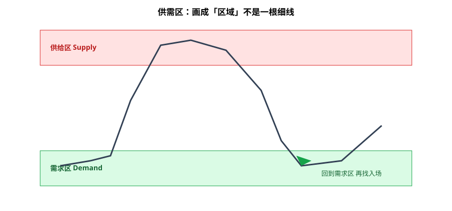

SMC（Smart Money Concepts）内容爆炸：OB、FVG、流动性猎杀、无数缩写。信息过载之后，我只从中留下两块能写进日常 SOP 的：**自上而下定级**，以及**保护低点/高点被收盘打破就换偏见**。其余黑话包默认观望；课程营销层直接弃用。

---

## 1. Top-down：W/D → 4H → 1H

执行顺序固定：

1. **周线 / 日线（W/D）**：大级别趋势与主要供需区——只回答偏见与「大区在哪」。
2. **4H**：把大区细化为可操作的结构、摆动、回调路径。
3. **1H（或你的执行周期）**：等 Entry 触发；不在 1H 上重新发明一个与日线矛盾的故事。

**禁忌**：从小周期漂亮形态倒推大级别方向。那是自下而上找理由，不是 top-down。

---

## 2. 区域思维：Areas，不是一根价

供需、整理区、前高前低，一律当 **zone（区域）**：

- 用高低点区间或影线集群标带，不追求「精确到 tick 的入场线」。
- 触及区域边缘、区域中部，含义不同；需要你自己的规则（例如：更愿意在区域远端评估逆势，还是等收回区内再顺势）。

细线强迫症会导致：假突破被扫一次就推翻整个框架。区域思维更抗噪。

---

## 3. 破「保护低/高」→ 换偏见

一条够用的偏见切换规则：

- 多头偏见下，标出结构中的 **protected low**（不破则结构仍偏多的关键低点）。
- **收盘**跌破该低 → 偏见降级或翻空评估（与道氏/BOS 笔记一致：看 close）。
- 空头偏见对称使用 protected high。

不必等学完全部 SMC 词条才行动；「破保护摆动点换偏见」已经能驱动仓位方向管理。

---

## 4. 黑话包与营销层怎么处理

| 层级 | 态度 |
|------|------|
| Top-down 多周期 + 区域 + 破位换偏见 | 留下 |
| 个别术语（OB/FVG 等）若能映射到「区/失衡」 | 观望，能翻译成 plain English/中文再用 |
| 「机构一定在这里上下单」叙事、保证胜率话术、课程饥渴营销 | 弃用 |

能画在图上、能写进规则、能量化复盘的，才留下；只能在社群里炫耀缩写的，丢掉。

---

## 价值判断：留下什么、丢掉什么

| 做法 | 建议 |
|------|------|
| W/D → 4H → 1H top-down | **采用** |
| 供需当 zone；破保护低/高换偏见（收盘确认） | **采用** |
| 整包 SMC 黑话、流动性神话当信仰 | **观望** |
| 课程营销、「跟聪明钱就能稳赢」话术 | **弃用** |
| 小周期形态推翻大级别偏见 | **弃用** |

自检一句：去掉 SMC 商标，我的规则还能向初学者用三句话讲清吗？

---

## 小结

1. **只留**：自上而下定级 + 区域思维 + 破位换偏见。
2. 执行周期服从 W/D 偏见，不逆向编故事。
3. 保护摆动点被**收盘**打破，才严肃切换方向。
4. 黑话可翻译则观望试用；营销层整包丢掉。

---

## 参考来源

1. ComLucro 相关 SMC / 供需 / 多周期教学内容（学习笔记提炼：top-down、区域、破位换偏见；非课程广告）。
2. 配图：`supply-demand.svg`，示意供需当区域，仅供教学。
3. 框架对照：本站「道氏三步 / BOS」与「T.A.E」笔记。

*本文为学习笔记，不构成任何投资建议。*
