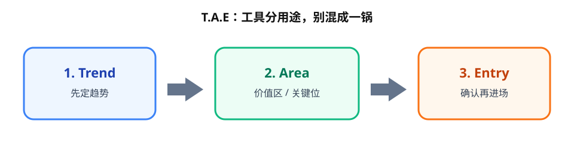
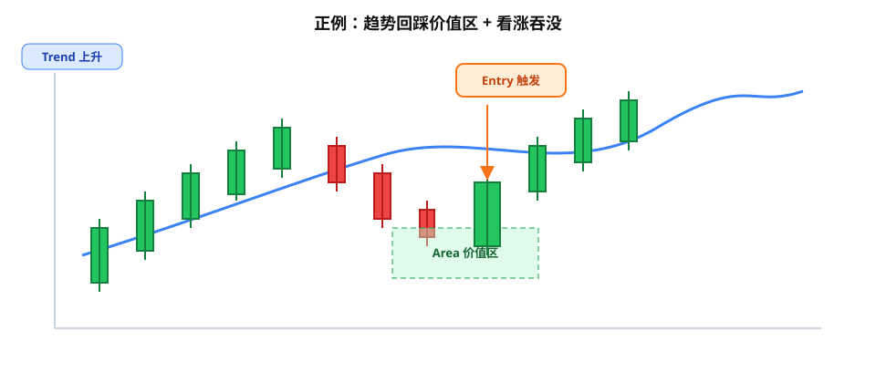
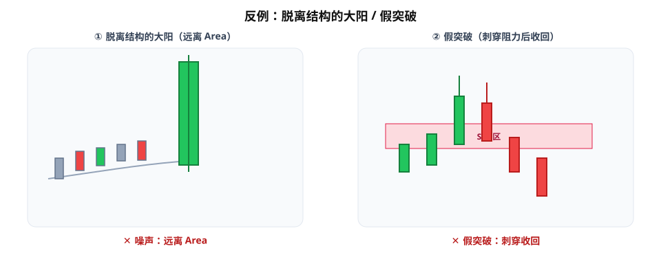

技术分析最常见的坑，不是「指标不够」，而是**工具用途混在一起**：均线既判方向又找买卖点，再叠三条震荡指标「确认一下」——图上花花绿绿，还是不知道何时动手。

一套更干净的拆法叫 **T.A.E**（Trend / Area of Value / Entry Trigger）：先定趋势，再找价值区，最后等确认触发再进场。工具各管一段，别搅成一锅。

> 顺序固定：**Trend → Area → Entry**。跳步通常就是追价或瞎猜。

---

## 1. Trend：先有方向，再谈交易

进场之前先问：现在是多、空，还是盘整？

- **多头**：高点、低点整体抬高；回调更像机会，不是翻空信号。
- **空头**：高点、低点整体下移；反弹多半是减仓/做空区，不是无脑抄底。
- **盘整**：方向不清。这时硬做突破或逆势，胜率和盈亏比都很难看。

**实操要点**：趋势不清楚时，默认不交易。很多亏损不是「看错形态」，而是在**无方向环境**里硬找方向。

均线、趋势线、更高时间框架结构，都可以辅助判趋势——但这一步只回答一件事：做多、做空，还是观望。也要记得：**均线天然滞后**，适合当过滤器，不适合当唯一的「现在翻多/翻空」开关。

---

## 2. Area of Value：去「价格该回来」的地方等

有了方向，下一步不是追着蜡烛跑，而是标出 **Area of Value（价值区）**：价格更可能回头测试、你也更愿意在这里承担风险的位置。

常见来源（都当**区域**，别当一根精确价位）：

- 支撑 / 阻力（S/R，Support / Resistance）
- 趋势线与通道边界
- 关键均线附近的「引力带」

**心态切换**：从「现在能不能买」改成「等它回到合理位置再谈」。好的入场往往出现在价值区，而不是情绪最高点。

---

## 3. Entry Trigger：在价值区等确认，不追价

到了价值区，仍先别下单——等 **Entry Trigger（入场触发）**。

常见确认（举例，不是圣杯）：

- 看涨 / 看跌吞没（engulfing）
- 明确的拒绝影线（rejection）
- 短暂刺破关键位后迅速收回 / 守住

### 正例（配图）

上升趋势里，价格回踩均线或趋势线价值区，出现看涨吞没——这时才考虑做多，而不是价格已经拉飞时追进去。

读图顺序：先确认 **Trend 上升** → 等价格回到 **Area 价值区** → 出现 **Entry 触发**（看涨吞没）再考虑进场。

**原则**：确认出现在价值区里，才更像顺结构的第二次机会；远离结构的一根大阳 / 大阴，更像噪声或假动作的燃料。

---

## ATR 放哪？它不负责看多看空

**ATR（Average True Range）只量波动**，帮你设止损距离与仓位，**不预测方向**。

- 波动放大：止损往往要放宽，否则正常噪声就会扫掉你。
- 波动收窄：同样「看起来很远」的止损，实际风险可能更小。

止损尽量放在**结构之外**，给正常波动留空间；方向仍由 Trend + 结构决定，ATR 只是尺子。

---

## 反例：什么时候框架在喊停（配图）

- **脱离结构的漂亮蜡烛**：没有 Trend / Area 垫底，再好看也是噪声（上图左）。
- **假突破**：价格刺穿关键位又迅速收回——正是「先有 Area、再等 Entry」要过滤的；把刺穿当成进场，容易接飞刀（上图右）。
- **均线滞后被当成即时信号**：均线拐头可以当趋势过滤，不宜单独当扳机。
- **指标堆叠当勇气**：五个共振仍可能同时错。框架要的是职责清晰，不是投票人数。

---

## 完整策略还缺什么

T.A.E 解决的是「何时考虑动手」。一笔可执行的交易通常还要补齐：

- **止损**：结构外 + 波动留白（可参考 ATR）
- **退出**：目标位、移动止损或结构破坏离场——事先想清楚
- **单笔风险**：例如账户的 0.5%–1%，用仓位去匹配止损距离

只「看个形态」不够；形态只是 Entry 那一环。

---

## 价值判断：留下什么、丢掉什么

| 做法 | 建议 |
|------|------|
| T.A.E + ATR（方向 / 区域 / 触发 / 波动） | **采用**，职责分开 |
| 孤立指标、互不隶属地乱叠；孤立形态当系统 | **弃用**或降级 |
| 单独 Donchian 等通道突破 | **观望**，需更多验证，别单独当整套系统 |

自检一句：这个工具在 T、A、E、波动里负责哪一段？答不上来，就先别画上图。

---

## 小结

T.A.E 不是新指标，是**决策顺序**：

1. **Trend** —— 有没有值得参与的方向？
2. **Area of Value** —— 去哪里等才划算？
3. **Entry Trigger** —— 等到确认了吗？
4. **ATR + 风控** —— 波动下止损、退出、单笔风险是否匹配？

理顺顺序之后，技术分析会从「猜下一根 K」变成「只在结构允许的位置出手」。

---

## 参考来源

1. Rayner Teo, *Technical Analysis For Beginners (The Ultimate Guide)*（完整学习后的框架提炼；本文侧重 T.A.E 决策顺序与工具分用途，非原书逐章摘要）。
2. 名词与示意图：交易学习笔记词条「T.A.E」及配套图解（Trend → Area → Entry）。
3. 正例 / 反例配图：为本文说明「回踩价值区 + 吞没」与「噪声大阳 / 假突破」而绘制的 SVG 示意，仅供教学，不对应某一具体品种或实盘成交。

*本文为学习笔记，不构成任何投资建议。*
