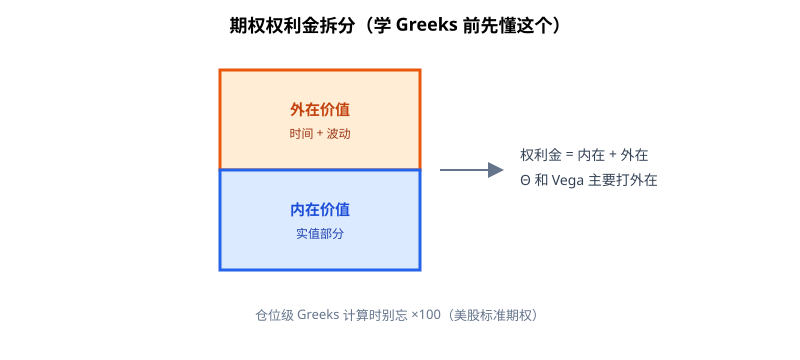
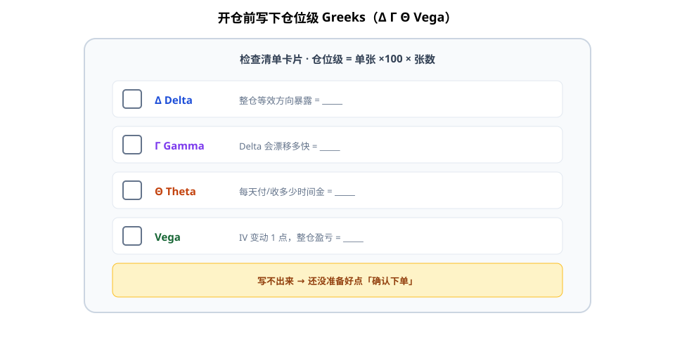

期权开仓前，很多人只看「方向对不对」。更基础的一步是：把**仓位级 Greeks**写下来——Δ / Γ / Θ / Vega 各暴露多少——再决定仓位大小与要不要对冲。

对学生版一句话：**先填风险说明书，再点确认下单。** 这是风险基线，不是预测工具。





**读图（检查清单）**

- 四个空要填的是**整仓**数字，不是屏幕上「每张」的小数。
- 美股常见乘数：单张 Greek × **100** × 张数（再乘多空符号）。
- 写不出来 → 默认还没准备好加仓。

---

## 1. 四个希腊字母（学习版定义）

| Greek | 大致含义 | 仓位上你在问什么 |
|-------|----------|------------------|
| **Delta (Δ)** | 标的涨 1 单位，期权价格大约变多少 | 我有多少「等效方向」暴露？ |
| **Gamma (Γ)** | Delta 随标的变化的速度 | 方向暴露会不会快速漂移？ |
| **Theta (Θ)** | 时间流逝对权利金的影响（通常卖方为正、买方为负，视头寸而定） | 我每天在付/收多少时间金？ |
| **Vega** | 隐含波动率变动对权利金的影响 | IV 升/降 1 个点，我赚亏多少？ |

记住：Greeks 是**局部、近似、会变的**；大波动、临近到期时，近似误差变大。

---

## 2. ×100 乘数：别漏合约规模

美股等股票期权常见：**1 张合约对应 100 股**。屏幕上的「每期权」Greek，乘到仓位时常要：

\[
\text{仓位级 Greek} \approx \text{单张 Greek} \times 100 \times \text{张数} \times \text{方向符号}
\]

（期货期权等乘数不同，以合约规格为准。）

**实操**：开仓单上同时写「每张」和「整仓」两行，避免口头说 Delta 0.3、实际账户已是 30 股等效却按 0.3 想风险。

---

## 3. Θ 与 Vega 打在「外在价值」上

期权价格常拆成：

- **内在价值（Intrinsic）**：立刻行权也有的部分（实值部分）。
- **外在价值（Extrinsic）**：时间 + 波动等溢价。

**Theta、Vega 主要作用在外在价值**：

- 时间流逝 → 外在价值趋向衰减（对多头权利金不利，对空头权利金有利——在其他条件不变时）。
- IV 上升 → 外在价值通常抬升（多波动的一方受益）。

深度实值主要跟 Delta/标的走；虚值则更「纯」地暴露在 Θ/Vega 上。开仓前问：我这张单，赚的是方向、时间，还是波动？

---

## 4. 开仓检查清单（最小版）

```text
□ 策略目标：方向 / 收时间 / 做多或做空波动？
□ 仓位级 Δ、Γ、Θ、Vega（含 ×100 × 张数）
□ 最大亏损情景（标的跳空、IV 崩溃/爆炸）
□ 是否需要对冲 Δ 或限制短波动暴露
□ 退出规则（时间、Greek 阈值、结构破坏）
```

写不出来，就还没准备好加仓。

---

## 价值判断：留下什么、丢掉什么

| 做法 | 建议 |
|------|------|
| 开仓前记录仓位级 Δ/Γ/Θ/Vega（含乘数） | **采用**，风险基线 |
| 分清内在/外在，理解 Θ、Vega 打在哪 | **采用** |
| 只看方向对错、不看 Greek 暴露 | **弃用** |
| 把 Greek 当「明日涨跌预言」 | **弃用** |
| 复杂高阶 Greek 堆满却无仓位上限 | **观望**，先把一阶风险管住 |

自检一句：这张单的钱，主要来自 Δ、Θ 还是 Vega？答不上来就先别点确认。

---

## 小结

1. Δ/Γ/Θ/Vega 先当**风险说明书**，不当水晶球。
2. 记得 **×100（或合约乘数）× 张数** 得到仓位级暴露。
3. **Θ、Vega 主要冲击外在价值**；先分清 intrinsic / extrinsic。
4. 开仓清单里必须有「整仓 Greeks + 最坏情景」。

---

## 参考来源

1. projectoption 期权基础与 Greeks 相关教学内容（学习笔记：定义、乘数、内在/外在价值）。
2. 配图：`option-value.svg`、`greeks-checklist.svg`，示意内在/外在与开仓清单，仅供教学。

*本文为学习笔记，不构成任何投资建议。*
