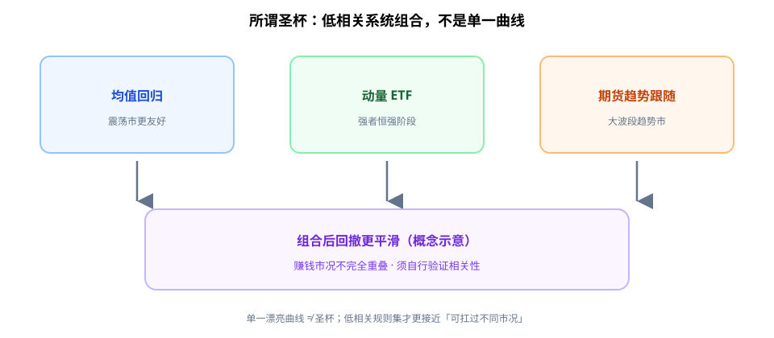

很多人找「一个」圣杯策略；更现实的答案往往是：**几套规则清晰、彼此低相关的系统，组合在一起**。

对学生更直白的说法：别指望一条权益曲线永远漂亮；更像是「晴天有一套工具、雨天有另一套工具」，合在一起才比较扛得住不同市况。单一曲线再漂亮，也可能只是某一市场阶段的幸存者。Rayner《Strategies That Work》一类材料，核心不在复制收益数字，而在「规则 + 组合 + 自行验证」。

---

## 1. 三套规则族（示意，非照抄仓位）

材料里常并列讨论三类思路（名称以你笔记为准，规则需自己写死）：

| 类型 | 直觉 | 典型风险 |
|------|------|----------|
| **均值回归** | 极端偏离后朝均值靠 | 趋势市连环止损；若**无价格止损**更危险 |
| **动量 ETF / 相对强度** | 强者恒强一段时间 | 拥挤交易、急速风格切换 |
| **期货趋势跟踪** | 突破/通道跟随大波段 | 长期震荡磨损；回报路径崎岖 |

「圣杯感」来自：三者赚钱的市况不完全重叠——趋势市里跟踪与动量可能贡献，震荡市里均值回归可能贡献——**组合后回撤形态往往优于单系统**（仍须自测）。

**读图**

- 上面三块：均值回归 / 动量 ETF / 期货趋势跟随——各吃不同市况。
- 下面合成框：概念上「组合后回撤更平滑」——这是示意，不是保证。
- 真正要自己验证的是：它们是否**真的低相关**，以及换样本后是否还成立。

---

## 2. 200DMA 等过滤器：降频，不神奇

常见做法：用 **200 日均线（200DMA）** 等长均线做风险开关，例如：

- 价格在 200DMA 之上，才允许某些多头/风险开启规则；
- 之下则减仓、空手或只保留对冲侧。

过滤器解决的是「何时允许系统发言」，不是提高胜率魔法。换市场、换品种，过滤参数要**重新检验**。

---

## 3. 收益数字必须自行核实

课程/文章里的年化、最大回撤、夏普等：

1. **当作假说**，不是成绩单。
2. 用自己的数据区间、成本、滑点、合约规格重跑。
3. 换样本外年份、换市场状态（高波动/低波动）再压一次。

**禁止**：直接复制别人的权益曲线截图当预期收益。曲线是结果，不是可迁移的「圣杯零件」。

---

## 4. 市场变了要重测

低相关不是永恒性质：

- 危机阶段，许多「平时低相关」资产与策略会一起砸。
- 监管、费率、品种流动性变化，会改写同一规则的期望。

SOP 建议：固定日历（如每季/每年）做一次**相关性与规则衰减检查**；大改市场结构时触发临时重测。

---

## 价值判断：留下什么、丢掉什么

| 做法 | 建议 |
|------|------|
| 低相关多系统组合 + 写死规则 | **采用** |
| 200DMA 等作风险过滤（并自测） | **采用** |
| 样本外/换市况重测 | **采用** |
| 均值回归且无价格止损/无熔断 | **观望**（危险） |
| 复制他人权益曲线、不重做验证 | **弃用** |
| 「一个指标打天下」 | **弃用** |

自检一句：我的第二套系统，是在第一套失效的市况里仍有逻辑——还是同一逻辑换了个皮肤？

---

## 小结

1. 圣杯更像 **低相关规则集的组合**，不是单策略神话。
2. 均值回归 / 动量 / 趋势跟踪各有适配市况与坑。
3. **收益数字一律自测**；过滤器要随市场重检。
4. 警惕无价格止损的均值回归；丢掉抄曲线的习惯。

---

## 参考来源

1. Rayner Teo, *Strategies That Work*（及同系列策略讨论）学习笔记：多系统组合、规则化、过滤器；**文中任何回报数字均须读者自行验证**，本文不转述为承诺收益。
2. 配图：`low-correlation-combo.svg`，概念示意。

*本文为学习笔记，不构成任何投资建议。*
