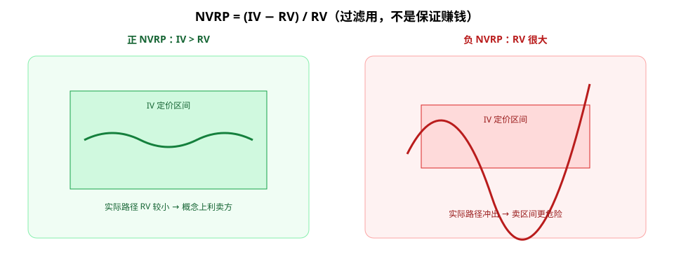

期权卖方常被说成「收保费」；买方则像「买保险」。中间那道缝，很多教材用 **波动率风险溢价（VRP）** 来描述：市场为「不确定」愿意多付一点钱。

第一次接触可以这样想：**买方付钱买安心（或凸性），卖方收钱承担出事时要赔的义务**。理解 VRP / NVRP，是为了当**概念过滤器**，不是为了无脑卖裸期权。

**读图（保险隐喻）**

- 左：买方付保费——多数时候权利金耗尽，大波动时可能获得保护。
- 右：卖方收保费——多数时候小赢，尾部一次可能吞掉长串小赢。
- 正 VRP 只说明「历史上波动常被定价得偏贵」，**不等于下一笔稳赚**。

---

## 1. VRP ≈ IV − 未来已实现波动

常用直觉式定义（学习用，细节因数据源而异）：

- **IV（Implied Volatility）**：期权价格隐含的、市场对未来波动的报价。
- **RV（Realized Volatility）**：事后量出来的实际波动。
- **VRP ≈ IV − 未来 RV**：若长期平均 IV 高于随后实现的 RV，卖方相当于在「波动偏贵」时收保费。

注意：你开仓时**看不到未来 RV**，只能估计；历史平均 VRP 为正，**不等于下一笔交易稳赚**。

---

## 2. NVRP：把溢价标准化

**NVRP（Normalized VRP）** 常见写法之一：

\[
\text{NVRP} = \frac{\text{IV} - \text{RV}}{\text{RV}}
\]

作用：让「贵多少」在不同波动环境下可比。NVRP 长期偏正，常被用来解释为何系统化卖权在样本里好看——但同样：**正溢价 ≠ 保证利润**，尾部一段 RV 飙升，就能吞掉很长一串小赢。

---

## 3. 保险隐喻：钱从哪来，爆在哪

| 角色 | 隐喻 | 钱从哪来 / 风险在哪 |
|------|------|---------------------|
| 买方 | 买保险 | 付保费；大波动时赔付可能覆盖损失 |
| 卖方 | 卖保险 | 收保费（VRP 的「租金」）；尾部波动爆炸时赔大 |

卖方赚的是「多数时候波动没想象中大」的那部分；爆仓剧本通常是：**波动突然实现得远高于 IV**，再叠高杠杆、短期限、无对冲。

---

## 4. POP ≠ EV：胜率高也会亏期望

短期限卖方策略往往 **POP（Probability of Profit）很高**：多数到期温和失效，小赢很多次。但：

- 高胜率可以伴随**负期望**（偶发大亏压过连胜）。
- **EV（期望）** 才谈「长期是否划算」；POP 只是频率。

因此：把「胜率 80%」当广告语不够；要问亏损分布、保证金、能否扛住尾部。

---

## 5. 买与卖都能进组合——看目标

同一账户里可以同时存在：

- **买权/买保险**：付 VRP，换尾部保护或方向凸性。
- **卖权/收保费**：收 VRP，换路径依赖与尾部风险。

没有道德上的「卖方先进、买方落后」；只有**目标、约束、爆仓边界**是否匹配。正 NVRP 环境也不等于人人该裸卖。

---

## 价值判断：留下什么、丢掉什么

| 做法 | 建议 |
|------|------|
| VRP/NVRP 作概念过滤（理解保费从哪来） | **采用** |
| 买/卖服从组合目标，而非站队 | **采用** |
| 短 DTE 全自动卖方机器人、无风控放大 | **观望**（尾部与执行风险高） |
| 裸卖无对冲、无仓位上限当「印钞」 | **弃用** |
| 用 POP 替代 EV 做决策 | **弃用** |

自检一句：我赚的是溢价租金，还是在赌「明天不会有黑天鹅」？

---

## 小结

1. **VRP ≈ IV − 未来 RV**；**NVRP** 把差额相对化。
2. 卖方收的是保险费；尾部 RV 飙升时费用不够赔。
3. **正 NVRP ≠ 稳赚**；**高 POP ≠ 正 EV**。
4. 买与卖都可服务目标；丢掉「裸卖圣杯」叙事。

---

## 参考来源

1. Option Alpha 关于波动率风险溢价、胜率与期望的教学内容（学习笔记提炼）。
2. Quant Guild 相关 VRP/NVRP 讨论与量化表述（概念对齐用）。
3. 配图：`nvrp.svg`、`vrp-insurance.svg`，教学示意。

*本文为学习笔记，不构成任何投资建议。*
