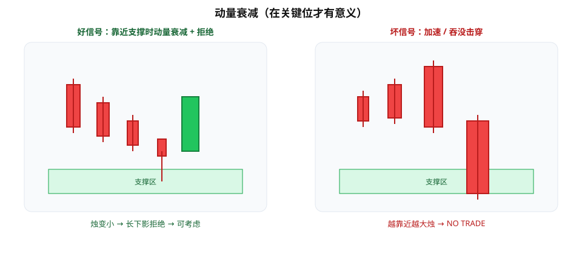

很多人一看到价格靠近支撑/阻力就下单——「到了关键位，总该反了吧」。更稳一点的习惯是：到了关键位，**先看动能有没有在衰减**，再谈反转或延续。

Wysetrade 强调的一条可读规则是：**关键位 + 实体变小 +（可选）拒绝影线**。反过来，加速大实体或吞没式推进，往往意味着「别急着逆势接」。

---

## 1. 三件套：关键位 × 变小 × 拒绝

把「动量衰竭」拆成可检查的清单：

1. **关键位存在**：水平 S/R、前高低、明显供需区——当**区域**，不当一根像素线。
2. **蜡烛实体变小**：靠近该区时，连续若干根实体明显小于前一段推进波——推进力在减弱。
3. **拒绝影线（加分项）**：上影/下影显示该方向买/卖被顶住，但单独一根长影不够，最好叠在「实体已收窄」之后。

三者凑齐，才更像「可以评估反向或止盈/减仓」的环境；缺关键位、或缺收窄，都降级为观察。

---

## 2. 什么时候明确 NO TRADE

下列情况，默认**不做逆势接飞刀**（可做的是顺势或空手）：

| 信号 | 含义 |
|------|------|
| 靠近 S/R 时实体**加速放大** | 动能在加强，不是衰竭 |
| 出现**吞没式**大阳/大阴继续推进 | 对方还在主导，逆势胜率差 |
| 关键位模糊、几乎没人防守过 | 「关键」本身不成立 |

口诀：**加速/吞没 = 先别逆着它做。** 等收窄出现，再谈反转剧本。

---

## 3. 多品种周线：正例与反例怎么记

做笔记时不要只抄结论，按「周线级别、多资产」各存一类样本（自行复盘，数字以你本地图表为准）：

**正例（可观察反转/反弹质量）**

- 价格进入已知支撑区 → 连续 2–3 根实体明显小于下跌波 → 出现下影拒绝 → 再评估做多或空头止盈。
- 对称地，阻力区 + 上攻实体收窄 + 上影拒绝 → 再评估做空或多头减仓。

**反例（不该硬接）**

- 跌到「看起来像支撑」却出现更大阴线/看跌吞没 → 支撑可能失效，优先保护，不抄底。
- 涨到阻力却实体越涨越大 → 突破动能仍在，不因「到了整数关」就翻空。

把正反例贴在同一张对照表里，比背形态名字管用。

---

## 4. 和「挂单扫 S/R」的区别

| 做法 | 问题 |
|------|------|
| 盲挂限价在 S/R，不管蜡烛 | 忽略动能；容易接住加速段 |
| 到区后看实体是否变小再决策 | 把「位置」和「状态」拆开 |

关键位只回答「在哪等」；**实体收窄**回答「现在还有没有力量」。两者缺一，系统不完整。

---

## 价值判断：留下什么、丢掉什么

| 做法 | 建议 |
|------|------|
| 关键位 + 实体变小（+ 拒绝影）再评估反转/减仓 | **采用** |
| 加速推进 / 吞没推进时不做逆势 | **采用** |
| 盲挂 S/R 限价、不问蜡烛状态 | **弃用** |
| 单根长影、无收窄也当反转圣杯 | **观望**或降级 |

自检一句：到关键位时，我看的是「价位到了」，还是「动能也弱了」？

---

## 小结

1. 靠近 S/R，先问：**蜡烛实体有没有变小？**
2. 收窄 +（可选）拒绝影 → 才进入反转/减仓评估。
3. 加速、吞没式推进 → **NO TRADE（逆势）**。
4. 用多资产周线正反例训练眼睛，比背名词快。

---

## 参考来源

1. Wysetrade 相关价格行为/动量衰竭教学内容（学习笔记：关键位附近实体收窄与拒绝；非原课逐字稿）。
2. 配图：`momentum-loss.svg`（示意「到区后实体收窄 vs 加速推进」），仅供教学。

*本文为学习笔记，不构成任何投资建议。*
