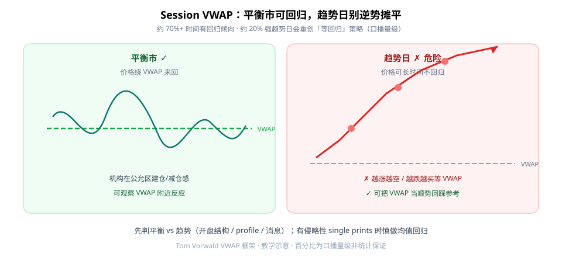
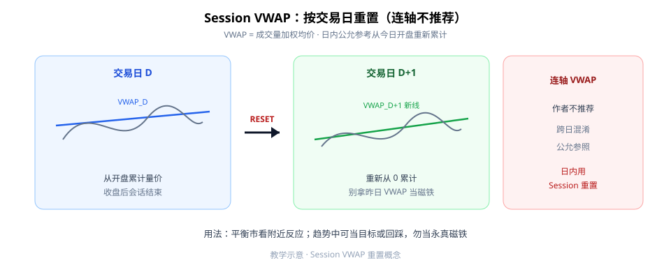

VWAP（成交量加权均价）常被当成「价格一定要回来的磁铁」。第一次学，先记住两句：**用 Session（按交易日）重置的 VWAP**；**平衡市可观察回归，趋势日别逆势金字塔摊平等回归。**



**读图（两种日子）**

- 左（绿）：平衡市，价格绕 VWAP 来回——可观察附近反应。
- 右（红）：趋势日，价格长时间不回归；红点示意「越走越加仓等 VWAP」的危险路径。
- 口播量级：约 **70%+** 时间有回归平衡倾向，约 **~20%** 交易日偏强趋势、收在当日极端——那一小撮趋势日会重创「加仓等回归」策略。百分比是教学量级，**不是**可背的机械胜率。

---

## 1. Session VWAP：每日重置

VWAP 通常**按交易日 session 重置**；连轴（跨日不重置）VWAP，作者不推荐——容易把「今日公允」和「跨日残留」搅在一起。



**读图（重置）**

- Day D 的 VWAP 从开盘累计量价；收盘后会话结束。
- Day D+1 **RESET**，新开一条线——别拿昨日 VWAP 当今日磁铁。
- 右侧红框：连轴用法在本框架里降级/不推荐。

---

## 2. 平衡用回归，趋势用回踩（或当目标）

| 环境 | 更稳用法 | 危险用法 |
|------|----------|----------|
| 平衡市 | 看 VWAP 附近反应 / 回归 | 无确认乱刷 |
| 趋势日 | VWAP 作**顺势回踩**参考或目标 | 逆势金字塔加仓「等它回来」 |

与 Volume Profile（POC / VAH / VAL、single prints）联动：出现侵略性 **single prints** 时，慎做 VWAP 均值回归——市场可能正在「走路」而不是「绕圈」。

---

## 3. 最小 Checklist

```text
1. 先判平衡 vs 趋势（开盘结构 / profile / 消息）
2. 平衡：可观察 VWAP 回归 / 反弹
3. 趋势：停止「越跌越买 / 越涨越空等 VWAP」
4. 可用 VWAP 作目标，勿当永真磁铁
5. 确认用的是 Session 重置，不是连轴线
```

---

## 价值判断：留下什么、丢掉什么

| 做法 | 建议 |
|------|------|
| Session VWAP 作日内公允参考；趋势日关闭盲目回归 | **采用** |
| 平衡市观察附近反应；趋势中当回踩/目标 | **采用** |
| 把「70% 回归」写成机械胜率系统 | **观望** |
| 无风控金字塔逆势摊平等 VWAP；连轴当唯一参照 | **弃用** |

自检一句：今天是绕圈日还是走路日？没判环境就加仓等 VWAP，等于把策略交给运气。

---

## 小结

1. 用 **Session VWAP**（每日重置），别迷信连轴。
2. **平衡可回归，趋势别摊平。**
3. VWAP 可当目标或顺势回踩，**不是永真磁铁**。
4. 先判环境，再决定要不要做均值回归。

---

## 参考来源

1. Tom Vorwald, *The ONLY VWAP-Video you will EVER need*（学习笔记：Session 重置、平衡 vs 趋势、勿逆势等回归；与 Volume Profile 联动提示）。
2. 配图：`vwap-balance-vs-trend.svg`、`session-vwap-reset.svg`，教学示意；文中百分比为口播量级。

*本文为学习笔记，不构成任何投资建议。*
