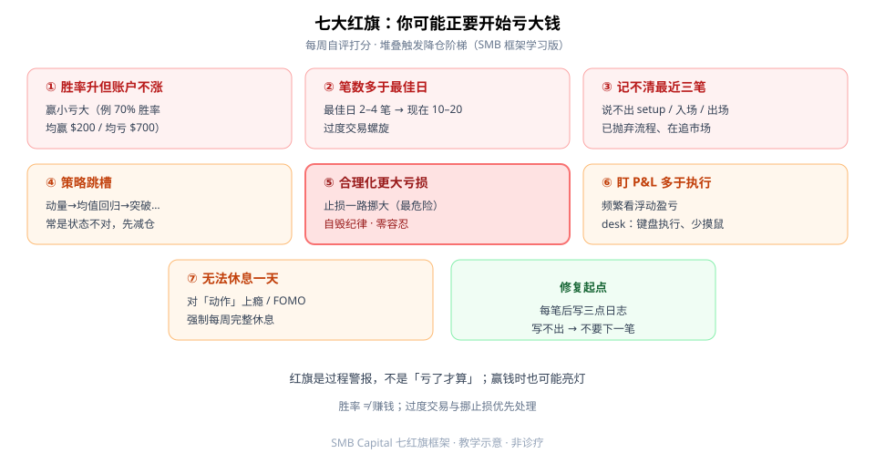
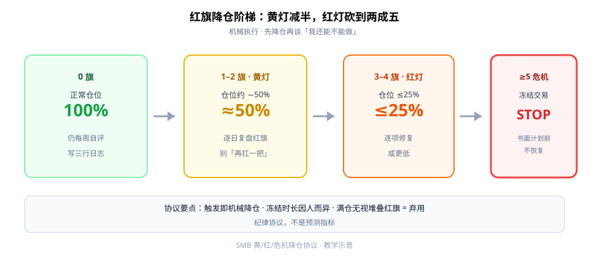

账户开始下滑之前，过程上通常已经亮灯了。SMB 把常见过程故障收成 **七大红旗**，再配一条机械的 **黄/红/危机降仓阶梯**——对学生版一句话：**先降仓，再谈「我还能不能做」。**

这是纪律协议，不是预测指标；赢钱时也可能亮灯。



**读图（七旗）**

- ①–③：胜率≠赚钱、过度交易、记不清最近三笔——流程已经松了。
- ④–⑦：策略跳槽、合理化挪止损（最危险）、盯 P&L、无法休息。
- 右侧绿框：每笔强制写三点；写不出就不要下一笔。

---

## 1. 七大红旗（学习版）

1. **胜率上升但账户不涨**：赢小亏大（例：胜率 70%，均赢 $200 / 均亏 $700）。
2. **交易笔数多于自己最佳日**：最佳日可能 2–4 笔，现在 10–20 笔 → 过度交易螺旋。
3. **记不清最近三笔**：说不出 setup / 入场逻辑 / 出场逻辑 → 已抛弃流程、在追市场。
4. **策略跳槽**：动量不行换均值回归再换突破……问题常是**市场状态**，不是策略「永久坏掉」；状态不对时先减仓而非弃策略。
5. **合理化更大亏损**（最危险）：止损一路挪大 → 自毁纪律，零容忍。
6. **盯 P&L 多于盯执行**：频繁看浮动盈亏；强调键盘执行、少摸鼠标。
7. **无法休息一天**：对「动作」上瘾 / FOMO；强制每周完整休息（例周五晚–周六晚）。

---

## 2. 降仓阶梯：黄灯 −50%，红灯 ≤25%



**读图（阶梯）**

- 0 旗：正常仓，仍每周自评。
- **1–2 黄灯**：仓位约 **−50%**，逐日复盘红旗。
- **3–4 红灯**：仓位 **≤25%**（或更低），逐项修复。
- **≥5 危机**：冻结交易；辅导/重建；**书面计划前不恢复**。
- 冻结具体天数因人而异——观望「一刀切 30 天」口号，保留「先停再写计划」原则。

| 旗数 | 级别 | 动作 |
|------|------|------|
| 1–2 | 黄灯 | 仓位约 −50%；逐日复盘红旗 |
| 3–4 | 红灯 | 仓位 ≤25%；逐项修复 |
| ≥5 | 危机 | 冻结；书面计划前不恢复 |

---

## 3. 最小 Checklist

```text
1. 每周自评 7 旗打分
2. 触发黄/红灯立即机械降仓
3. 每笔强制三行日志（setup / 入场 / 出场）
4. 安排无图表休息日
```

---

## 价值判断：留下什么、丢掉什么

| 做法 | 建议 |
|------|------|
| 红旗计数 + 降仓阶梯；胜率≠赚钱 | **采用**（纪律协议） |
| 过度交易与挪止损零容忍；每笔三行日志 | **采用** |
| 具体「冻结 N 天」时长 | **观望**（因人而异） |
| 无视堆叠红旗仍满仓 | **弃用** |

自检一句：这周亮了几盏灯？亮了还满仓，协议等于没写。

---

## 小结

1. 七旗盯的是**过程**，不是事后才认亏。
2. 黄灯减半，红灯砍到两成五，危机冻结。
3. 写不出三行日志 → 默认不下一笔。
4. 当作纪律协议采用；别当「预测明天会不会亏」的指标。

---

## 参考来源

1. SMB Capital, *7 red flags you are about to lose*（YouTube 学习笔记：七旗与黄/红/危机降仓协议）。
2. 配图：`redflag-seven.svg`、`redflag-ladder.svg`，教学示意。

*本文为学习笔记，不构成任何投资建议。*
