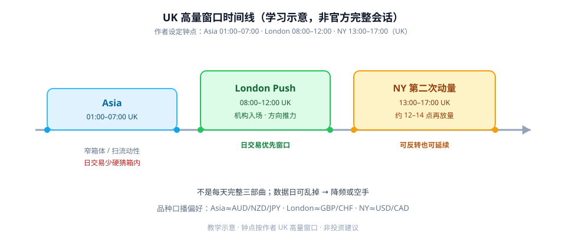
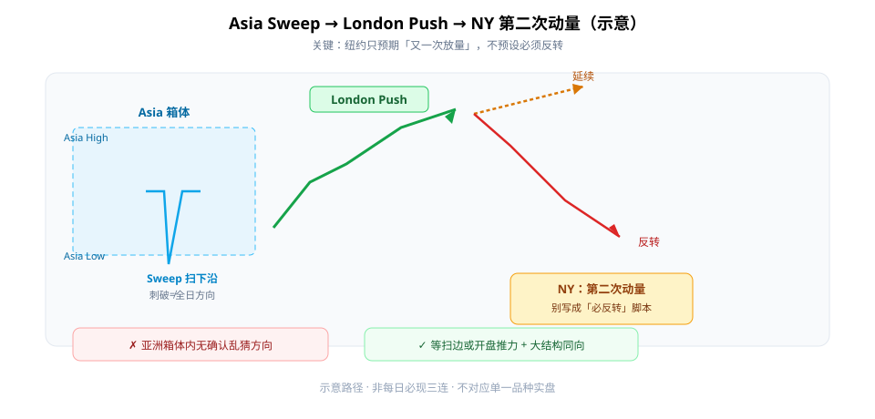

第一次学日交易，很容易盯着一根 K 线猜涨跌。更省力的入口是：**先看现在落在哪个会话窗口**，再谈方向。

JeaFx 的框架可以记成三句话：**亚洲扫箱体流动性 → 伦敦出现方向推力 → 纽约再来一次动量浪**。注意第三句是「第二次动量」，**不是**「纽约必然反转」。



**读图（时间线）**

- 这是作者设定的 **UK 高量窗口**，不是完整官方会话表；夏令时变化时，作者仍建议先钉住这组钟点。
- **London / NY** 更适合做日交易主战场；Asia 主货币对量能弱、箱内乱猜成本高。
- 口播品种偏好：Asia≈AUD/NZD/JPY，London≈GBP/CHF，NY≈USD/CAD——当背景，不当硬规则。

---

## 1. 三个窗口各干什么

| 窗口（UK） | 大致特征 | 学生版用法 |
|------------|----------|------------|
| Asia 01:00–07:00 | 常走窄箱体（Asia High/Low） | 标好区间；少在箱内硬猜 |
| London 08:00–12:00 | 机构入场，常出现清晰推力 | **优先找与大结构同向的 Push** |
| NY 13:00–17:00 | 约 12:00–14:00 再放量 | 只预期「第二次动量」：可反转也可延续 |

原则：会话特征是**概率结构**，不是天天完美的三部曲。有时只有 1–2 个特征；数据日可以完全乱掉——降频或空手。

---

## 2. Asia Sweep：扫边不等于全日方向

亚洲先走出箱体，随后某一侧被扫流动性（刺破 High 或 Low）。刺破方向**不一定**是全日方向，后面常出现反向推进。

对学生：把 Asia range 当成「今天的流动性地图」，而不是「亚洲方向圣杯」。

---

## 3. London Push 与 NY 第二次动量



**读图（路径示意）**

- 左：Asia 箱体 + 扫下沿（示意）；扫边后未必继续向下。
- 中：London Push 给出更清晰的方向推力——日内定位的好窗口。
- 右：NY 分出「延续」与「反转」两条虚实线——**不要写成机械「NY 必反转」脚本**。
- 绿勾：等扫边或开盘推力，并与更高时间框架结构同向；红叉：亚洲箱内无确认乱猜。

实操上，图表常在 **≤15 分钟** 观察会话阴影；机会例子包括：扫一侧后交易向另一侧，或对准会话开盘捕捉推力——仍要叠供需/结构，而不是孤立赌脚本。

---

## 4. 最小 Checklist

```text
1. 标好今日 Asia High / Low（或会话指标）
2. 明确自己只做 London / NY 哪个窗口
3. 等待扫边或开盘推力，而不是亚洲箱体里瞎猜
4. 纽约开盘只预期「第二次动量」，不预设必须反转
5. 数据日 / 乱行情：降频或空手
6. 与更高时间框架结构结合
```

---

## 价值判断：留下什么、丢掉什么

| 做法 | 建议 |
|------|------|
| 用 UK 高量窗口安排日交易作息；标记 Asia range | **采用** |
| 伦敦开盘附近找与大结构同向的推力；纽约当第二动量窗口 | **采用** |
| 把「Sweep → Push → NY 反转」写成每天必做的三连机械系统 | **观望**（需自建统计） |
| 亚洲箱体内无确认乱做；认定纽约必然反转；无风控扫边逆势 | **弃用** |

自检一句：我现在是在「等会话特征」，还是在「箱体里猜下一根」？

---

## 小结

1. 先钉 **Asia / London / NY** 高量窗口，再谈进场。
2. **Asia Sweep** 标流动性；别在箱内硬猜。
3. **London Push** 是日内定位优先窗口；**NY** 是第二次动量，可反可续。
4. 不是圣杯、不是每天三部曲；数据日允许空手。

---

## 参考来源

1. JeaFx, *How to Day Trade London & NY Session*（YouTube 学习笔记：会话窗口、Asia Sweep、London Push、NY 第二次动量）。
2. 配图：`session-timeline.svg`、`asia-sweep-london-push.svg`，教学示意，不对应单一品种实盘。

*本文为学习笔记，不构成任何投资建议。*
