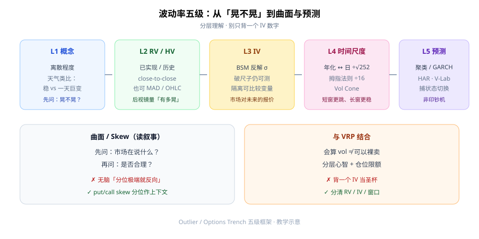
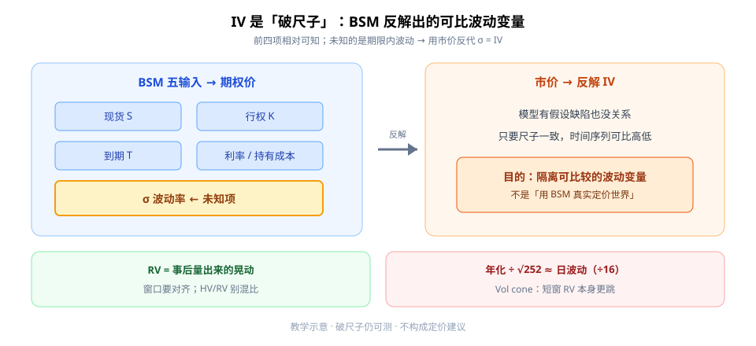

期权课里最容易卡死的词就是「波动率」。第一次学，别急着背一个 IV 数字——先建立**五级心智模型**：从「晃不晃」，到已实现、隐含、时间尺度，再到曲面与预测。

目标不是「会预报就能印钞」，而是：**分清自己在谈哪一层，窗口是否对齐。**



**读图（五级梯子）**

- L1→L5 从左到右：概念 → RV/HV → IV → 时间尺度 → 预测工具箱。
- 底部左：看 skew 先**读叙事**再判断，忌无脑反向。
- 底部右：会算 vol **不等于**可以裸卖；要和 VRP、仓位限额一起想。

---

## 1. Level 1–2：离散、RV / HV、MAD

**L1 概念**：波动率 ≈ 数值围绕中心的离散程度。天气类比——有的地方天天差不多（低波），有的地方一天温差巨大（高波）。

**L2 已实现 / 历史**：

- **RV**：已经发生的波动；常用 close-to-close（对数收益 → 方差 → 年化平方根）。
- **MAD**（平均绝对偏差）：不平方，极端日权重更小；平方差会放大大波动日。
- 不必只盯收盘：noon-to-noon、OHLC 混合等，目的是更快收敛到「资产到底有多晃」。
- 提醒：HV 与 RV 有时被混用——**口径/窗口不同时不要硬比**。

---

## 2. Level 3：IV 是 BSM 反解出来的「尺子读数」

BSM 五输入：现货、行权、到期、利率/持有成本、波动率 → 期权价。前四项相对可知；**未知的是期限内波动**。把市价反代回去得到的 σ，就是 **IV**。



**读图（破尺子）**

- 左：五项输入里，σ 是高亮的未知项。
- 右：用市价反解 IV——模型有假设缺陷也没关系，**只要尺子一致，时间序列仍可比高低**。
- 目的是隔离出一个可比较的波动变量，不是宣称「BSM 真实定价了世界」。
- 底下：RV 是事后量出来的晃动；年化 ↔ 日波动常用 ÷√252（拇指法则 ÷16）。

---

## 3. Level 4–5：√T、Vol Cone、曲面与预测

**时间换算**：

- 年化 vol → 日 vol：÷ √252（或 √251；√256=16，故有 ÷16 拇指法则）。
- 反推：日 vol ×16 ≈ 年化。

**Vol cone**：短窗口 RV 本身更跳（一周指数 RV 可到个位数或 60–80），长窗口更稳——期限越短，**波动率的波动率**越大。

**Skew / 曲面**：先问「市场在说什么」，再问「是否合理」。例如某板块在上行风险叙事下 call skew 偏贵、put skew 偏平——当上下文，**不要无脑「分位极端就反向」**。

**L5 预测**：纯后视镜会错过财报等前瞻事件。工具箱有波动聚类、GARCH 族、HAR 等；私人交易员目标未必「比市场更准」，而是用「破预报器」捕捉**状态切换/异常**。最高 ROI 往往是多频率测量 RV/OHLC 并观察变化，而不是幻想印钞机。

---

## 4. 最小 Checklist

```text
1. 分清自己在谈 RV/HV 还是 IV，窗口是否对齐
2. 年化 ↔ 日波动用 √T（÷16 拇指法则）
3. 看 skew/期限结构时先读叙事再交易
4. 预测模型当决策辅助，不当圣杯
5. 与 VRP / 仓位限额结合，避免「会算 vol 就裸卖」
```

---

## 价值判断：留下什么、丢掉什么

| 做法 | 建议 |
|------|------|
| 五级心智模型；IV 作反解度量；√T 换算；vol cone 直觉 | **采用** |
| Skew「先读后判」；分层理解 + 仓位限额 | **采用** |
| 自建 GARCH/HAR 当交易信号 | **观望**（需样本外） |
| 背一个 IV 数字当圣杯；无脑分位反向；以为会预报就能印钞 | **弃用** |

自检一句：我嘴里的「波动」是 RV、IV，还是某根期限上的 skew？说不清就先别下单。

---

## 小结

1. 波动先问 **晃不晃**（L1），再用 RV/HV 量出来（L2）。
2. **IV** 是市价反解的可比变量（破尺子仍可测）。
3. **√252 / vol cone** 管时间尺度；短窗更跳。
4. 曲面先读叙事；预测捕状态切换；**会算 ≠ 可裸卖**。

---

## 参考来源

1. Outlier Trading / Options Trench, *Volatility in 5 Levels of Difficulty*（YouTube 学习笔记：L1–L5、IV 反解、√T、vol cone、skew、预测工具箱）。
2. 配图：`vol-five-levels.svg`、`iv-vs-rv-ruler.svg`，教学示意。

*本文为学习笔记，不构成任何投资建议。*
