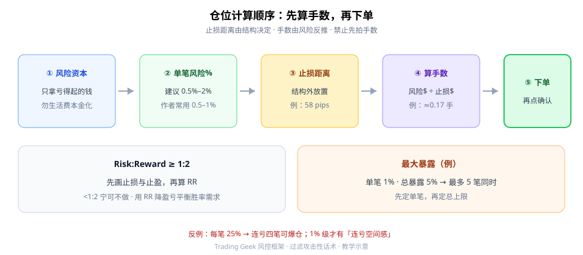
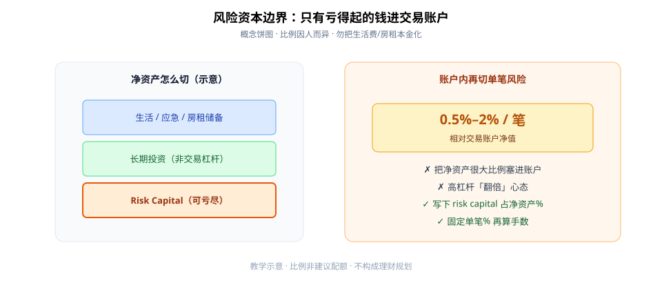

很多人亏钱不是因为「看不懂形态」，而是**先拍手数、再找理由**。学生版顺序应反过来：**只拿亏得起的钱 → 固定单笔风险% → 由止损距离反推手数 → 再下单。**

来源视频语气偏情绪化；本文只吸收公式与流程，**过滤攻击性话术**。



**读图（流程）**

- ①–⑤：风险资本 → 单笔% → 止损距离 → 算手数 → 才下单。
- 左下：RR 最低常见门槛 **1:2**；先画止损止盈再算，&lt;1:2 宁可不做。
- 右下：先定单笔风险，再定总暴露（例：1%×5 笔 = 5% 上限）。
- 底注：每笔 25% 级风险，连亏几笔就可爆仓——用 1% 级建立「连亏空间感」。

---

## 1. 风险资本：生活费不进杠杆账户

**Risk Capital** = 亏光也不影响房租/吃饭的钱。把净资产很大比例塞进交易账户，爆仓时伤的是生存底线，不是「策略回撤」。



**读图（边界）**

- 左：净资产先切出生活应急、长期投资，**最后**才是可亏尽的 Risk Capital。
- 右：账户内再切单笔 0.5%–2%；写下 risk capital 占净资产的百分比。
- 红叉：高杠杆翻倍心态、生活费本金化。

---

## 2. 单笔风险与手数：结构定止损，风险定手数

一般建议单笔风险约 **1%–2%** 账户；作者个人常用 **0.5%–1%**。

计算顺序：

1. 定风险%（例：账户 $10,000 × 1% = $100 可亏）。
2. 由结构定止损距离（例：EURUSD 约 58 pips）。
3. 用仓位计算器得出手数（片中演示约 **0.17 手**——以你的合约规格为准）。
4. 止损更近（例 15.7 pips）时，同样 1% 对应更大手数——**不是「更敢赌」，是同一风险换算结果**。

口诀：**止损距离由结构决定，手数由风险反推。**

---

## 3. RR 与最大暴露

- **Risk:Reward**：先画止损与止盈，再算 RR。常见最低 **1:2**；示意可到更高的「狙击入场」。与其硬抬胜率，不如用 RR 降低盈亏平衡所需胜率（口播量级：约 1:2 时盈亏平衡胜率大约三十出头%——以演算为准，勿当保证）。
- **Maximum exposure**：任意时刻总风险上限。例：单笔 1%、总暴露 5% → 最多同时 5 笔。先定单笔，再定总上限；5% 是否适合自身波动，需结合账户曲线观望微调。

---

## 4. 最小 Checklist

```text
1. 写下 risk capital 上限（占净资产%）
2. 固定单笔风险%（建议 ≤1–2%）
3. 每笔先算手数再进场
4. 止损距离由结构决定，手数由风险反推
5. 检查 RR ≥ 1:2；检查总暴露未超上限
```

---

## 价值判断：留下什么、丢掉什么

| 做法 | 建议 |
|------|------|
| 风险资本边界；0.5%–2% 级单笔风险；先算仓位再下单 | **采用** |
| RR≥1:2 作筛选；总暴露上限 | **采用**（比例可自调） |
| 最大暴露恰好 5% | **观望**（需匹配自身波动） |
| 高杠杆「翻倍」；先拍手数；每笔超大风险 | **弃用** |
| 来源中的辱骂/攻击性话术 | **弃用**（只留公式） |

自检一句：下单前我能写出「风险$ / 止损距离 / 手数」三行吗？写不出就还没准备好。

---

## 小结

1. 只拿 **Risk Capital**；生活费不进杠杆。
2. 单笔 **0.5%–2%**；结构定止损，风险定手数。
3. **先算再下**；RR≥1:2；管住总暴露。
4. 吸收流程，丢掉情绪化话术与赌徒仓位。

---

## 参考来源

1. The Trading Geek, *ULTIMATE Risk Management & Position Sizing*（YouTube 学习笔记：风险资本、单笔%、手数计算、RR、最大暴露；本文已过滤攻击性表述）。
2. 配图：`risk-sizing-flow.svg`、`risk-capital-pie.svg`，教学示意，数字为课堂演示量级。

*本文为学习笔记，不构成任何投资建议。*
