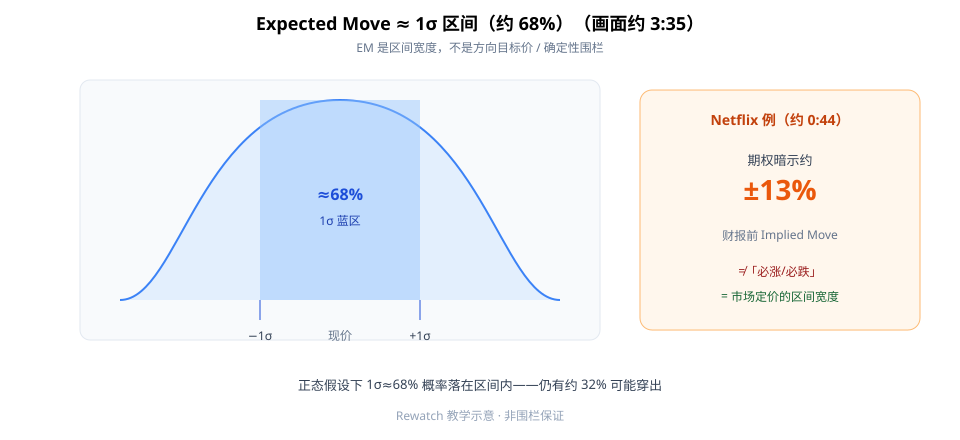
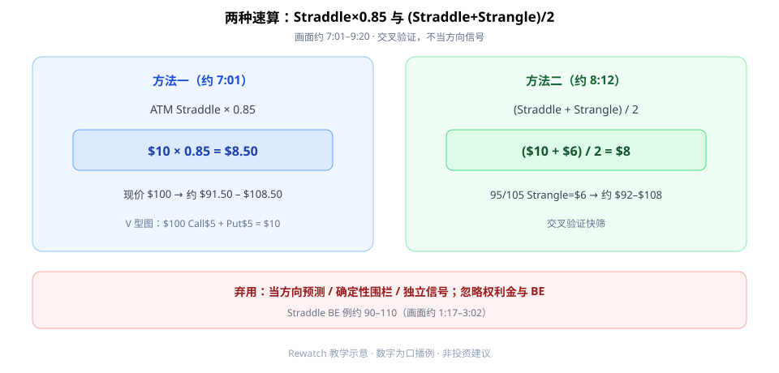

Expected Move（期望波动区间）第一次按画面学，先记住三句：**约等于 1σ，正态下约 68% 概率落在区间内**；可用 **ATM Straddle × 0.85** 快筛；再用 **(Straddle + Strangle) / 2** 交叉验证。它是**区间宽度**，不是方向目标价，更不是确定性围栏。

本文对照完整观看画面（约 9:40）成文。开场 Netflix 财报例（约 **0:44**）：期权暗示约 **±13%**——说的是 Implied Move 宽度，不是「必涨/必跌」。



**读图（正态）**

- 蓝区：**1σ ≈ 68%**（约 **3:35**）。
- 右侧 Netflix：约 ±13% 是市场定价的区间感，**不是方向信号**。
- 仍有约 32% 可能穿出——所以不能当「围栏保证」。

抛硬币类比（约 **4:12–5:19**）：均值 50、1σ=5 → EM 45–55。公式直觉（约 **5:52**）：`S×e^(vol×√t)` 例约 $100→$78–$122（±22%），**非方向预测**。

---

## 1. Straddle 先搞清 BE

画面约 **1:17–3:02**：V 型图——$100 Call $5 + $100 Put $5 = **$10**；盈亏平衡约 **90–110**。权利金与 BE 要一起看，别只抄 EM 数字。

---

## 2. 两种速算



**读图（双算法）**

- **方法一**（约 **7:01–7:35**）：ATM Straddle × **0.85** → $10×0.85=$8.50 → 现价 $100 约 **$91.50–$108.50**。
- **方法二**（约 **8:12–9:20**）：`(Straddle+Strangle)/2`；95/105 Strangle=$6 → ($10+$6)/2=$8 → 约 **$92–$108**。
- 两法交叉验证作快筛；流动性差或 IV 极端抬升时结果需**观望**。

---

## 3. 最小 Checklist

```text
1. 先问：我要的是「区间宽度」还是「方向」？EM 只答前者
2. 算 ATM Straddle×0.85 得一版 EM
3. 再用 (Straddle+Strangle)/2 交叉验证
4. 核对权利金与 BE，别忽略成本
5. 事件（财报等）前后：EM 变宽 ≠ 自动交易信号
6. 穿出 1σ 是常态概率的一部分，勿当「不可能」
```

---

## 价值判断：留下什么、丢掉什么

| 做法 | 建议 |
|------|------|
| Straddle×0.85 快筛；(Straddle+Strangle)/2 交叉验证；EM=区间非目标价 | **采用** |
| 流动性差、IV 极端抬升时的数值 | **观望** |
| 当方向预测 / 确定性围栏 / 独立信号；忽略权利金与 BE | **弃用** |

自检一句：我把 EM 当成「价格笼子」，还是「期权定价的区间宽度」？

---

## 小结

1. EM ≈ **1σ**，约 **68%** 概率语言，不是铁壁。
2. 速算一：**Straddle × 0.85**；速算二：**(Straddle+Strangle)/2**。
3. Netflix ±13% 类例子讲的是 Implied Move，**不是方向**。
4. **不当围栏、不当独立信号。**

---

## 参考来源

1. Expected Move 教学（https://www.youtube.com/watch?v=DXszu8DRN-M · 笔记：`03-expected-move-rewatch-notes.md`）。
2. 配图：`rewatch-em-sigma68.svg`、`rewatch-em-two-methods.svg`（rewatch 新文件）。

*本文为学习笔记，不构成任何投资建议。期权有到期与流动性风险。*
