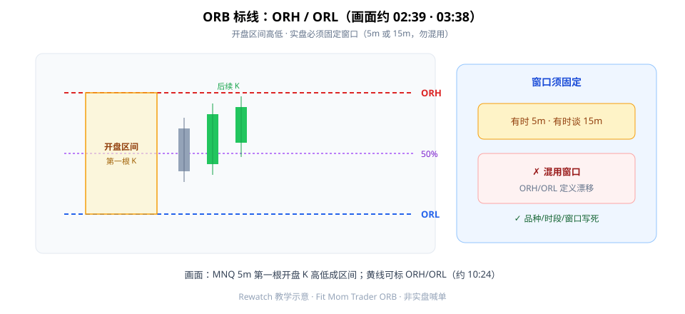
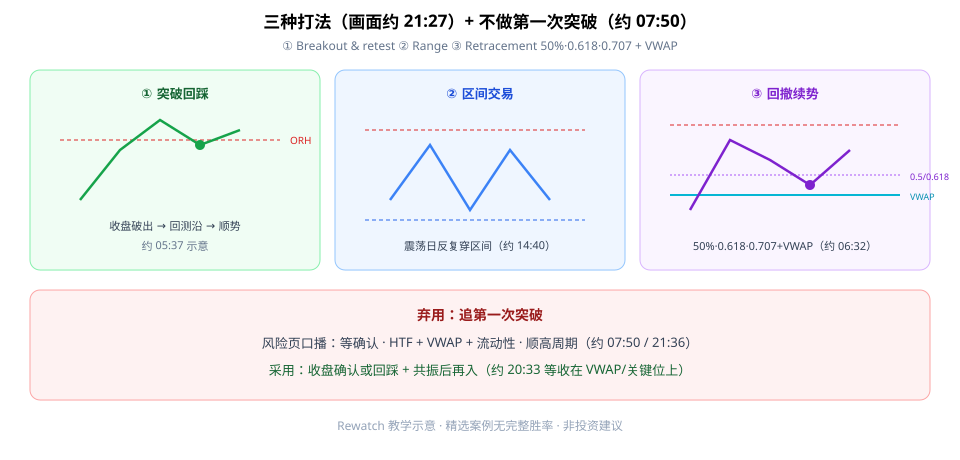

开盘区间突破（Opening Range Breakout，ORB）第一次按画面学，先钉三件事：**标清 ORH/ORL**；**不做第一次突破**；**同一套线有三种打法**——突破回踩、区间、回撤续势（**50%·0.618·0.707 + VWAP**）。

本文对照完整观看画面（约 22:35）成文，不是喊单。视频里有时用第一根 **5m**、有时谈前 **15m**——实盘必须**固定** ORB 窗口，写进品种/时段规则。



**读图（标线）**

- 黄框：会话开盘后第一根选定周期 K 的高低 → **ORH**（上）/ **ORL**（下）；中轨为 **50%**。
- 右侧强调：画面混谈 5m 与 15m——混用会让区间定义漂移。
- 画面约 **02:39** 定义 ORB；约 **03:38** MNQ 5m 第一根成区间；约 **10:24** 黄线标 ORH/ORL。

---

## 1. 先固定窗口，再画线

Checklist 起点：

```text
1. 固定品种 / 会话时段 / ORB 窗口（5m 或 15m，二选一写死）
2. 画 ORH / ORL
3. 叠 HTF + VWAP + 流动性语境
4. 先区分趋势日 vs 震荡日
```

没固定窗口就画线，等于每天换一把尺子量「开盘区间」。多色线并存时，不能默认每条都是 VWAP。

---

## 2. 三种打法（画面约 21:27）

同一套 ORH/ORL，不是只会「破了就追」。



**读图（三种剧本）**

- ① **Breakout & retest**：收盘破出后回测区间沿再顺势（约 **05:37** 示意）。
- ② **Range trade**：在 ORH/ORL 附近拒绝、做区间——震荡日反复穿区间与 VWAP（约 **14:40–16:10**），非每次突破都是趋势。
- ③ **Retracement & continuation**：更深回撤到 **50% / 0.618 / 0.707** 与上行 **VWAP** 共振再续势（约 **06:32**、**19:49**）；约 **20:33** 等收在 VWAP/关键位上再入。

风险页口播（约 **07:50 / 21:36**）：等确认；**不要交易第一次突破**；HTF + VWAP + 流动性；顺高周期。

分批止盈例（约 **12:07–13:34**）：口述止损约 33 点、目标约 107.5——精选案例，无完整亏损样本/胜率。约 **18:34**：「等回踩」也可能错过——预定义「多久不回踩则放弃/改剧本」。

---

## 3. 最小 Checklist

```text
1. 固定品种/时段/ORB 窗口
2. 画 ORH/ORL
3. HTF + VWAP + 流动性语境
4. 区分趋势日 vs 震荡日
5. 不做第一次突破：等收盘确认或回踩
6. 三选一打法 + 预定义止损/目标/仓位
```

---

## 价值判断：留下什么、丢掉什么

| 做法 | 建议 |
|------|------|
| ORH/ORL + 收盘确认 + VWAP/HTF 共振；优先回踩/回撤续势 | **采用** |
| 5m vs 15m 窗口选择、止损统计、跨品种迁移 | **观望**（需自建统计） |
| 追第一突破；只碰 Fibonacci 就进；无视 HTF；把精选盈利当保证 | **弃用** |

自检一句：我看到的是「第一根刺破」还是「确认 + 共振」？没确认就追，等于把假突破当 Alpha。

---

## 小结

1. 先**固定** ORB 窗口（5m 或 15m），再标 ORH/ORL。
2. **不做第一次突破**；等收盘确认或回踩。
3. 三种打法：突破回踩 / 区间 / **50%·0.618·0.707 + VWAP** 续势。
4. 叠 HTF + 流动性；震荡日别把每次穿越当趋势。

---

## 参考来源

1. Fit Mom Trader（https://www.youtube.com/watch?v=as3aN2faLxo · 浏览器画面笔记：`01-orb-rewatch-notes.md`）。
2. 配图：`rewatch-orb-orh-orl.svg`、`rewatch-orb-three-plays.svg`（rewatch 新文件，非废稿复用）。

*本文为学习笔记，不构成任何投资建议。*
