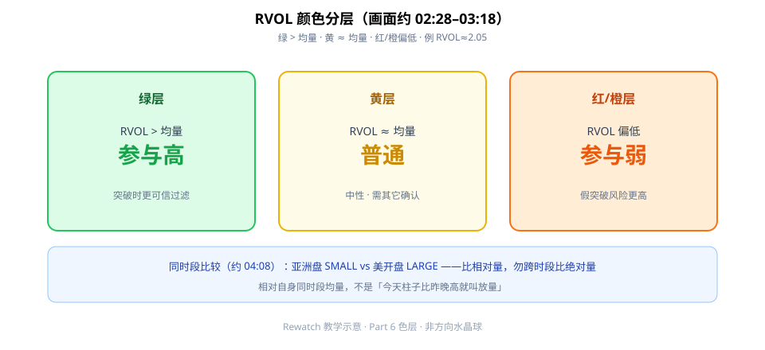
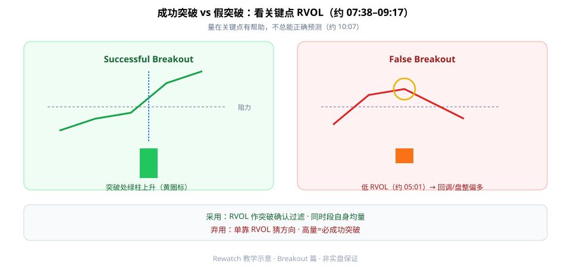

相对成交量（Relative Volume，RVOL）第一次按画面学，先记住一句：**它是参与度过滤，不是方向水晶球。** 绿/黄/红（橙）分层告诉你「相对自身均量高不高」；突破时要用**同时段**比较，并区分成功突破与假突破。

本文合并两支完整观看：Part 6（约 7:51）+ Breakout（约 11:01）。



**读图（色层 · 约 02:28–03:18）**

- **绿**：RVOL > 均量 → 参与度较高（例画面 RVOL≈**2.05**）。
- **黄**：≈ 均量 → 普通，需其它确认。
- **红/橙**：偏低 → 假突破风险更高。
- 同时段比较（约 **04:08–05:48**）：亚洲盘 SMALL vs 美开盘 LARGE——比**相对**量，勿跨时段比绝对量。

约 **00:53–01:38**：相对均量高/升 = 参与度较高——仍是过滤语言，不是多空指令。

---

## 1. 成功突破 vs 假突破



**读图（Breakout 篇）**

- **Successful**：突破处蓝竖线 + 黄圈标 **RVOL 绿柱上升**（约 **07:38–09:17**）。
- **False / 弱量**：黄圈低 RVOL → 更支持回调/盘整（约 **05:01–06:48**）；区间内持续低 RVOL 要警惕「假破」。
- 总结（约 **10:07**）：量在关键点有帮助，**不总能正确预测**。

约 **01:43–04:12** 还讨论「回调还是反转」——RVOL 低时更像盘整/回调语境，仍要结构确认。

---

## 2. 最小 Checklist

```text
1. 确认 RVOL 相对的是「自身同时段均量」
2. 读色层：绿/黄/红橙，先定性参与度
3. 突破关键点：看 RVOL 是否同步放大
4. 低 RVOL 盘整：观望，等突破时量同步
5. 勿跨资产/跨时段比绝对量柱高度
6. RVOL 只做过滤，方向由结构/趋势决定
```

---

## 价值判断：留下什么、丢掉什么

| 做法 | 建议 |
|------|------|
| RVOL 作趋势/突破确认过滤；同时段自身均量比较 | **采用** |
| 低 RVOL 盘整，等突破时量同步放大 | **观望** |
| 单靠 RVOL 猜方向；跨资产/跨时段比绝对量；高量=必成功突破 | **弃用** |

自检一句：我是在问「参与够不够」，还是误问「该多还是该空」？

---

## 小结

1. **绿/黄/红**分层 = 相对参与度，不是涨跌指令。
2. 用**同时段**相对均量，别拿亚洲盘柱子直接比美开盘。
3. 突破关键点看 RVOL 是否同步放大，区分成功 vs 假突破。
4. 量有帮助，**不能单独预测方向**。

---

## 参考来源

1. RVOL Part 6（https://www.youtube.com/watch?v=gDjt9CY4LS4）+ Breakout（https://www.youtube.com/watch?v=p00fu987jWo · 笔记：`04-rvol-rewatch-notes.md`）。
2. 配图：`rewatch-rvol-color-layers.svg`、`rewatch-rvol-breakout-filter.svg`（rewatch 新文件）。

*本文为学习笔记，不构成任何投资建议。*
