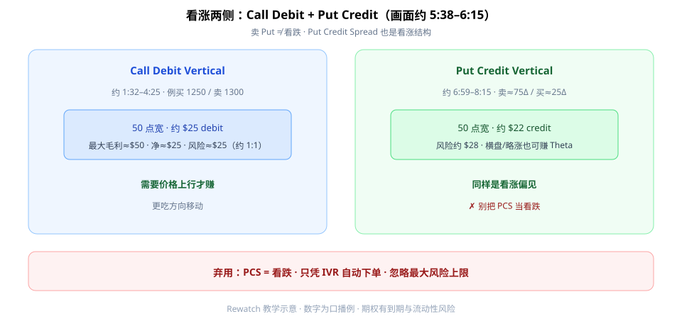
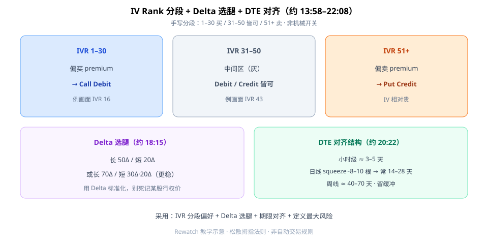

垂直价差（Vertical Spread）第一次按画面学，别被「买腿卖腿」绕晕。看涨侧要同时记住两句：**Call Debit 看涨**；**Put Credit 也是看涨**（卖 Put ≠ 看跌）。再用 **IV Rank 分段**选偏买还是偏卖溢价，用 **Delta** 选腿，用结构周期定 **DTE**。

本文对照完整观看画面（约 26:27）成文。开场 Netflix 双图（约 **0:00–1:00**）是看涨案例语境。



**读图（看涨两侧）**

- **Call Debit**（约 **1:32–4:25**）：买 1250 Call、卖 1300 Call；50 点宽、约 **$25 debit**；>1300 最大毛利 $50、净约 $25；最大风险约 $25（约 **1:1**）。更需要价格上行。
- **Put Credit**（约 **5:38–8:15**）：口播明确 **Put Credit 也是看涨**；例 50 点宽，卖约 75Δ Put、买约 25Δ；约 **$22 credit** / 风险约 $28。横盘/略涨也可能赚 Theta。
- 红条：**弃用「PCS = 看跌」**。

---

## 1. IV Rank 三分 + Delta + DTE



**读图（框架 · 约 13:58–22:08）**

- **IVR 1–30**：偏买 premium（偏 CDS）；画面例 IVR **16**（约 **16:19**）。
- **IVR 31–50**：皆可；画面标签 IVR **43** 灰=中间（约 **13:58**）。
- **IVR 51+**：偏卖 premium（偏 PCS）。
- **Delta**（约 **18:15**）：长 **50Δ** / 短 **20Δ**；或长 **70Δ** / 短 **30Δ·20Δ**（更稳、奖励更小）。
- **DTE**（约 **20:22**）：日线 squeeze~8–10 根 → 常 **14–28** 天；周线 **40–70** 天；小时级 **3–5** 天——按结构对齐，留缓冲。

这是松散拇指法则，**不是**「IVR 到线就自动下单」的机械开关。

---

## 2. 最小 Checklist

```text
1. 先定方向：看涨时 CDS 与 PCS 都可用，别把 PCS 当看跌
2. 查 IV Rank：1–30 偏买 / 31–50 皆可 / 51+ 偏卖（不机械）
3. 用 Delta 选长/短腿；核对最大亏损是否可承受
4. 到期日 ≥ 结构需要的时间，留缓冲
5. 计划退出：权利金衰减%、结构失效、或时间止损
6. 单笔风险计入账户总暴露；具体标的仍看流动性/趋势/账户规模
```

总结口播（约 **23:36**）：debit 风险较低、收益空间相对高；高 IVR 偏卖、低 IVR 偏买——仍是偏好，不是自动交易。

---

## 价值判断：留下什么、丢掉什么

| 做法 | 建议 |
|------|------|
| IV Rank 分段 + Delta 选腿 + 期限对齐结构 + 定义最大风险 | **采用** |
| 具体标的进场（流动性/趋势/账户规模） | **观望** |
| 只凭 IVR 自动下单；忽略风险上限；把 Put Credit 当看跌 | **弃用** |

自检一句：这笔 PCS 是因为「看涨 + IV 偏贵」，还是误以为「卖 Put = 看跌」？

---

## 小结

1. 看涨：**Call Debit** 与 **Put Credit** 都是看涨结构。
2. **IVR**：1–30 买 / 31–50 皆可 / 51+ 卖——偏好不是开关。
3. **Delta** 选腿；**DTE** 对齐结构周期。
4. 永远有最大风险与退出计划；勿只凭 IVR 自动下单。

---

## 参考来源

1. *How To Trade Vertical Spreads*（https://www.youtube.com/watch?v=x1NLp1vCbM4 · 笔记：`05-vertical-spreads-rewatch-notes.md`）。
2. 配图：`rewatch-vertical-bullish-both.svg`、`rewatch-vertical-ivr-delta.svg`（rewatch 新文件）。

*本文为学习笔记，不构成任何投资建议。期权有到期与流动性风险。*
