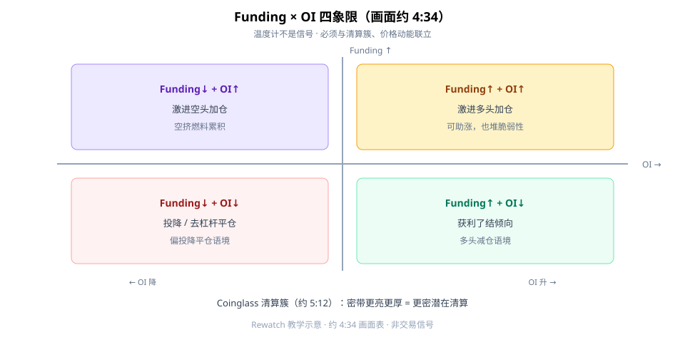
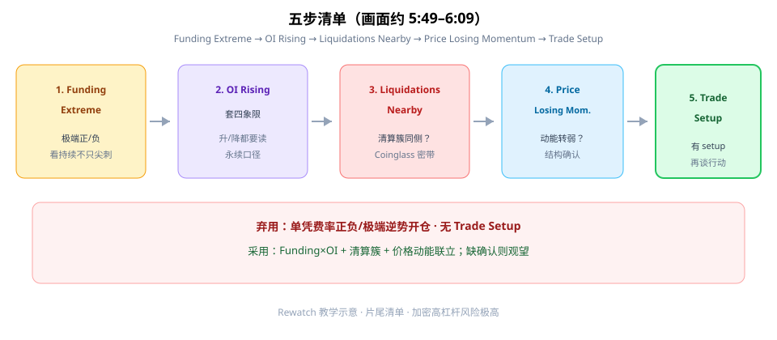

资金费率（Funding Rate）第一次按画面学，先改掉一个习惯：**别把它当方向水晶球。** 它是永续合约里多空互付的**持仓情绪温度计**——正确用法是 **Funding × OI 四象限 + 清算簇 + 价格动能** 联立。

本文对照完整观看画面（约 6:44）成文。**从不单独交易 Funding。**



**读图（四象限 · 画面约 4:34）**

- **Funding↑ + OI↑**：激进多头加仓——可助涨，也堆脆弱性。
- **Funding↓ + OI↑**：激进空头加仓——空挤燃料累积。
- **Funding↑ + OI↓**：获利了结倾向。
- **Funding↓ + OI↓**：投降 / 去杠杆平仓。
- 画面前文（约 **1:56–3:57**）：TV 永续费率绕零轴（极端峰值黄圈）；OI & Volume 联立，例 OI~129–134B、量~194–270B（口播量级）。

清算簇（约 **5:12** Coinglass）：密带更亮更厚 = 更密潜在清算；例价~59k–62k——回答「杠杆困在哪」，不是「下一根必去哪」。

---

## 1. 正/负费率分别说什么

- **正费率**：多头付空头（多头拥挤 / 合约偏贵）。
- **负费率**：空头付多头（空头拥挤 / 合约偏便宜）。
- 确认口径：用**永续**数据（约 **2:10** 搜合约）；单所 vs 聚合别混。

费率本身也是持仓成本：长期扛极端正费率做多，等于持续付「拥挤税」。

---

## 2. 五步清单（画面约 5:49–6:09）



**读图（流程）**

1. **Funding Extreme**——极端正/负，看持续时间，不只瞬时尖刺。
2. **OI Rising**（及升降）——套四象限。
3. **Liquidations Nearby**——清算簇是否与拥挤同侧。
4. **Price Losing Momentum**——价格动能/结构是否转弱。
5. **Trade Setup**——有 setup 再谈行动；无则观望。

底部红条：弃用「费率极值就满仓反指」。

---

## 3. 最小 Checklist

```text
1. 确认看的是永续、费率口径（单所 vs 聚合）
2. 标出极端正/负与持续时间
3. 对照 OI 升降，套四象限表（约 4:34）
4. 查看 Coinglass 清算密集区
5. 等价格动能/结构确认；无 Trade Setup 则观望
6. 记住费率本身也是持仓成本
```

---

## 价值判断：留下什么、丢掉什么

| 做法 | 建议 |
|------|------|
| Funding×OI + 清算簇 + 价格动能联立；片尾五步清单 | **采用** |
| 仅有费率极端、其它未确认 | **观望** |
| 单凭费率正负/极端逆势开仓；无 Trade Setup | **弃用** |

自检一句：我现在读的是「拥挤温度」，还是误当成「下一根 K 方向」？

---

## 小结

1. Funding 是**温度计**，不是预言机。
2. 用画面 **四象限表（约 4:34）** 联立 OI。
3. 清算簇回答「杠杆困在哪」。
4. 五步走完才有 Trade Setup；**从不单做费率**。

---

## 参考来源

1. *How Smart Traders Use Funding Rates*（https://www.youtube.com/watch?v=t06z4rCmp4w · 笔记：`02-funding-rewatch-notes.md`）。
2. 配图：`rewatch-funding-oi-quadrants.svg`、`rewatch-funding-five-step.svg`（rewatch 新文件）。

*本文为学习笔记，不构成任何投资建议。加密高杠杆与交易所风险极高。*
