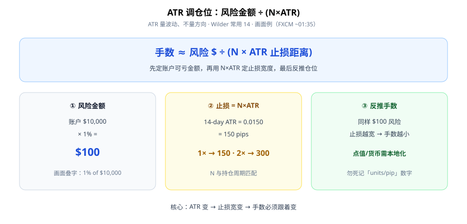
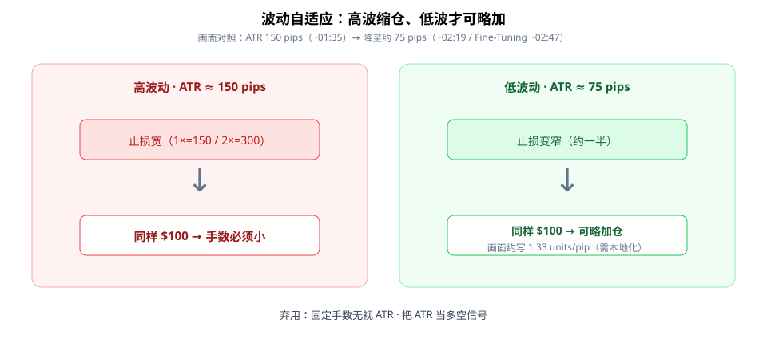

ATR（Average True Range）第一次学，先记住一句：**它量的是波动有多大，不是涨还是跌。** 用它调仓位，不是用它猜方向。

本文只谈一个公式：账户愿亏的钱 ÷（N×ATR 止损距离）→ 手数。画面来自 FXCM 短片（约 3 分钟），数字以叠字为准，点值需你本地化。



**读图（三步）**

- ① 先定 **风险金额**：例账户 $10,000 × 1% = **$100**（画面 ~01:35 叠字）。
- ② 再用 **N×ATR** 定止损宽度：片中 14-day ATR = **0.0150（150 pips）**；常用 **1×=150** 或 **2×=300** pips（~01:07 / ~01:35）。
- ③ 最后反推手数：止损越宽，同样 $100 能开的仓越小。

---

## 1. ATR 是什么（学生版）

J. Welles Wilder 提出的波动度量；实战常看 **14 周期**（片中 GBPUSD 15m 用 ATR 14 RMA）。

- 高 ATR → 平均波幅大 → 同样点数的止损「更贵」。
- 低 ATR → 波幅收窄 → 同样风险金额可以支持略大的手数。
- **绝不**把 ATR 抬头/低头当成多空信号。

可用 Bollinger 等确认波动 regime（画面 ~02:44 同框），但仓位逻辑仍回到风险$÷距离。

---

## 2. 波动变了，手数必须变



**读图（自适应）**

- 左：ATR ≈ **150 pips** 时止损宽，固定 $100 风险 → **强制小仓**。
- 右：ATR 降至约 **75 pips**（~02:19）时止损变窄；画面 Fine-Tuning 段（~02:47）写约 **1.33 units per pip**——意思是「同样风险可略加仓」，**具体换算依赖账户货币与点值，勿照抄数字**。
- N（1× vs 2×）要和持仓周期匹配：短线常用更紧的倍数，波段可略宽。

Checklist：

```text
1. 固定 ATR 周期（例 14）与品种点值换算
2. 先定风险 $（例 1%），再算手数
3. 止损距离用 N×ATR（N 与持仓周期匹配）
4. ATR 上升 → 缩仓；ATR 下降 → 才可考虑略加
5. 勿把 ATR 当多空信号
```

---

## 价值判断：留下什么、丢掉什么

| 做法 | 建议 |
|------|------|
| 风险$ ÷ (N×ATR) 的波动自适应仓位；高波强制减仓 | **采用** |
| 具体 N（1×/2×）与 units/pip 数字；需按品种点值本地化 | **观望** |
| 把 ATR 当方向；固定手数无视 ATR 变化 | **弃用** |

自检一句：这周 ATR 变了，我的手数改了没有？没改就还在「固定手数」陷阱里。

---

## 小结

1. ATR **量波动、不量方向**（Wilder / 常 14）。
2. 仓位 = **风险金额 ÷ (N×ATR 止损)**。
3. 高波缩仓、低波才可略加；N 对齐持仓周期。
4. 点值与货币要本地化，别死记片中 units/pip。

---

## 参考来源

1. FXCM, *Advanced Use of ATR to Adjust Position Size*（https://www.youtube.com/watch?v=JlF7xG8zC98；画面核对笔记：Wilder/14、$10k×1%=$100、150/300 pips、ATR→75、约 1.33 units/pip）。
2. 配图：`atr-sizing-formula.svg`、`atr-vol-adaptive.svg`，教学示意。

*本文为学习笔记，不构成任何投资建议。CFD/杠杆产品风险极高；片中披露英零售约 62%、EU 约 65% 账户亏损。*
