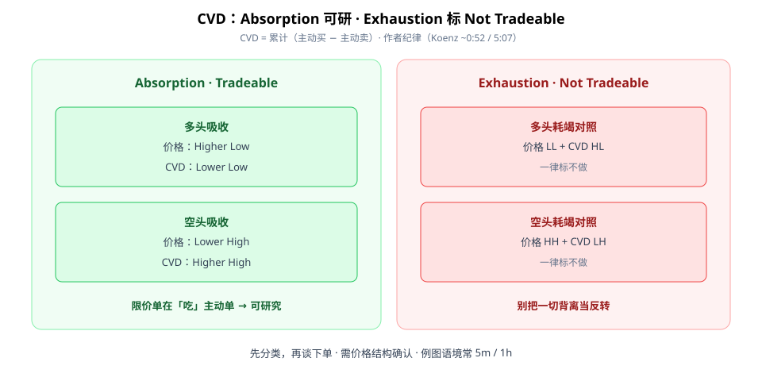
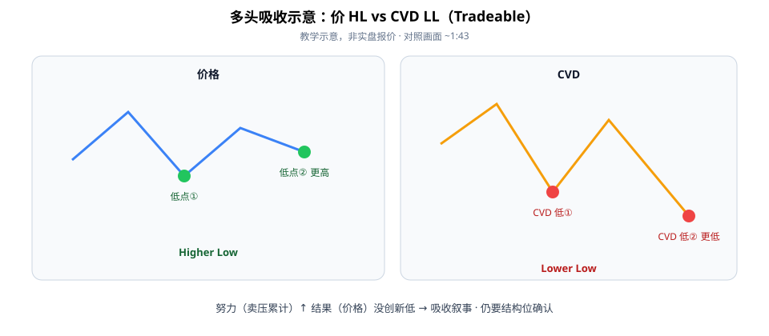

CVD（Cumulative Volume Delta）第一次学，别一看到「背离」就喊反转。作者纪律很硬核：**只做 Absorption（吸收），Exhaustion（耗竭）一律标 Not Tradeable。**

本文只谈分类：价与 CVD 的高低点怎么对照、什么可研究、什么直接划掉。例图语境常 **5 分钟 / 1 小时**（画面 ~8:46）。



**读图（分类墙）**

- 左绿 **Absorption · Tradeable**：多头吸收 = 价 **Higher Low** + CVD **Lower Low**；空头吸收 = 价 **Lower High** + CVD **Higher High**（开场/~1:43/~2:24）。
- 右红 **Exhaustion · Not Tradeable**：价 LL + CVD HL；价 HH + CVD LH——对照图（~4:17–5:07）**一律不做**。
- 叙事直觉：吸收 ≈ 限价单在吃主动单；耗竭 ≠ 自动给你反转单。

---

## 1. CVD 是什么

**CVD = 累计（主动买量 − 主动卖量）**。升偏主动买、降偏主动卖。它回答的是「努力」，价格回答的是「结果」。

- 努力↑ 结果却没创新低/新高 → 才进入「吸收？」讨论。
- 数据源、session 是否重置，会改变曲线形状——先确认你平台的 CVD 定义。

---

## 2. 多头吸收长什么样（可研究）



**读图（多头吸收）**

- 价格做出 **更高的低点（HL）**。
- CVD 同步做出 **更低的低点（LL）**——卖压累计更大，但价格没破前低。
- 作者标 **Tradeable**（~1:43）；仍要放在结构位 / 订单流语境里确认，勿单靠一根背离下单。

空头吸收对偶：价更低高点，CVD 更高高点。

耗竭对照（~5:07）请直接贴标签：**Not Tradeable**——这是本篇最该带走的纪律，不是多一个「也可以做」的花样。

Checklist：

```text
1. 确认 CVD 数据源与 session 重置习惯
2. 先分清 absorption vs exhaustion（对照作者图）
3. 只在结构位上看 absorption；exhaustion 标「不做」
4. 用价格行为确认，勿单靠 CVD 下单
5. 多周期（如 5m + 1h）交叉看
```

---

## 价值判断：留下什么、丢掉什么

| 做法 | 建议 |
|------|------|
| CVD 作努力/结果对照；吸收可研、耗竭慎用/不做 的分类纪律 | **采用** |
| 作者模板/平台参数；加密例图外推到美股需自测 | **观望** |
| 一切背离当反转；忽略 Not Tradeable 硬做 exhaustion | **弃用** |

自检一句：我眼前这张背离，是 absorption 还是 exhaustion？说不清就先不做。

---

## 小结

1. CVD = 累计主动买卖差；看努力 vs 结果。
2. **只做 Absorption**；**Exhaustion 标 Not Tradeable**。
3. 多头吸收：价 HL + CVD LL；需结构确认。
4. 常用 5m/1h 语境交叉，勿单指标下单。

---

## 参考来源

1. Koenz Trading, *Beginners Guide | CVD*（https://www.youtube.com/watch?v=0U0sHmTe1CI；画面：absorption tradeable / exhaustion not tradeable、多头吸收 HL vs LL、耗竭对照图、5m/1h）。
2. 配图：`cvd-absorption-vs-exhaustion.svg`、`cvd-bullish-absorption.svg`，教学示意。

*本文为学习笔记，不构成任何投资建议。片中含 Discord/平台/模板等营销；仅作教育信息。*
