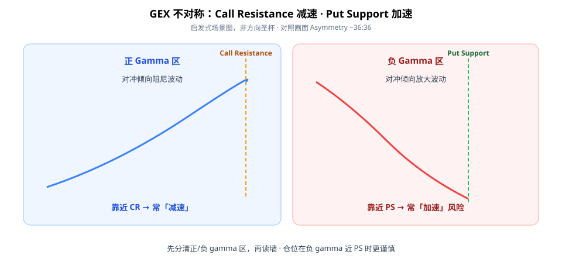
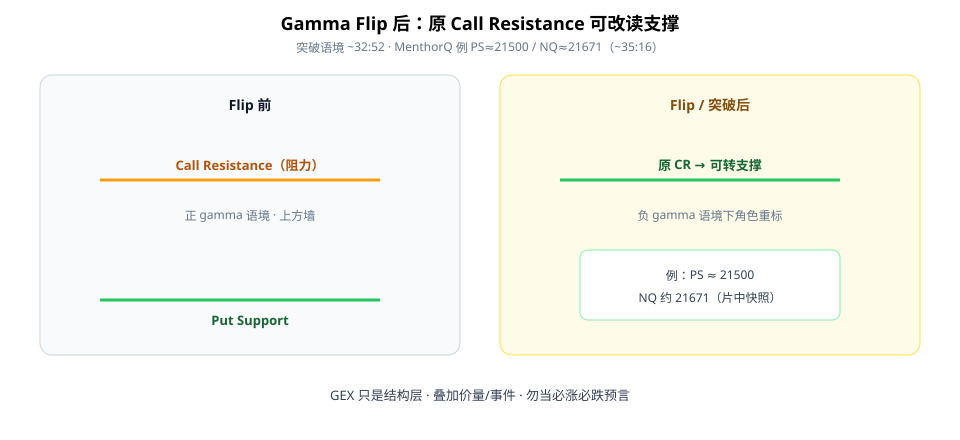

GEX（Gamma Exposure）第一次学，别把它当成「明天必涨/必跌」的圣杯。更有用的是一张**场景图**：正/负 gamma 区里，墙位附近价格行为可能怎样变——以及 **Gamma Flip** 后墙的角色怎么重标。

本文只谈片中可核对的启发式：Call Resistance（CR）减速、Put Support（PS）加速、突破后 CR 转支撑。数值是 MenthorQ 画面快照，不是你此刻的行情。



**读图（不对称）**

- 左 **正 gamma**：经销商对冲倾向**阻尼**波动；靠近 **Call Resistance** 常出现**减速**（~36:36 Asymmetry）。
- 右 **负 gamma**：对冲倾向**放大**波动；靠近 **Put Support** 常出现**加速**下跌压力叙事。
- 用途：调预期与仓位谨慎度——**不是**喊单方向。

---

## 1. GEX 在说什么

GEX 描述期权经销商 gamma / 对冲流对价格行为的**机械影响**（启发式，非完整市场解释）。

粗分：

| 区制 | 对冲直觉 | 读墙时更关注 |
|------|----------|--------------|
| 正 gamma | 阻尼波动 | 近 CR 的减速/均值回归观察 |
| 负 gamma | 放大波动 | 近 PS 的加速风险、更小仓 |

长 call 兑现 → 卖压叙事；长 put 兑现 → 买压叙事；下跌中新 put 需求可迫使加卖——这些是片中机械故事线，需叠加价量/事件，不能单独当扳机。

---

## 2. Gamma Flip：墙的角色会变



**读图（Flip）**

- Flip / 突破语境下，原 **Call Resistance** 可由正 gamma 墙**改读支撑**（~32:52）。
- Put Support 反弹与负 gamma 下机械卖压叙事同屏出现时（~33:59），优先想「风险加速」而非「抄底口令」。
- 片中 MenthorQ 自订层例：NQ 约 **21671**，绿横线 **Put Support ≈ 21500**，双底触碰后上修箭头（~35:16）——**仅作读图练习，非当前水平**。

Checklist：

```text
1. 先分清正/负 gamma 区，勿当方向喊单
2. 标 CR / PS / flip（可信数据源；注意模型假设）
3. 正 gamma 近 CR：预期减速/均值回归偏多观察
4. 负 gamma 近 PS：预期加速风险，仓位更谨慎
5. Flip 后重标墙位角色
6. GEX 只作结构层，叠加价量/事件
```

---

## 价值判断：留下什么、丢掉什么

| 做法 | 建议 |
|------|------|
| 正/负 gamma 不对称（CR 减速 vs PS 加速）；墙位+flip 作场景图 | **采用** |
| 具体 MenthorQ/SpotGamma 数值差异；0DTE 占比变化下的稳定性 | **观望** |
| 把 GEX 当必涨必跌预言；无视 heuristic / 勿硬套免责 | **弃用** |

自检一句：我现在在正还是负 gamma？近的是 CR 还是 PS？说不清就先别用 GEX 定方向。

---

## 小结

1. GEX = 对冲流启发式，**场景图不是预言**。
2. 正 gamma 近 CR → 常减速；负 gamma 近 PS → 常加速风险。
3. **Gamma Flip** 后重标墙：原 CR 可转支撑。
4. 只用结构层 + 价量/事件；数字以你数据源当日为准。

---

## 参考来源

1. Fractal Flow, *The ULTIMATE Beginner's Guide to GEX*（https://www.youtube.com/watch?v=YDbSbkLfi20；画面：CR/PS 不对称 ~36:36、突破翻支撑 ~32:52、MenthorQ PS≈21500 / NQ≈21671 ~35:16）。
2. 配图：`gex-cr-ps-asymmetry.svg`、`gex-gamma-flip.svg`，教学示意。

*本文为学习笔记，不构成任何投资建议。片中强调 GEX 为启发式、勿在不适用情境硬套；含订阅/MenthorQ 等营销。*
