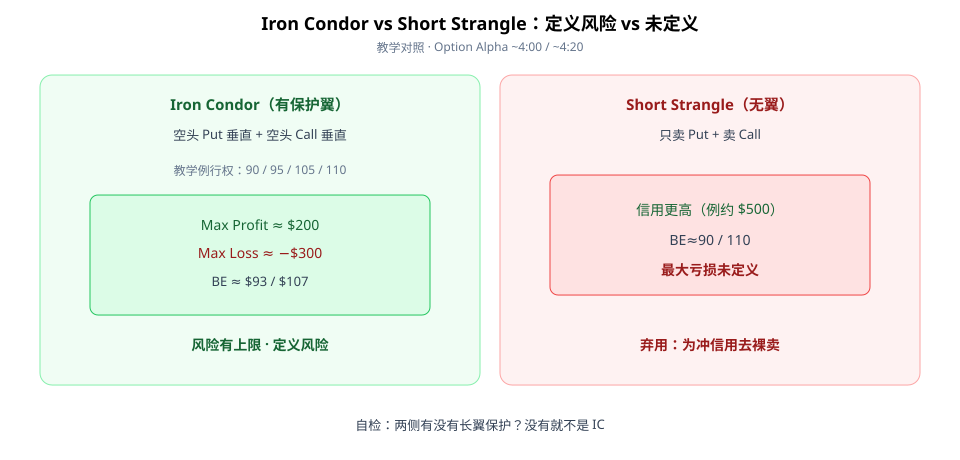
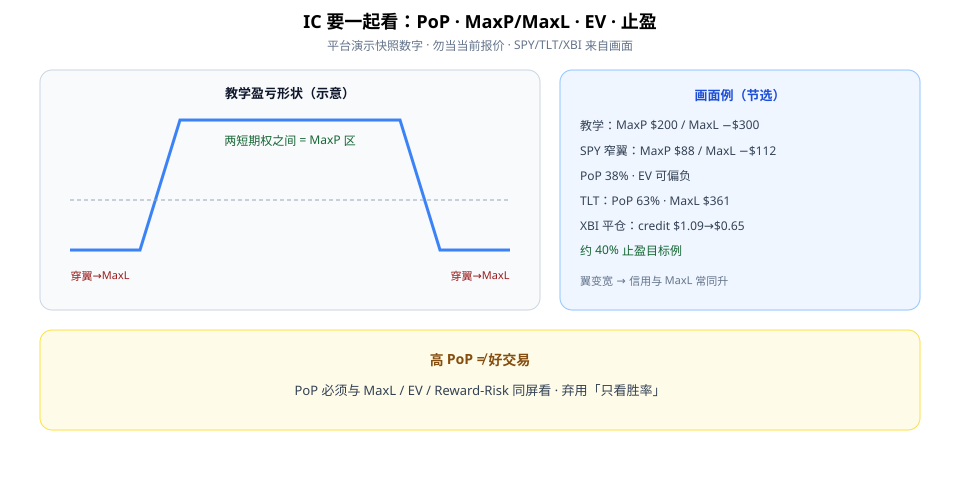

Iron Condor（铁秃鹰）第一次学，先分清它和 Short Strangle：**IC = 两边各做一个 Credit Vertical（有长翼保护）→ 风险有上限；裸 strangle 信用更高但最大亏损未定义。**

本文用教学盈亏图把 MaxP / MaxL / BE 说清楚，再用平台演示数字练习「PoP 不能单独看」。数字是画面快照，不是下单依据。



**读图（定义风险）**

- 左 **Iron Condor**：空头 Put 垂直 + 空头 Call 垂直。教学行权 **90 / 95 / 105 / 110**；**MaxP ≈ $200**、**MaxL ≈ −$300**、BE **$93 / $107**（~4:00）。
- 右 **Short Strangle**：无保护翼；信用可更高（例约 **$500**）、BE≈90/110，但**最大亏损未定义**（~4:20）。
- 自检：两侧有没有长翼？没有就不是 IC。

---

## 1. 盈亏形状与该记的字段

最大利润在两**短**期权之间；价格穿出长翼 → 走到最大亏损区。开仓前至少记下：

```text
四档行权价 · 净信用 · 两侧 BE · MaxP / MaxL · DTE
```

翼变宽时：信用与最大亏损**常常一起变大**（画面加宽翼例 ~17:59）——别只看见「收更多权利金」。

---

## 2. PoP、EV、止盈要同屏



**读图（指标同看）**

- 教学盈亏：中间平台 = MaxP 区，两侧穿翼 = MaxL。
- 画面 SPY 窄翼例（~15:52）：Put **500/502** + Call **558/560**，DTE **22**，mid≈**$0.88**；BE **501.12 / 558.88**；MaxP **$88** / MaxL **−$112**；**PoP 38%**，Reward/Risk≈78.6%，**EV 可偏负**——高胜率幻觉的反例教材。
- TLT 例（~23:00）：PoP **63%**，但 MaxL **$361** vs MaxP **$139**——仍要问「亏得起吗」。
- XBI 平仓例（~32:22）：开仓 credit **$1.09** → 平仓 **$0.65**，约 **40%** 止盈目标、画面示无止损；P/L 约 **$44（~40.37%）**——管理规则示例，非万能模板。

Checklist：

```text
1. 确认是 IC（两侧长翼）而非裸 strangle
2. 记下四档行权、信用、BE、MaxP/MaxL、DTE
3. 同时看 PoP 与 EV/MaxL（高 PoP 可负 EV）
4. 预设止盈/退出（例 40% 目标）
5. 大波动日重新评估两侧风险
```

扫描器演示里还有组合约束例（~$3k、Alpha、EV/合约、reward/risk、PoP、max loss/合约等，~27:31–30:28）——当作「过滤思路」，阈值需自测。

---

## 价值判断：留下什么、丢掉什么

| 做法 | 建议 |
|------|------|
| IC = 两边 credit vertical；定义风险；用 EV/MaxL 约束高胜率幻觉 | **采用** |
| 片中扫描阈值与 SPY/TLT/XBI 具体数字（平台演示快照） | **观望** |
| 为冲信用去裸卖 strangle；只看 PoP 忽略 MaxL/EV | **弃用** |

自检一句：这笔是有翼的 IC，还是我其实在裸卖 strangle？MaxL 写进计划了吗？

---

## 小结

1. IC = **两侧 Credit Vertical**，风险有上限。
2. 别和 **Short Strangle** 搞混：信用高 ≠ 更好。
3. **PoP + MaxL + EV** 同看；翼宽则信用与 MaxL 常同升。
4. 预设退出（如 40% 止盈例）；大波动日重估。

---

## 参考来源

1. Option Alpha, *Iron Condor Strategy 101*（https://www.youtube.com/watch?v=IPDJ4nDiDCo；画面：90/95/105/110 教学图、vs Strangle、SPY/TLT/XBI 演示、40% 止盈）。
2. 配图：`ic-vs-strangle.svg`、`ic-payoff-metrics.svg`，教学示意。

*本文为学习笔记，不构成任何投资建议。期权有到期、保证金与流动性风险；片中为 Option Alpha 平台教育演示。*
