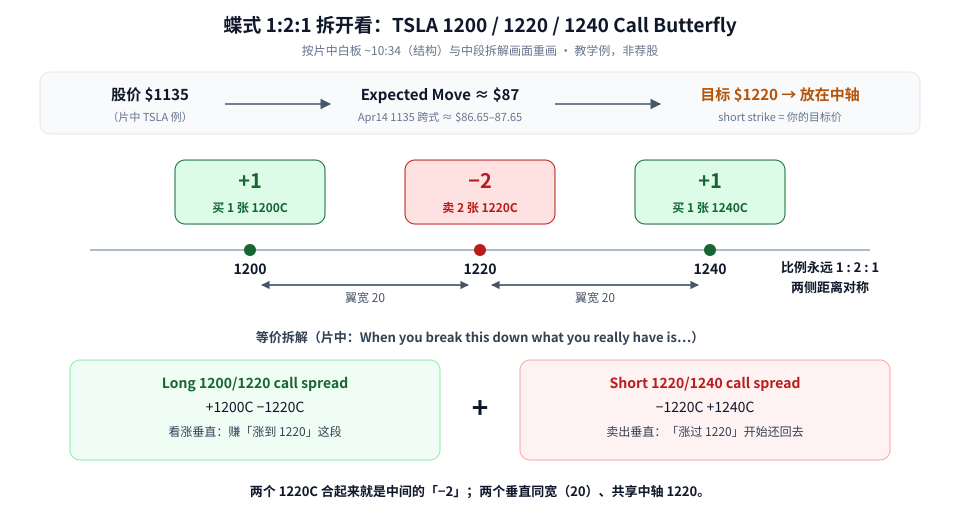
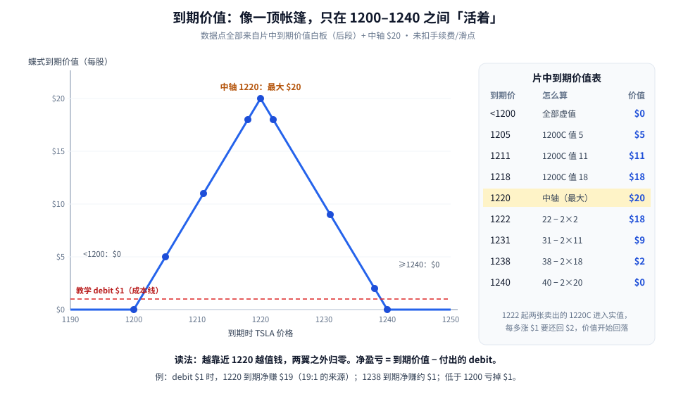
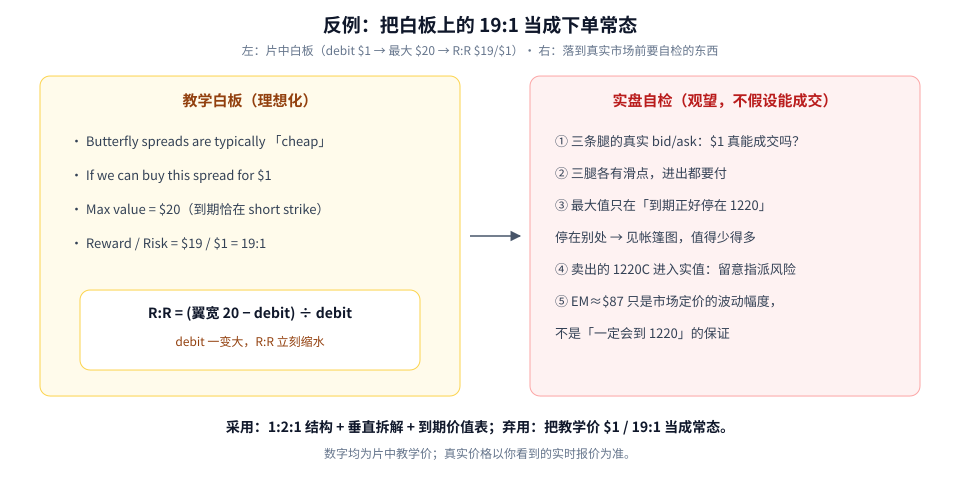

蝶式（Butterfly）第一次学，先记住一句话：**它是「押一个目标价」的结构——到期越接近中间那个行权价，越值钱；离得远了就归零。**

这篇用片中 TSLA 的白板例子，一步步拆：

1. 蝶式长什么样：**三条腿、1:2:1、两边翼宽对称**；
2. 它其实是**两个垂直价差拼起来的**；
3. 到期时在不同价格值多少钱（白板表逐行复算）；
4. 为什么白板上的 **19:1** 不能直接当成实盘常态。

素材为完整看过画面的教学视频，时间戳为视频内时间。所有价格都是**片中教学数字**，不是报价，也不是荐股。

---

## 1. 结构：三条腿，1:2:1，对称



**读图**

- **顶部是「为什么选 1220」的语境**：片中 TSLA 股价约 **$1135**；用 Apr14 的 1135 平值跨式（Straddle）估计 Expected Move，平台上两腿合计约 **$86.65–$87.65**，片中取 **$87**；讲师设定的**目标价是 $1220**（~10:34 白板：*Stock = $1135 and an expected move to April 14th $87 / We are going to target $1,220*）。
- **中间是三条腿**：买 1 张 1200 Call、卖 2 张 1220 Call、买 1 张 1240 Call。白板原话：*A butterfly consists of 3 options / Always in a 1 : 2 : 1 / The distance between the strikes is symmetrical.*
- **目标价放在中轴**：卖出的那两张（short strike）就是你押的目标价。片中讲师在期权链上指着说 1220 是「我们要卖的那个」。
- **两边翼宽都是 20**（1200→1220、1220→1240），这就是「对称」。
- **底部是等价拆解**：*When you break this down what you really have is… Long 1200/1220 call spread + Short 1220/1240 call spread.* 两个 1220C 合在一起，正好是中间的「−2」。

### 用垂直价差来理解，最不容易乱

如果你已经学过垂直价差（Vertical Spread），蝶式就一点都不神秘：

```text
Long  1200/1220 call spread：+1200C −1220C  → 赚「从 1200 涨到 1220」这一段
Short 1220/1240 call spread：−1220C +1240C  → 「涨过 1220」以后开始把钱还回去
合起来：+1200C −2×1220C +1240C  = 1200/1220/1240 call butterfly
```

所以蝶式的直觉是：**先吃一段涨幅，再把超过目标的部分让出去**——你不需要它涨很多，你需要它**停在目标附近**。

---

## 2. 到期价值：一顶帐篷

片中后段讲师在白板上逐行算「到期时股价在 X，这个蝶式值多少」。下面把表和图放在一起：



**读图**

- 横轴是到期时 TSLA 价格，纵轴是蝶式的**到期价值**（每股，未扣成本）。
- **低于 1200**：三张 call 全部虚值 → **$0**。
- **1200 到 1220 之间**：只有买入的 1200C 有价值，股价每涨 $1 就多 $1 —— 白板例：**1205 → $5，1211 → $11，1218 → $18**。
- **正好在 1220**：达到最大值 **$20**（= 翼宽）。
- **1220 到 1240 之间**：卖出的两张 1220C 也变成实值了，要「还钱」，而且是**两倍速度**。白板写法：
  - **1222**：1200C 值 22，两张 1220C 各 2 → 22 − 2×2 = **$18**
  - **1231**：31 − 2×11 = **$9**
  - **1238**：38 − 2×18 = **$2**
  - **1240**：40 − 2×20 = **$0**
- **1240 以上**：买入的 1240C 开始补回卖出腿多出来的亏损，整体一直是 **$0**——这就是长翼的保护作用，风险被锁住了。
- 红色虚线是教学里的**成本 $1**：到期价值高于它才算赚钱。

> 自己动手：把 1225 代进去算一次。1200C 值 25，两张 1220C 各值 5 → 25 − 10 = 15。和帐篷图对一下，是不是正好在 1220 右边往下走的斜线上？

### 净盈亏 = 到期价值 − 你付出的成本

片中讲师说蝶式「通常很便宜」（白板上把 *cheap* 圈了出来），并假设 **能以 $1 买进**：

```text
最大价值 $20（到期正好在 1220）
减去成本 $1
= 最大净利 $19，最大风险 $1  →  Reward / Risk = $19 / $1 = 19:1
```

这就是标题里「19:1」的来源。

---

## 3. 反例：把白板 19:1 当成下单常态



**读图**

- **左边是白板原话**：*Butterfly spreads are typically cheap / If we can buy this spread for $1 / Max value = $20, if stock goes to short strike at expiration / Reward/Risk = $19/$1 = 19:1*。注意讲师自己在「到期正好到 short strike」后面打了一串问号——这本来就是**最理想**的情形。
- **公式框**：R:R = (翼宽 20 − 成本) ÷ 成本。成本只要比 $1 高一点，R:R 就会明显缩水。所以「能不能真的以这个价格成交」决定了一切。
- **右边是落到真实市场前的自检**：
  - ① 三条腿的真实买卖价差：教学价 $1 真的能成交吗？
  - ② 三腿进出各有滑点，开仓、平仓都要付；
  - ③ 最大值只出现在「到期正好停在 1220」，停在别处要回去看帐篷图；
  - ④ 卖出的 1220C 进入实值后，要留意被提前指派（行权）的可能；
  - ⑤ Expected Move ≈ $87 只是市场定价出来的波动幅度，**不是**「一定会涨到 1220」的保证。
- 片中下单演示界面也标注了 *POSITION ADJUST, NOT A REAL ORDER*——演示就是演示。

---

## 4. 一张开仓前的 Checklist

```text
1. 先定方向和目标价 → 目标价 = 中轴（short strike）
2. 比例必须 1:2:1，两边翼宽对称
3. 用 Expected Move / 跨式价格检查：目标离现价是不是太离谱
4. 看真实成本 vs 翼宽（理论最大值），算真实 R:R（含滑点、手续费）
5. 记住：越临近到期，中轴附近价值越高；价格远离则有归零风险
```

---

## 价值判断：留下什么、丢掉什么

| 做法 | 建议 |
|------|------|
| 1:2:1 + 对称翼；拆成「长垂直 + 短垂直」理解；用 Expected Move 给目标价找语境；用到期价值表 / 帐篷图读盈亏 | **采用** |
| 片中 $1 成本、19:1 这类教学价在真实市场里能否成交 | **观望** |
| 把教学 $1 / 19:1 当成常态；无视流动性与提前指派；把 Expected Move 当必达目标 | **弃用** |

自检一句：我押的目标价是哪一个？如果到期没停在那里，帐篷图上我落在哪？真实成本算出来 R:R 还剩多少？

---

## 小结

1. 蝶式 = 三条腿，**1:2:1**，两边翼宽**对称**；目标价放在中轴。
2. 等价于 **Long 1200/1220 call spread + Short 1220/1240 call spread**。
3. 到期价值像帐篷：两翼之外 $0，中轴最大（= 翼宽 $20），过中轴后以两倍速度回落。
4. 19:1 来自「成本 $1 + 到期正好在中轴」的理想假设，实盘要自己重算。

延伸阅读：先把垂直价差打牢——[垂直价差：Debit-Credit、IV-Rank 分段与 Delta 选腿](./2026-09-17-垂直价差：Debit-Credit、IV-Rank分段与Delta选腿.md)；Expected Move 的算法见 [Expected-Move：Straddle×0.85 与 (Straddle+Strangle)÷2](./2026-09-17-Expected-Move：Straddle×0.85与%28Straddle+Strangle%29÷2.md)。

---

## 参考来源

1. Prosper Trading Academy, *Butterfly Spread Options Trading Strategy (2025 ULTIMATE Guide)*（https://www.youtube.com/watch?v=SB8fO13T8dY；完整观看画面：TSLA 期权链与 Apr14 1135 跨式约 $86.65–$87.65、~10:34 白板结构（$1135 / EM $87 / 目标 $1220 / 1:2:1 / 1200/1220/1240）、长短垂直拆解、$1 成本 → 最大 $20 → 19:1、到期价值表，片尾 21:19）。
2. 配图：`fly-structure-decomp.svg`、`fly-expiry-value.svg`、`fly-teaching-vs-real.svg`，依据片中白板重画的教学示意。

*仅供学习，不构成投资建议。期权有到期归零、指派、保证金与流动性风险；片中为 Prosper Trading Academy 教学演示，非真实下单。*
