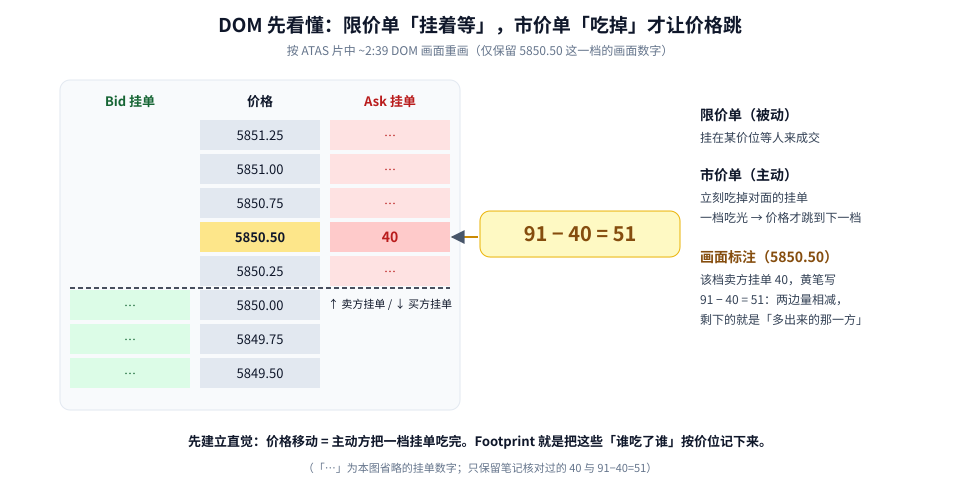
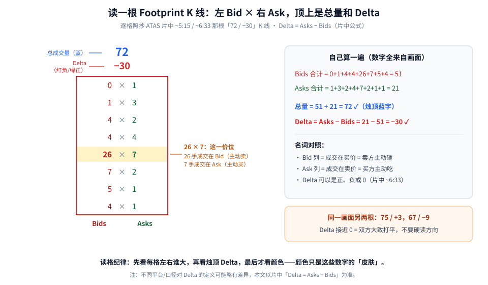
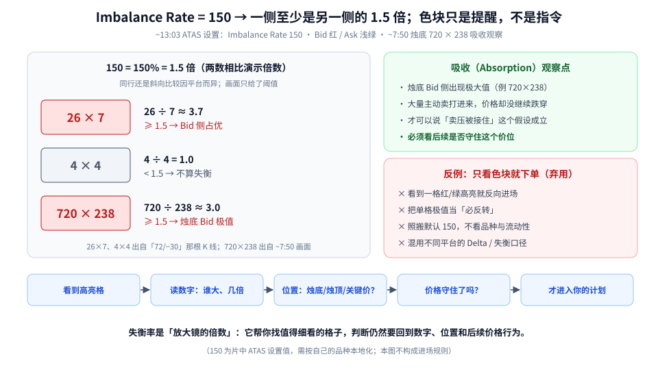

Footprint（足迹图）第一次看，满屏数字加红绿色块，很容易直接被颜色带着走。这篇的目标很朴素：**先学会读数字，再谈颜色。**

按从底层到上层的顺序：

1. **DOM**：限价单和市价单到底谁推动了价格；
2. **Footprint 格子**：每一格左 Bid × 右 Ask 是什么意思；
3. **Delta = Asks − Bids**：拿片中一根真实的 K 线，逐格算一遍；
4. **Imbalance Rate = 150**：为什么 150 就是 1.5 倍，以及为什么「只看色块下单」要丢掉。

素材是 ATAS 的教学视频（完整看过画面），时间戳为视频内时间。文中所有数字都来自片中画面，不是行情。

---

## 1. 地基：DOM 里谁在推价格



**读图**

- **DOM（Depth of Market，盘口深度）** 中间一列是价格，两边是挂在各价位、还没成交的限价单：上方是卖方挂单（Ask），下方是买方挂单（Bid）。
- **限价单是被动的**：挂在那里等别人来成交。**市价单是主动的**：立刻吃掉对面的挂单。
- **价格为什么会跳？** 因为主动方把某一档的挂单**吃光**了，下一笔成交只能发生在下一档。片中 ~3:54 用 *MARKET* 标注演示了市价单往上吃挂单的过程。
- 片中 ~2:39 在 **5850.50** 这一档（画面上该档卖方挂单为 **40**）旁用黄笔写了 **`91 − 40 = 51`**。笔记把它记为这一价位两边量相减的演算：**减完剩下的，就是「多出来的那一方」**——这正是后面 Delta 的直觉来源。
- 图里的「…」是故意省略的挂单数字，只保留核对过的 40 和 91−40=51。

**一句话：价格移动 = 主动方把一档挂单吃完。** Footprint 做的事，就是把「谁吃了谁」按价位、按 K 线记下来。

---

## 2. 读一根 Footprint K 线

普通 K 线只告诉你开高低收。Footprint 把一根 K 线**拆成每个价位的一格**，每格写成 `Bid × Ask`：

- **左边（Bids）**：成交在买价上的量 = 卖方主动砸下来的量；
- **右边（Asks）**：成交在卖价上的量 = 买方主动吃上去的量。

K 线顶上通常还有两个数：**蓝色是总成交量，红 / 绿是 Delta**（负为红、正为绿）。



**读图**

- 这根 K 线是逐格照抄片中 ~5:15 / ~6:33 画面里那根「**72 / −30**」：从上到下 `0×1、1×3、4×2、4×4、26×7、7×2、5×1、4×1`。
- 黄底那格 **26 × 7**（片中 ~5:15 用 Bids / Asks 箭头标出来的就是这一格）：这个价位上，**26 手成交在 Bid（主动卖），7 手成交在 Ask（主动买）**。
- 右边方框自己算一遍：
  - Bids 合计 = 0+1+4+4+26+7+5+4 = **51**
  - Asks 合计 = 1+3+2+4+7+2+1+1 = **21**
  - 总量 = 51 + 21 = **72** ✓（对上烛顶蓝字）
  - **Delta = Asks − Bids = 21 − 51 = −30** ✓（对上烛顶红字）
- 片中 ~6:33 的白板公式就是 **Delta = Asks − Bids**，并强调 *it can be any positive or negative number or zero*——Delta 可正、可负、可为 0。
- 同一画面另外两根：**75 / +3**、**67 / −9**。Delta 接近 0，说明双方大致打平，别硬读方向。

> 练习：你可以在片中那根「67 / −9」上按同样方法算一次——左列加起来、右列加起来，看看是不是总量 67、Delta −9。能自己算对，才算真的会读格。

**口径提醒**：有些平台 / 指标（比如一些 CVD 口径）写作「主动买 − 主动卖」，和这里的 Asks − Bids 本质同族，但细节可能不同。本文以片中足迹格的定义为准，换平台先看说明。

---

## 3. 失衡率 150 与「吸收」

片中 ~13:03 打开了 ATAS 的图表设置：**Bid/Ask Imbalance → Imbalance Rate = 150**，Bid 颜色 Red、Ask 颜色 LightGreen。字幕说得很直接：*means that one side should be at least 1 and 1 half times*——**一侧至少是另一侧的 1.5 倍**，才会被高亮成「失衡」。



**读图**

- **150 = 150% = 1.5 倍**。不是玄学指标，就是一个倍数门槛。
- 左侧用画面里出现过的格子演示「倍数」这个概念（按两个数直接相比）：
  - **26 × 7**：26 ÷ 7 ≈ 3.7，超过 1.5 → Bid 侧占优；
  - **4 × 4**：4 ÷ 4 = 1.0，不到 1.5 → 不算失衡；
  - **720 × 238**：720 ÷ 238 ≈ 3.0，超过 1.5 → 烛底 Bid 侧极值。
- 注意框里的小字：**到底是同一行左右比，还是斜着跟相邻价位比，不同平台做法不同**；片中画面只给了阈值 150。上面的除法是为了让你理解「倍数」，真正高亮哪一格，以平台规则为准。
- **右上（吸收 Absorption）**：片中 ~7:50 圈出一根 K 线**烛底**的 **720 × 238**，字幕强调 *extremely high values on the bid side at the bottom of the candle*。读法语境是：大量主动卖打了进来，价格却没有继续跌穿——**卖压可能被接住了**。但这个假设必须看**后续是否守住这个价位**才成立。
- **右下（反例，弃用）**：看到一格红 / 绿高亮就反向进场；把单格极值当「必反转」；照搬默认 150 不看品种；混用不同平台的 Delta / 失衡口径。
- **底部流程**：看到高亮格 → 读数字（谁大、几倍）→ 看位置（烛底？烛顶？关键价位？）→ 价格守住了吗？→ 才进入你的计划。

---

## 4. 读格 Checklist

```text
1. 先懂 DOM：谁挂限价（被动）、谁用市价（主动）推价
2. 读格：左 Bid / 右 Ask；再看烛顶总量与 Delta
3. 能手算：随便挑一根，左列求和、右列求和，对上烛顶数字
4. 极值格（吸收）要结合「价位守没守住」，不单看数字大小
5. 失衡阈值（如 150）按自己的品种本地化，别把默认值当圣杯
6. 换平台先核对 Delta / 失衡的定义口径
```

片中后段还演示了簇高亮、策略示意页和图表设置，那部分具体入场规则没有做实盘验证，本文不当作可用规则。

---

## 价值判断：留下什么、丢掉什么

| 做法 | 建议 |
|------|------|
| 足迹格结构（左 Bid × 右 Ask）；Delta = Asks − Bids 并能手算核对；DOM `91 − 40 = 51` 的演算直觉；失衡率 150 = 1.5 倍；烛底大 Bid 作为吸收观察点 | **采用** |
| ATAS 默认参数迁移到其他平台；策略页的具体入场规则（未做实盘验证） | **观望** |
| 只看失衡色块就下单；把单格极值当必反转 | **弃用** |

自检一句：这格为什么是红的？我能说出左右两个数、几倍、在 K 线的哪个位置、后面价格有没有守住吗？

---

## 小结

1. DOM：**市价单吃光一档挂单，价格才会跳**。
2. Footprint 每格 = `Bid × Ask`；烛顶 = 总量 + Delta。
3. **Delta = Asks − Bids**：片中「72 / −30」那根，21 − 51 = −30，可手算核对。
4. **Imbalance Rate 150** = 一侧至少 1.5 倍才高亮；色块是提醒，不是指令。
5. 吸收要看「大量打进来 + 价位守住」，单格数字不够。

延伸阅读：[CVD：只做 Absorption，Exhaustion 标 Not-Tradeable](./2026-09-18-CVD：只做Absorption，Exhaustion标Not-Tradeable.md)。

---

## 参考来源

1. ATAS, *Footprint Chart Explained: Introduction to Trading Strategies*（https://www.youtube.com/watch?v=tCSISuPe6CI；完整观看画面：~2:39 DOM 5850.50 与 `91 − 40 = 51`、~3:54 市价单吃挂单、~5:15 足迹格 Bids / Asks（26 × 7、烛顶 72 / −30）、~6:33 Delta = Asks − Bids（67 / −9）、~7:50 烛底 720 × 238、~13:03 Imbalance Rate 150，片尾 14:04）。
2. 配图：`fp-dom-market-order.svg`、`fp-cell-anatomy-delta.svg`、`fp-imbalance-absorption.svg`，依据片中画面重画的教学示意。

*仅供学习，不构成投资建议。订单流工具只描述已发生的成交，不预测未来；期货等杠杆品种风险较高。片中为 ATAS 平台教学演示。*
