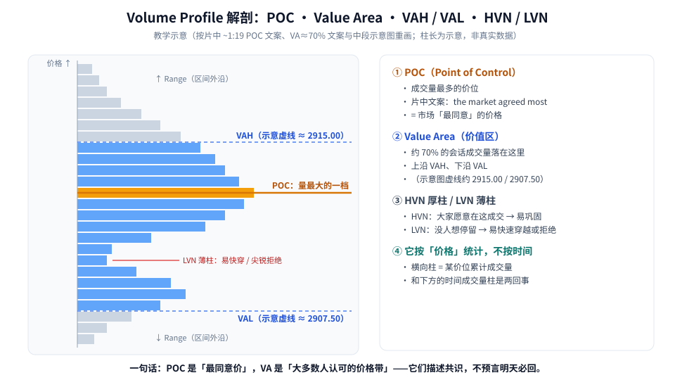
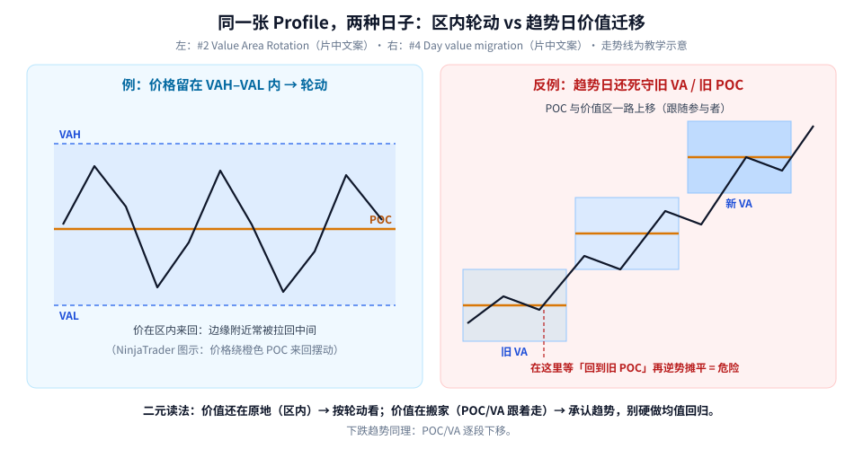
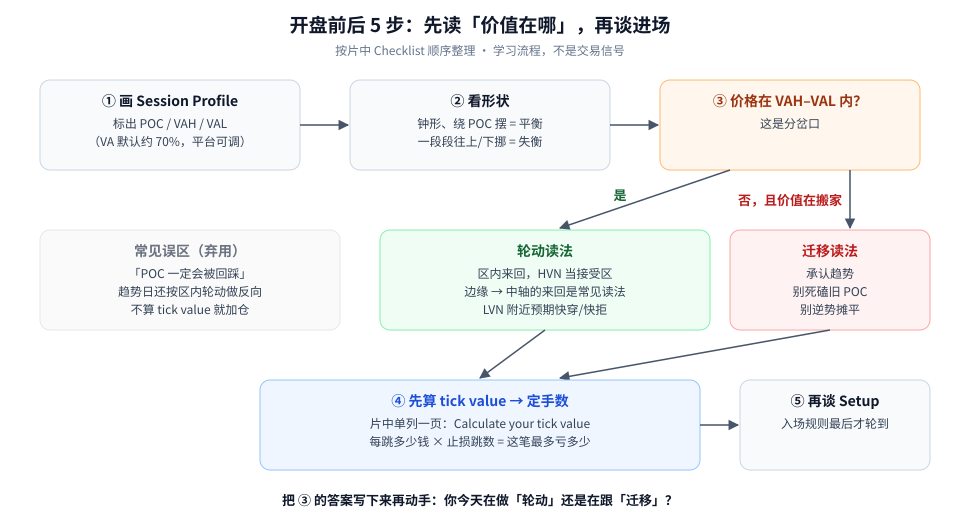

第一次接触 Volume Profile（成交量分布），最容易卡在一个地方：**它和 K 线下面那排成交量柱不是一回事。** 普通成交量柱按「时间」统计（每根 K 线成交多少），Volume Profile 按「价格」统计（每个价位累计成交多少），所以它是横着画在图上的。

这篇只做三件事：

1. 把 POC、Value Area、VAH / VAL、HVN / LVN 这几个词讲清楚；
2. 学会一个二元判断：**今天价值在原地（轮动），还是在搬家（迁移）？**
3. 记住片中单独强调的一步：**先算 tick value，再谈仓位。**

素材来自 NinjaTrader 的教学视频（完整看过画面），文中时间戳为视频内时间。图里的数字是片中示意图的读数，不是行情。

---

## 1. 先认识这张图：POC 与价值区



**读图**

- 横向的柱子越长，说明**那个价位成交越多**。纵轴是价格，不是时间。
- 最长那根（橙线）就是 **POC（Point of Control）**。片中 ~1:19 的原文是：*Point of control (POC) shows you where the market agreed most.* —— 用大白话说：**买卖双方在这里「最谈得拢」**，所以成交最多。
- 浅蓝区是 **Value Area（价值区）**。片中文案：*Represents roughly 70% of the traded volume for a session.* 也就是**一个交易时段约 70% 的成交量落在这个价格带里**。上沿叫 **VAH**，下沿叫 **VAL**。
- 片中示意图上，价值区附近的两条虚线读数约为 **2915.00（上）/ 2907.50（下）**。这里只拿它当看图的参照点，你自己的品种和时段数值肯定不一样。
- **HVN（高成交量节点）** 是厚柱：大家愿意在这里反复成交，价格到这儿容易停下来、磨一阵。**LVN（低成交量节点）** 是薄柱：没人愿意停留，价格到这儿往往要么快速穿过去，要么很快被推回来。

> 小白常问：为什么是 70%？这是 Value Area 的常见默认口径（有点像统计里「约一个标准差」的思路），很多平台允许你改。先按默认理解，别纠结。

---

## 2. 最重要的分岔：轮动 vs 迁移

片中把好几种用法编了号，本文只挑最适合入门的两条：**#2 Value Area Rotation** 和 **#4 Day value migration**。它们其实是同一个问题的两个答案——**价值到底在不在原地？**



**读图**

- **左（例）**：价格一直待在 VAH 和 VAL 之间，绕着橙色 POC 来回摆。片中文案是 *If price stays inside VAH and VAL, some traders may view the market as rotational.* 注意原话用的是 **some traders may view**——「有人会这样看」，不是「一定这样走」。
- 片中多段 Profile 的示意图里，价格就在一组级别之间来回（画面可见 2915.00、2913.75、2910.75、2909.75、2907.50 等标注），这就是「平衡 / 轮动」的样子。
- **右（反例）**：趋势日里，POC 和价值区**一段一段往上挪**。片中文案：*On strong trend days, value doesn't stay in one place… the POC and value areas shift steadily higher in an uptrend — or lower in a downtrend — as participation follows price.* 也就是说，**参与者跟着价格走了，「最同意价」也跟着走了**。
- 右图红色虚线处，就是新手常犯的错：还守着早上的旧 POC，等它「回来」，并且逆势加仓摊平。趋势日里，旧 POC 可能当天都不回来。

**一句话记住：** 价值在原地 → 按轮动理解；价值在搬家 → 承认趋势，别硬做均值回归。

---

## 3. 把它变成开盘前后的流程

光懂概念不够，得变成每天都能照做的步骤。下面把片中的 Checklist 按顺序画成流程：



**读图**

- **① 画 Profile**：选好时段（Session）或区间，标出 POC、VAH、VAL。
- **② 看形状**：像一口钟、价格绕 POC 摆，是平衡；一段段往上或往下挪，是失衡。
- **③ 分岔口**：价格在 VAH–VAL 里面吗？
  - 在里面 → **轮动读法**：HVN 当「接受区」，LVN 附近预期快穿或快拒；
  - 出去了，而且 POC / 价值区跟着搬 → **迁移读法**：承认趋势，别死磕旧 POC，别逆势摊平。
- **④ 先算 tick value**：片中专门用一页讲 Position sizing，只有一个勾选项 —— *Calculate your tick value*。每跳多少钱 × 止损有几跳 = 这笔最多亏多少，然后才决定手数。
- **⑤ 最后才是 Setup**：入场规则排在最后，不是最前。
- 左侧灰框是要丢掉的习惯：「POC 一定会被回踩」、趋势日还按区内轮动做反向、不算 tick value 就加仓。

### tick value 为什么要单独拿出来讲？

因为 Volume Profile 给你的是**价位**，不是**钱**。同样「止损放在 VAL 下面几跳」，不同合约每跳价值不同，亏损金额可能差好几倍。所以顺序必须是：

```text
先确定止损放在哪（结构位） → 数出离入场有几跳
→ 乘以 tick value 得到单手风险 → 用你愿意承担的金额反推手数
```

---

## 4. 新手最容易误会的三件事

1. **「POC 是磁铁，一定会回来。」** 不对。POC 描述的是**过去**这段时间哪里成交最多，是共识的记录，不是对明天的承诺。平衡日里价格常回到 POC 附近，趋势日里可能一去不回。
2. **「价格碰到 VAH 就该做空、碰到 VAL 就该做多。」** 只在「价值还在原地」时才有讨论意义；一旦价值开始迁移，边缘反而可能是新价值区的起点。
3. **「HVN / LVN 有标准阈值。」** 没有。多厚算厚、多薄算薄，本身有主观成分，平台参数（价值区百分比、时段切分）也会改变图的样子。

---

## 价值判断：留下什么、丢掉什么

| 做法 | 建议 |
|------|------|
| POC = 最同意价、VA≈70%；用「区内轮动 vs 价值迁移」做二元判断；先算 tick value 再定手数 | **采用** |
| NinjaTrader 平台特有参数（价值区 %、Session 切分）搬到自己的平台；HVN / LVN 的厚薄阈值 | **观望** |
| 把 POC 当必回磁铁；趋势日还死磕旧 VA、逆势摊平；不算 tick value 就加仓 | **弃用** |

自检一句：我现在是在做「轮动」，还是价值已经在「搬家」了？这笔每跳多少钱、最多亏多少，我写下来了吗？

---

## 小结

1. Volume Profile 按**价格**统计成交量，横着看。
2. **POC** = 成交最多 = 市场最同意的价格；**Value Area** ≈ 70% 成交量，上下沿是 VAH / VAL。
3. **HVN** 容易停、**LVN** 容易快穿或快拒。
4. 核心判断：价在 VAH–VAL 内 → 轮动；POC / 价值区跟着价格走 → 迁移，承认趋势。
5. 先算 **tick value**，再谈仓位和 Setup。

延伸阅读：同样讲「平衡市 vs 趋势日」的 [Session VWAP：平衡市可回归，趋势日别逆势摊平](./2026-09-16-Session%20VWAP：平衡市可回归，趋势日别逆势摊平.md)。

---

## 参考来源

1. NinjaTrader Essentials, *Volume Profile Strategy: The Complete Breakdown*（https://www.youtube.com/watch?v=sgL4bJ2cpMo；完整观看画面：~1:19 POC 文案、Value Area≈70% 文案、POC / VA 示意图（虚线约 2915.00 / 2907.50）、Position sizing「Calculate your tick value」、#2 Value Area Rotation、#4 Day value migration、片尾 10:34）。
2. 配图：`vp-poc-va-anatomy.svg`、`vp-rotation-vs-migration.svg`、`vp-read-flow.svg`，均为依据片中画面重画的教学示意，柱长与走势线非真实数据。

*仅供学习，不构成投资建议。期货等杠杆品种风险较高；片中为 NinjaTrader 平台教学示意，不是荐股或喊单。*
