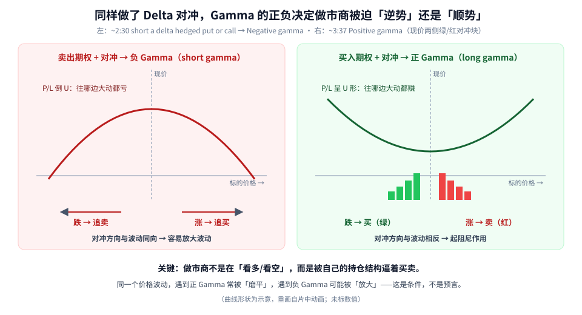
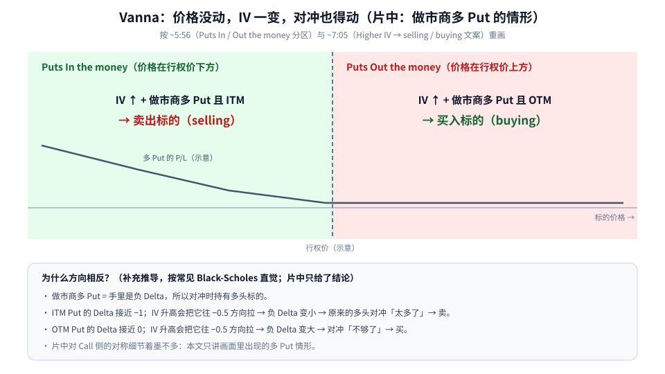
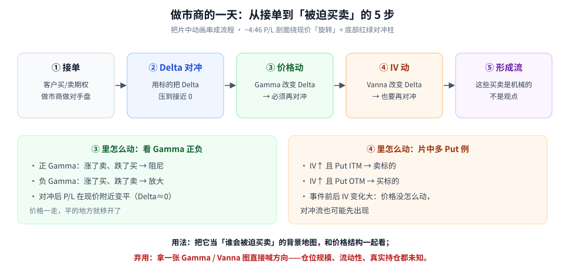

很多人第一次听到「做市商在买 / 在卖」，会下意识理解成「做市商看多 / 看空」。这篇要纠正的就是这个直觉：

> **做市商（Market Maker, MM）大多不赌方向。他们接了客户的期权单之后，用标的把 Delta 对冲掉；之后的买卖，很多是被持仓结构「逼」出来的。**

逼他们动手的有两个开关：

- **价格动了** → Gamma 让 Delta 变了 → 要再对冲；
- **隐含波动率（IV）动了** → Vanna 让 Delta 变了 → 也要再对冲。

素材是一支 8 分多钟的动画教学视频（完整看过画面），时间戳为视频内时间。动画里的曲线没有标数值，本文配图同样只画形状。

---

## 0. 四个名词先对齐

| 名词 | 一句话 |
|------|--------|
| **Delta** | 标的涨 $1，期权价格大约变多少；也可以理解成「这张期权相当于多少股标的」 |
| **Delta 对冲** | 用买卖标的把整体 Delta 压到接近 0，让持仓对小幅涨跌不敏感 |
| **Gamma** | 标的每动一点，Delta 自己会变多少；Gamma 越大，对冲越要频繁调整 |
| **Vanna** | IV 变化时，Delta 会变多少；IV 一变，对冲也得跟着改 |

---

## 1. 同样做了对冲，Gamma 的正负决定「逆势」还是「顺势」

片中先演示 *Market Maker Short a call*（~1:22）：做市商卖出一张 call，P/L 曲线在「Price of underlying」右侧往下弯——标的涨得越多越亏。然后做市商用标的对冲，曲线会「旋转」到现价附近变平（~4:46 的动画里 P/L 波形绕着现价转，底部出现红绿对冲柱）。

对冲完以后，关键就看**持仓是卖出期权还是买入期权**：

**读图**

- **左：卖出期权 + 对冲 → 负 Gamma**。片中 ~2:30 标题：*Market maker short a delta hedged put or call*，下方标注 *Market maker short gamma (Negative gamma)*，曲线是倒 U 形：往哪边大动都亏。
- 负 Gamma 的对冲方向和价格波动**同向**：涨了要追买、跌了要追卖 → 容易**放大**波动。
- **右：买入期权 + 对冲 → 正 Gamma**。片中 ~3:37 标题：*Market maker long gamma (Positive gamma)*，曲线呈 U 形；现价竖线**左边是绿色方块（跌了买），右边是红色方块（涨了卖）**。
- 正 Gamma 的对冲方向和价格波动**相反**：涨了卖、跌了买 → 起**阻尼**作用，像给价格加了减震器。
- 底部那句话最重要：做市商不是在表达观点，而是在执行持仓结构要求的对冲。

### 为什么正 Gamma 是「涨卖跌买」？（用 Delta 推一遍）

1. 做市商买入期权后对冲，初始 Delta ≈ 0；
2. 正 Gamma 意味着：**标的涨 → 持仓 Delta 变正**（等于意外多了一些多头）；
3. 要回到 0，就得**卖出**标的；跌的时候反过来，Delta 变负 → **买入**标的。

负 Gamma 把第 2 步的符号反过来：涨了 Delta 变负 → 要**买**；跌了 Delta 变正 → 要**卖**。这就是「追涨杀跌式对冲」。

---

## 2. Vanna：价格没动，IV 一变，对冲也得动

片中 ~5:56 把画面一分为二：左边绿色 *Puts In the money*，右边红色 *Puts Out the money*。~7:05 给出结论：

**读图**

- 画面前提：**做市商手里是多头 Put**（long puts），并且已经用标的对冲。
- **左（Put 实值 ITM，价格在行权价下方）**：片中文案 *Higher implied volatility when market maker long puts are ITM leads to selling* —— IV 上升 → 做市商**卖出**标的。画面中轴附近出现了红色卖单柱。
- **右（Put 虚值 OTM，价格在行权价上方）**：*Higher implied volatility when market maker long puts are OTM leads to buying* —— IV 上升 → 做市商**买入**标的。
- 下方灰框是补充推导（按常见的 Black-Scholes 直觉；片中只给了结论，没展开公式）：
  - 多 Put = 负 Delta，所以对冲时持有**多头标的**；
  - ITM Put 的 Delta 接近 −1，IV 升高会把它往 −0.5 拉 → 负 Delta 变小 → 原来的多头对冲「太多了」→ **卖**；
  - OTM Put 的 Delta 接近 0，IV 升高也把它往 −0.5 拉 → 负 Delta 变大 → 对冲「不够了」→ **买**。
- 片中侧重多 Put 的示意，Call 侧的对称细节讲得不多，本文不自行延伸。

**为什么这件事值得学？** 因为 IV 常常在事件前后大幅变化（财报、宏观数据等）。**价格还没怎么动，IV 先动了，对冲流就可能先出现。** 这解释了一些「没有新闻、价格却被推着走」的时刻——当然，只是可能的解释之一。

---

## 3. 把它串成流程

**读图**

- **① 接单**：客户买或卖期权，做市商做对手盘。
- **② Delta 对冲**：用标的把 Delta 压到接近 0。对冲后 P/L 曲线在现价附近变平。
- **③ 价格动**：Gamma 改变 Delta → 必须再对冲。正 Gamma 涨卖跌买（阻尼），负 Gamma 涨买跌卖（放大）。
- **④ IV 动**：Vanna 改变 Delta → 也要再对冲。片中多 Put 例：IV↑ 且 ITM → 卖，IV↑ 且 OTM → 买。
- **⑤ 形成流**：这些买卖是**机械的**，不是观点。
- 最下方红字是本文最想强调的边界：**别拿一张 Gamma / Vanna 图直接喊方向**——做市商真实持仓、规模、流动性，外人都只能估计。

---

## 4. 怎么用、怎么不用

**可以这样用：**

1. 先判断当前环境大致是正 Gamma 还是负 Gamma（可以和 GEX 类工具连读）；
2. 正 Gamma 环境：预期波动更容易被「磨平」，追突破要更谨慎；
3. 负 Gamma 环境：预期波动更容易被「放大」，仓位和止损要更保守；
4. 事件前后盯 IV：Vanna 可能在价格大动之前就触发对冲流。

**不要这样用：**

- 看到「正 Gamma」就断定「今天一定横盘」、看到「负 Gamma」就断定「今天一定暴跌」；
- 忽略仓位规模和流动性，只看方向箭头。

---

## 价值判断：留下什么、丢掉什么

| 做法 | 建议 |
|------|------|
| Delta 对冲 → 卖期权 = 负 Gamma、买期权 = 正 Gamma；正 Gamma 涨卖跌买、负 Gamma 放大波动；Vanna 用「多 Put + IV 升 → ITM 卖 / OTM 买」理解机械对冲流 | **采用** |
| 真实盘口是否总按教科书方向走；Call 侧 Vanna 的对称细节（片中侧重 Put） | **观望** |
| 把单张 Gamma / Vanna 图当方向圣杯；忽略仓位规模与流动性 | **弃用** |

自检一句：我说「做市商要买」时，说的是被迫的对冲流，还是在假装知道他们的观点？

---

## 小结

1. 做市商接单后**对冲 Delta**，大多不赌方向。
2. **卖期权 + 对冲 = 负 Gamma**（顺势对冲，放大波动）；**买期权 + 对冲 = 正 Gamma**（涨卖跌买，阻尼）。
3. **Vanna**：IV 一变 Delta 就变。片中多 Put 例：IV 升，ITM 卖、OTM 买。
4. 这是「谁会被迫买卖」的背景地图，不是方向信号。

延伸阅读：[GEX：Call-Resistance 减速、Put-Support 加速，以及 Gamma-Flip](./2026-09-18-GEX：Call-Resistance减速、Put-Support加速，以及Gamma-Flip.md)。

---

## 参考来源

1. KeyPaganRush, *Gamma and Vanna exposures*（https://www.youtube.com/watch?v=zfkOCc2evEk；完整观看画面：~1:22 Market Maker Short a call、~2:30 short a delta hedged put or call → Negative gamma、~3:37 Positive gamma 与现价两侧绿 / 红对冲块、~4:46 P/L 旋转与对冲柱、~5:56 Puts ITM / OTM 分区、~7:05 Higher IV → selling / buying 文案，片尾 8:45）。
2. 配图：`mmhedge-gamma-sign.svg`、`mmhedge-vanna-long-put.svg`、`mmhedge-flow-steps.svg`，依据片中动画重画的教学示意，曲线未标数值；Vanna 的 Delta 推导为笔者补充。

*仅供学习，不构成投资建议。做市商真实持仓不可见，Gamma / Vanna 分析只是启发式框架；期权与杠杆交易风险较高。*
