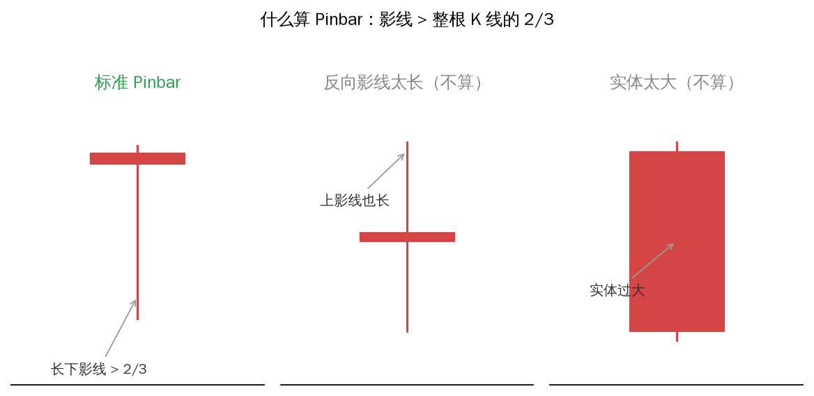
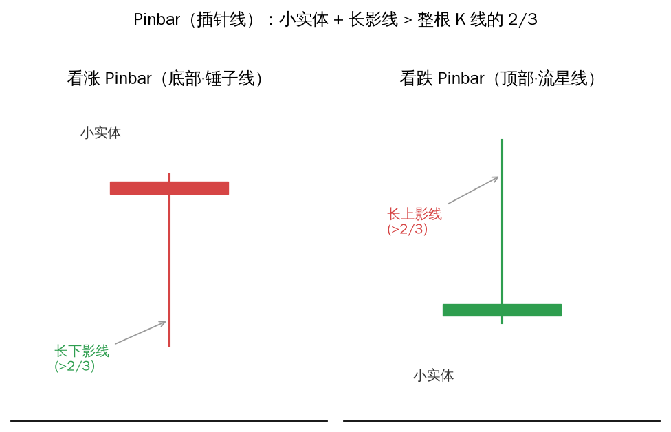
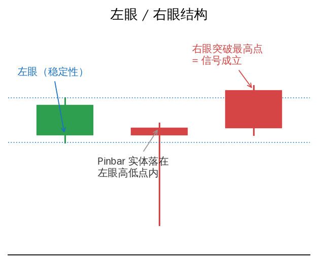
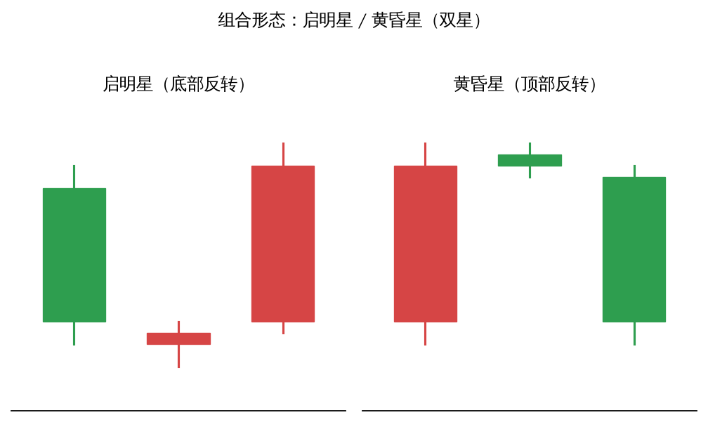

# Pinbar（插针线）：《裸K线交易法》第四章

> 来源：@HaibaraCrypto（灰原学姐）《裸K线交易法》第四章视频教程，本文由视频转录整理。
>
> 相关实战复盘：[纳指插针反转·前低支撑做多](../../市场分析/2026-08-30-纳指插针反转-前低支撑做多.md)（「插针」即 Pinbar）。

## 什么是 Pinbar

Pinbar 是一种特殊的 K 线形态（即第二章讲的「锤子线」和「流星线」），是捕捉反转行情的重要信号。

**三个定义要点：**

1. 影线是实体的两倍以上
2. 没有反向影线（或反向影线很短）
3. 出现在行情末端时，可能预示反转

**结构**：小实体 + 很长的影线。

**严格判定**：影线长度要超过整根 K 线长度的 **2/3** 才算 Pinbar——反向影线太长、或实体过大，都不算。

## 看涨 / 看跌

- **看涨 Pinbar**（在 K 线底部）：下影线长，低位遇到有力多单、价格回升。
- **看跌 Pinbar**（在 K 线顶部）：上影线长，高位被试探但被快速拒绝，空方力量强、价格回落。

## 核心意义：试探与拒绝

看涨 Pinbar 的形成：价格先快速下探（看起来像大阴线）→ 买盘发力 → 价格回到开盘附近或上方 → 留下长下影线。

原书把 Pinbar 比作**匹诺曹的鼻子**：Pinbar 附近所有 K 线组成的盘面是「脸」，价格一度朝某方向大幅运动却又收了回来——核心是「试探与拒绝」。鼻子变长 = 说谎，它试探着骗你要下跌，实际真正的意图是上涨。

## 单根 Pinbar 不能独立交易

要结合：

1. 当前所处位置（顶部 / 底部 / 运行途中）
2. 多根 K 线组合形态（高位看空吞没、低位看涨吞没、启明星、黄昏星等）

## 优秀 Pinbar 的两个条件

1. **自身幅度不能太小（也不是越大越好）**
   - 幅度过大 → 止损巨大（如常规止损 40 点，而 200 点的 Pinbar 止损巨大）
   - 幅度过大后行情整理时间也长
   - 合适的 Pinbar 约 70% 概率走出预期；过大的 Pinbar 可能只有约 60%
2. **对附近盘面的大小比例**（「鼻子」相对「脸」的大小）——较主观，偏盘感。

## 左眼与右眼

- **左眼**（Pinbar 左边的 K 线）：稳定性的参考
  - 希望 Pinbar 的实体被包含在左眼的最高价和最低价之间 → 稳定性高
  - 不希望 Pinbar 是跳空（跳空多因突发事件，非正常多空博弈）
  - 希望左眼幅度不要大于 Pinbar（否则 Pinbar 力量小于左眼，不利判断）
- **右眼**（Pinbar 右边的 K 线）：信号发力的参考
  - 右眼突破看空 Pinbar 的最低点 / 看多 Pinbar 的最高点 → 信号成立
  - 实战中常不等右眼走完，到预设点位就直接进场

## 组合形态信号

Pinbar 是大多数反转 K 线形态的经典缩影。最重要的组合形态：

- **启明星、黄昏星**（双星）
- **突破形态**（高位看空突破、低位看涨突破）

## 5 点判定清单

1. Pinbar 结构：影线是否超过整根 K 线的 2/3
2. 出现位置：顶部 / 底部 / 运行途中
3. 环境：相对附近 K 线，信号是否明显
4. 确认左眼、右眼结构，看后续表现
5. 是否处于组合形态（启明星 / 黄昏星 / 吞没 / 突破）

## 实战要点

- 实际 K 线形态和书本不完全一样，不一定有标准的 Pinbar。
- 例：比特币高位看空吞没形态 + 长上影线 = 明确的 Pinbar 信号 → 做空进场，止损放 Pinbar 末端。
- 60~70% 的胜率即可算有效交易（「胜率 70%」是经验值，非严格统计）。
- 建议自己交易找盘感，先用模拟盘反复练习。
