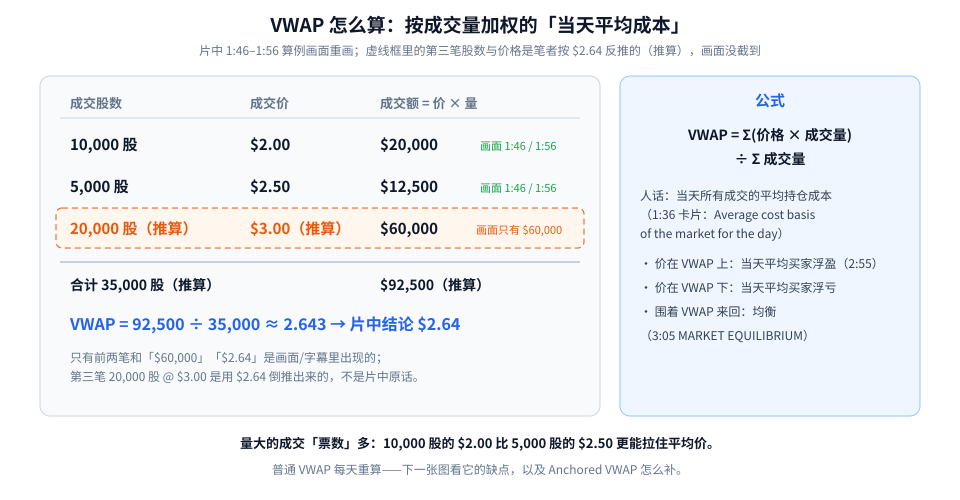
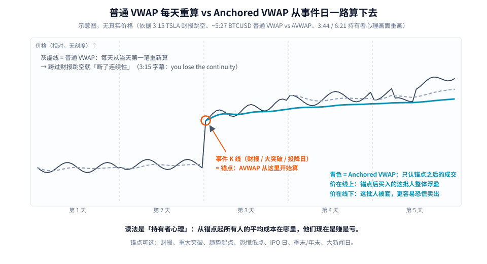
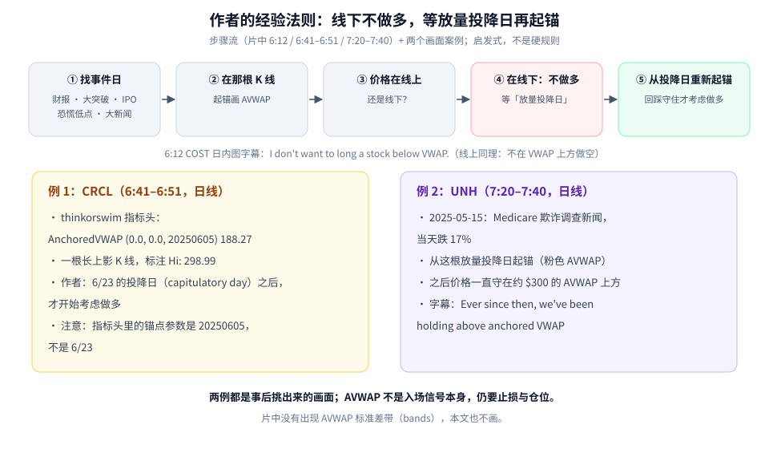

第一次学 Anchored VWAP（下文简称 AVWAP），先记住一句话：**它回答的是「从某个事件之后买进来的这批人，现在整体是赚还是亏」。**

普通 VWAP 只管「今天」；AVWAP 让你自己选一个起点——财报、大突破、恐慌放量的投降日、IPO 当天——然后从那根 K 线开始，把之后所有成交的平均成本一路算下去。

这篇按三步走：

1. VWAP 到底是什么、怎么算（片中算例）；
2. 普通 VWAP 每天重算的缺点，AVWAP 怎么补；
3. 作者的经验法则：**线下不做多，等放量投降日再起锚**，以及 CRCL、UNH 两个画面案例。

素材为完整看过画面的教学视频，时间戳为视频内时间。片中出现的个股只是教学例子，不是荐股。

---

## 1. VWAP：当天市场的「平均持仓成本」

VWAP 全称 Volume Weighted Average Price，成交量加权平均价。片中 1:36 的卡片写的是 *Average cost basis of the market for the day*——**当天市场的平均持仓成本**。

为什么要「按成交量加权」？因为 10,000 股在 $2.00 成交，和 5,000 股在 $2.50 成交，分量不一样：成交越多的价位，越能代表「大家实际在什么价买的」。



**读图**

- **左表前两行是画面原样**（1:46 / 1:56）：10,000 股 × $2.00 = **$20,000**；5,000 股 × $2.50 = **$12,500**。
- **第三行的 $60,000 也在画面上**，但对应的股数和价格**没截到**。随后字幕给出结论 **VWAP = $2.64**。
- **虚线橙框是笔者的推算**：如果结论是 $2.64，那第三笔应约为 20,000 股 @ $3.00，于是合计 35,000 股、$92,500，92,500 ÷ 35,000 ≈ 2.643。（推算）这一行**不是片中原话**，只是帮你把账对上。
- **右边是公式**：VWAP = Σ(价格 × 成交量) ÷ Σ成交量。
- 右下三条读法：价在 VWAP 上，当天平均买家浮盈（2:55「Trading above VWAP」）；价在线下，平均买家浮亏；围着 VWAP 来回走，就是均衡（3:05「MARKET EQUILIBRIUM」）。

> 自己动手（笔者补充的小练习，非片中内容）：只用前两笔，VWAP = (20,000 + 12,500) ÷ (10,000 + 5,000) ≈ $2.17。注意它比两笔价格的简单平均 $2.25 更靠近 $2.00——因为 $2.00 那笔量更大。

---

## 2. 普通 VWAP 的毛病：每天清零，跨过财报就「断片」

片中 3:15 用 TSLA 的 1 分钟图举例：财报或大突破之后出现大跳空，字幕说 *something important happens like earnings or a major breakout, you lose the continuity*——普通 VWAP **每天都从当天第一笔重新算**，昨天、前天那批人的成本，它一概不管。

AVWAP 的做法：**你挑一个有意义的事件当起点，从那根 K 线开始累计，不再每日重置。**



**读图**

- 黑线是价格（示意，无真实刻度）；竖虚线分隔 5 个交易日。
- **灰色虚线 = 普通 VWAP**：每到新的一天就从头算，所以一天一段，彼此不连。
- **橙圈 = 事件 K 线**：比如财报跳空。AVWAP 就从这里开始。
- **青色实线 = AVWAP**：只统计锚点之后的成交，一路延续下去。片中 ~5:27 的 BTCUSD 2 小时图就是这个对比：绿色是普通 VWAP，蓝色是从一个低点起锚的 AVWAP，两条线走法明显不同。
- **右下青色字是读法**：价在 AVWAP 上，代表「锚点之后买进来的这批人」整体浮盈；价在线下，这批人被套，更容易恐慌卖出。片中 3:44 / 6:21 的同一张图讲的就是「谁在赚钱（who is in the money）」。

### 锚点选在哪？

片中 3:24 字幕说「you pick the anchor point」，之后 3:34 讲到从 IPO 日起锚。笔记整理的候选有：**财报、重大突破、趋势起点、恐慌低点、IPO 日、季末/年末、大新闻日**。共同点是：这些日子之后，「持有者」这群人换了一批，他们的成本从此有意义。

片中 1:06 的预告图也很直观：白箭头把「ANCHOR POINT」标在一个早期高点，之后 4 次反弹（黄箭头）都在青色 AVWAP 附近受阻——从高点买进被套的人，一回本就想走。

---

## 3. 作者的经验法则：线下不做多，等投降日再起锚



**读图**

- **上排是步骤流**：① 找事件日 → ② 在那根 K 线起锚 → ③ 看价格在线上还是线下 → ④ 在线下就不做多，等「放量投降日」→ ⑤ 从投降日重新起锚，回踩守住才考虑做多。
- 中间一行是 6:12 COST 日内图的字幕：*I don't want to long a stock below VWAP*。反过来，作者也不在 VWAP 上方做空。
- **左卡 CRCL（6:41–6:51）**：thinkorswim 指标头显示 *AnchoredVWAP (0.0, 0.0, 20250605) 188.27*，图上一根长上影 K 线标着 *Hi: 298.99*；作者说的是 **6/23 投降日（capitulatory day）之后才开始考虑做多**。注意：指标头里的锚点参数是 20250605，和口述的 6/23 不是同一天，读图时以画面为准，别混在一起。
- **右卡 UNH（7:20–7:40）**：2025-05-15 Medicare 欺诈调查新闻，当天跌 17%；作者从这根放量投降日起锚（粉色 AVWAP），之后价格一直守在约 $300 的 AVWAP 上方，字幕：*Ever since then, we've been holding above anchored VWAP*。
- 底部两行提醒：这些都是事后挑出来的画面；**AVWAP 不是入场信号本身**；片中也**没有**出现 AVWAP 标准差带，所以本文不画、不讲。

### 为什么「线下不做多」有道理？

用第 2 节的持有者心理来想：价在 AVWAP 下方，意味着锚点后进场的人**平均是亏的**。价格每反弹一点，就有人「终于回本」想卖，上方天然有抛压。等到出现**放量的投降日**——该割的都割了——再从这一天起锚，看新的一批持有者能不能把价格守在他们的成本之上。

这是作者的**启发式**，不是硬规则。片中作者也建议先把 AVWAP 挂在图上几周，自己回测。

---

## 4. 一张上手 Checklist

```text
1. 最近哪天是「事件日」？（财报 / 跳空 / 放量投降 / IPO / 大新闻）→ 在那根 K 线起锚
2. 价格在锚定线上还是线下？线下别急着抄底做多，线上别逆势做空
3. 等放量投降日 → 新起锚 → 回踩守住才考虑做多
4. 可以同时挂几条（年初、财报日、低点），看市场「认」哪一条
5. AVWAP 不是入场信号：止损、仓位照样要先算
```

哪里找这个指标：片中 8:10 列了 thinkorswim / TradingView / TrendSpider。

---

## 价值判断：留下什么、丢掉什么

| 做法 | 建议 |
|------|------|
| 把 AVWAP 当「这批人赚没赚钱」的仪表；从事件日起锚；「线下不做多」作过滤条件 | **采用** |
| 锚点怎么选：主观性强，事后总能找到一条「刚好有效」的线，需要先固定锚点规则再回测 | **观望** |
| 把 AVWAP 当精确支撑价位、碰线就买；自己给它补画片中没有的标准差带 | **弃用** |

自检一句：我的锚点是按规则选的，还是看完走势才挑的？价格现在在这条线的哪一边？

---

## 小结

1. VWAP = 按成交量加权的当天平均成本；价在线上，当天买家整体浮盈。
2. 普通 VWAP 每天重算，跨过财报/大突破就断了连续性；AVWAP 从你选的事件 K 线开始一直算。
3. 读法是持有者心理：线上 = 锚点后的人赚钱，线下 = 被套。
4. 作者的启发式：线下不做多，等放量投降日重新起锚，守住才考虑多（CRCL、UNH 两个画面案例）。

延伸阅读：日内用的 Session VWAP 怎么用，见 [Session VWAP：平衡市可回归，趋势日别逆势摊平](./2026-09-16-Session%20VWAP：平衡市可回归，趋势日别逆势摊平.md)。

---

## 参考来源

1. TheOneLanceB, *The Anchored VWAP Edge Most Traders Never Discover*（https://www.youtube.com/watch?v=D2P-0xh6aEM ；浏览器完整观看至 9:26/9:26。画面时间点：1:06 ANCHOR POINT 预告图；1:36 Average cost basis 卡片；1:46–1:56 算例 10,000@$2.00 / 5,000@$2.50 / $20,000 / $12,500 / $60,000，字幕结论 $2.64；2:55 Trading above VWAP；3:05 MARKET EQUILIBRIUM；3:15 TSLA 财报跳空「lose the continuity」；3:34 从 IPO 日起锚；3:44 / 6:21 AVWAP 持有者心理图；~5:27 BTCUSD 普通 VWAP vs AVWAP；6:12 COST「I don't want to long a stock below VWAP」；6:41–6:51 CRCL「AnchoredVWAP (0.0, 0.0, 20250605) 188.27」「Hi: 298.99」、6/23 投降日；7:20–7:40 UNH 2025-05-15 跌 17%、守在约 $300 AVWAP 上方；8:10 thinkorswim / TradingView / TrendSpider）。
2. 配图：`avwap-vwap-math.svg`、`avwap-reset-vs-anchor.svg`、`avwap-capitulation-flow.svg`，依据上述画面重画的教学示意；第三笔成交（20,000 股 @ $3.00）为笔者推算，已在图中用虚线框标注。

*仅供学习，不构成投资建议。片中个股均为教学案例；AVWAP 是看持有者成本的工具，不是买卖信号。*
