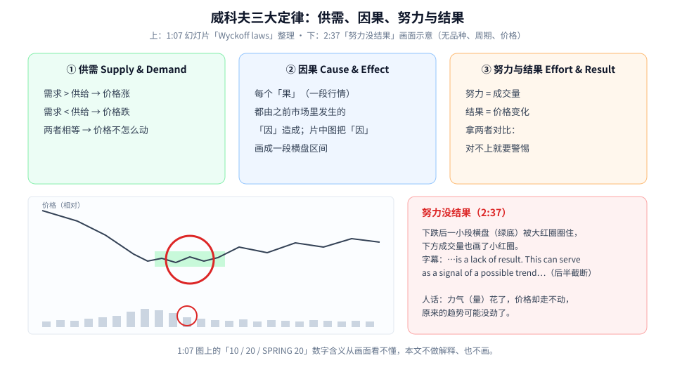
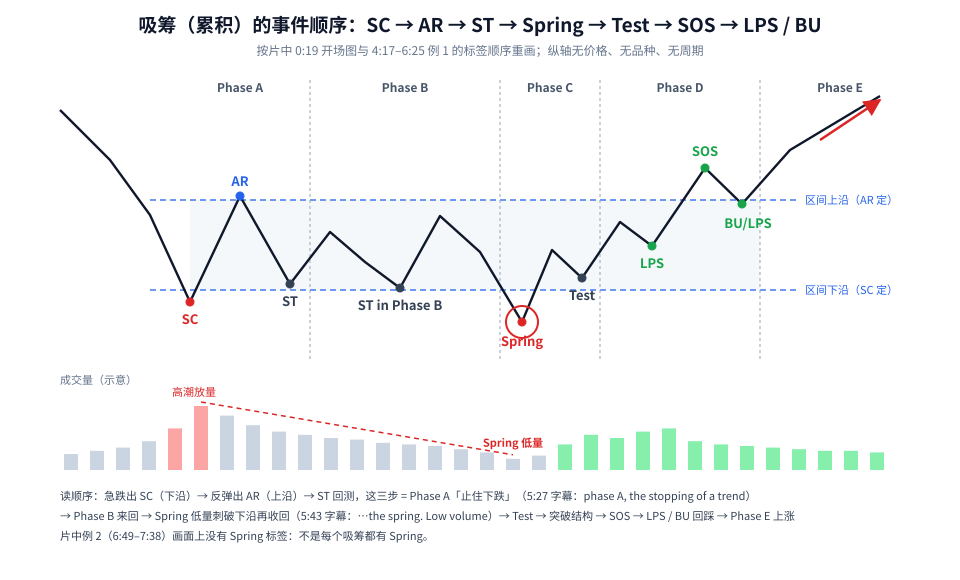
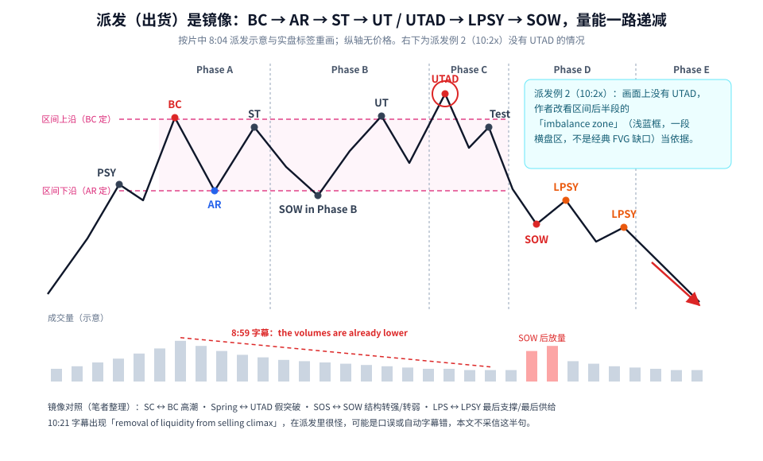
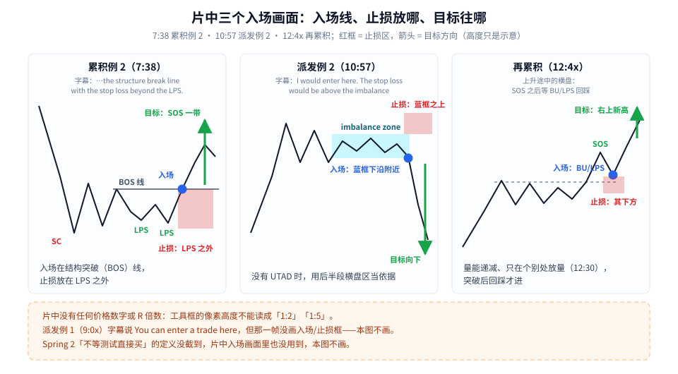

威科夫（Wyckoff）第一次学，先记住一句话：**它不是一个指标，而是一套「读横盘区间」的顺序——大跌或大涨之后，市场停下来横着走的那一段，里面发生了什么、按什么顺序发生。**

这篇按四步走：

1. 三大定律：供需、因果、努力与结果；
2. 吸筹（累积）的事件顺序：SC → AR → ST → Spring → Test → SOS → LPS / BU；
3. 派发（出货）是它的镜像：BC → AR → ST → UT / UTAD → LPSY → SOW；
4. 片中三个入场画面：入场线、止损、目标方向。

素材为完整看过画面的教学视频，时间戳为视频内时间。**片中所有图表都看不到品种、周期和价格数字**，所以本文的图全部用无刻度的示意坐标，不编任何价位。

---

## 1. 三大定律



**读图**

- **① 供需**（1:07 幻灯片「Wyckoff laws」第一条）：需求大于供给，价格涨；需求小于供给，价格跌；两者相等，价格不怎么动。
- **② 因果**：*each change (effect) is caused by certain factors occurring on the market (cause)*。人话：每一段行情（果）都有之前积累的原因（因）。片中的示意图把「因」画成一段横盘区间，「果」是之后的趋势。（片中没讲用点数图从横盘长度推目标，本文也不补。）
- **③ 努力与结果**：拿**成交量（努力）**和**价格变化（结果）**做比较。
- **下半部分是 2:37 的画面示意**：下跌后一小段横盘（绿底）被大红圈圈住，下方成交量处也画了一个小红圈；字幕：*…is a lack of result. This can serve as a signal of a possible trend…*（后半句被截断）。人话：**力气（量）花了，价格却走不动**，原来的趋势可能没劲了。
- 1:07 图上还有「10 / 20 / SPRING 20」几个数字，从画面和半句字幕都看不出含义，本文不解释、不画。

> 初学者最该带走的是第 ③ 条：**量和价要对得上**。放量却不涨/不跌、缩量却大涨/大跌，都是值得多看一眼的地方。

---

## 2. 吸筹：一张事件顺序图

吸筹（Accumulation，也译「累积」）发生在**一段下跌之后**的横盘里。下面这张图把片中开场图（0:19）和例 1（4:17–6:25）出现的标签按顺序排好：



**读图**

- **Phase A：止住下跌。**
  - **SC（Selling Climax，卖方高潮）**：急跌到底，片中 4:56 字幕说它就是「区间的下沿」。
  - **AR（Automatic Rally，自动反弹）**：SC 之后的反弹高点，画一条水平线就是「区间上沿」。
  - **ST（Secondary Test，二次测试）**：价格回来测试 SC 附近。
  - 5:27 字幕原话：*…was phase A, the stopping of a trend*。
- **Phase B：在区间里来回。** 图上标了 *ST in Phase B*——区间内的又一次低位测试。
- **Phase C：Spring。** 价格**刺破区间下沿、又很快收回**，红圈处。5:43 字幕：*…the spring. Low volume*——**低量**是关键（笔者解读：跌破了却没什么人跟着卖，卖方可能已经没劲）。之后有一个 **Test**。
- **Phase D：转强。** 突破结构 → **SOS（Sign of Strength，强势信号）**冲过区间上沿 → **LPS / BU（Last Point of Support / Back Up，最后支撑点 / 回踩）**：回踩上沿附近不破。
- **Phase E：** 离开区间，向上走（红箭头）。
- **下方成交量（示意）**：SC 处高潮放量，区间里量越来越小（红虚线），Spring 处最低，转强后再放量。
- **片中例 2（6:49–7:38）画面上没有 Spring 标签**——不是每个吸筹都会出现 Spring，别硬找。

### 三种 Spring（只讲画面能确认的部分）

片中 3:15–4:17 讲了三种 Spring：

- **Spring 1**：低量、小幅刺破下沿后收回（3:15 字幕：*Spring one forms on low volume*）。
- **Spring 2**：3:32 画面是「明显跌破下沿 → 回到下沿附近画了 BUY」，字幕同时出现 *without waiting for a test* 和 *The next type spring two is a…*。**讲 Spring 2 定义的那几秒没截到**，所以「不等测试直接买」到底属于哪一种，本文不下结论。
- **Spring 3 = Shakeout（洗盘）**：更深的 V 形下探，3:55 帧上淡红线勾出像头肩的形状，字幕说它「和前两种不一样」。4:17 字幕 *…is only traded after the price returns to the range and tests it*——笔记按时间顺序推断这句说的是 Spring 3（**推断**，不是确认）。

---

## 3. 派发：吸筹的镜像

派发（Distribution，出货）发生在**一段上涨之后**的横盘里，顺序反过来：



**读图**

- 片中 8:04 的派发示意与实盘标签：**PSY → BC（Buying Climax，买方高潮，区间上沿）→ AR（区间下沿）→ ST → SOW in Phase B → UT → UTAD → Test → LPSY → SOW**。
- **UTAD（Upthrust After Distribution）**：价格**冲过区间上沿又掉回来**，相当于吸筹里 Spring 的镜像（红圈）。字幕：*…called UTAD up thrust after distribution*。
- **LPSY（Last Point of Supply，最后供给点）**：跌破后的反抽高点。
- **SOW（Sign of Weakness，弱势信号）**：跌破区间下沿。
- **成交量是画面重点**：一条向右下的递减斜线。8:59 字幕 *…buying climax here. As you can see the volumes are already lower*；9:0x 又说 *Note that the volumes are lower*。SOW 之后才出现高量柱。
- **右上青框：派发例 2（10:2x）画面上没有 UTAD**，作者改看区间后半段的「imbalance zone」（浅蓝框）当依据。笔记特别提醒：这个框画的是**一段横盘区**，不是 SMC 里经典的 FVG 缺口，别混为一谈。
- 底部「镜像对照」是笔者整理的：SC ↔ BC、Spring ↔ UTAD、SOS ↔ SOW、LPS ↔ LPSY。
- 10:21 字幕出现「removal of liquidity from selling climax」，在派发语境里很怪，可能是口误或自动字幕错，本文不采信这半句。

---

## 4. 片中三个入场画面



**读图**

- **累积例 2（7:38）**：入场在 **BOS（结构突破）线**，红框（止损）向下到 BU/LPS 附近，目标看到 SOS 一带。字幕：*…the structure break line with the stop loss beyond the LPS.*
- **派发例 2（10:57）**：入场在浅蓝框（imbalance zone）下沿 / 最后 LPSY 附近，止损放在蓝框**之上**，目标一路向下。字幕：*I would enter here. The stop loss would be above the imbalance*。
- **再累积（12:4x）**：上升途中的横盘，标签和吸筹一样。12:30 画面上横盘里量总体递减、只在个别处放量（两个红圈）；入场在 **SOS 之后的 BU/LPS 回踩**，止损在其下方，目标右上新高。
- **底部橙框**：
  - 片中**没有任何价格数字或 R 倍数**。笔记目测过工具框的像素高度（绿框大约是红框的 2 倍、3 倍多、5 倍），但**那只是像素**，不能写成「片中 1:2 / 1:5 风险回报」。本图特意把目标画成箭头，不画成比例框。
  - **派发例 1（9:0x）**字幕说 *You can enter a trade here*，但那一帧没画入场/止损框，入场点未知，所以不画。
- 图里出现的 BOS、imbalance zone 是 SMC 的用词，作者把它们混进了威科夫框架（笔记补充）。

---

## 5. 一张读图 Checklist

```text
1. 先定背景：下跌后的横盘（可能吸筹）？上涨后的横盘（可能派发）？上升途中的横盘（可能再累积）？
2. 找 Phase A：有没有放量的高潮（SC / BC）→ 反向的 AR → ST？用 SC 和 AR 画出上下沿
3. 看量：区间里量是否递减？Spring / UTAD / 测试时是不是低量？——努力与结果对不对得上
4. 等确认，不抢跑：吸筹等 Spring 收回 + 结构突破 / SOS；入场选突破线或 LPS / BU 回踩；派发反过来
5. 止损放在结构外（LPS 之下 / 派发区或 imbalance 区之上），手数按风险算
6. 事后标注容易、实时标注难：先拿历史图「盲标」练手，再小仓验证
```

---

## 价值判断：留下什么、丢掉什么

| 做法 | 建议 |
|------|------|
| 把威科夫当「横盘区间的阅读顺序」：高潮 → 自动反弹 → 二次测试定区间，再看量能递减 + 假突破（Spring / UTAD）+ 突破后回踩；入场在突破线 / 回踩、止损在 LPS 外 | **采用** |
| 三种 Spring 的区分；用「imbalance zone」替代 UTAD；片中例子全是事后标好的漂亮图、没有失败案例，需自己回测 / 盲标 | **观望** |
| 「Get ahead of 99%」「每月赚多少就不用交易」之类营销话术；把截图里框的像素比例当成 1:2 / 1:5 风险回报 | **弃用** |

作者自己在 13:10 也说：*quite complex and definitely requires practice*。

---

## 小结

1. 三大定律：供需决定方向，因果说「每段行情都有之前的原因（片中画成横盘区间）」，努力与结果要求量价对得上。
2. 吸筹顺序：SC（下沿）→ AR（上沿）→ ST = Phase A 止跌；Phase B 来回；Spring 低量刺破收回；SOS 转强；LPS / BU 回踩。
3. 派发是镜像：BC → AR → ST → UT / UTAD → LPSY → SOW，量能一路递减。
4. 片中入场：突破线或回踩入场，止损放在结构外；没有任何价格和 R 倍数。

延伸阅读：Spring / UTAD「刺破再收回」的思路，和 SMC 里的流动性扫荡（liquidity sweep）很像（笔者补充的类比），见 [扫流动性还是真突破：看 K 线实体收在哪，再看 FVG 守不守得住](./2026-10-06-扫流动性还是真突破：看K线实体收在哪，再看FVG守不守得住.md)；量价分布的另一种看法见 [Volume-Profile：POC 是最同意价，VA 约七成，趋势日价值会搬家](./2026-09-25-Volume-Profile：POC是最同意价，VA约七成，趋势日价值会搬家.md)。

---

## 参考来源

1. Trading Neighbor, *How to Get Ahead of 99% of Traders (Wyckoff method)*（https://www.youtube.com/watch?v=aUFczGAVq3M ；浏览器完整观看至 13:35/13:35。画面时间点：0:19 开场 Phase A–E 示意；1:07 Wyckoff laws 三条；1:56 累积 / 派发框；2:37 lack of result；3:15 / 3:32 / 3:43–3:55 三种 Spring；4:17 吸筹示意 #1 / #2；4:56 SC；5:27 AR / ST、Phase A；5:43 ST in phase B、Spring 低量；6:0x–6:25 例 1 全标签；6:49–7:38 例 2 与 BOS 入场 / LPS 外止损；8:04 派发示意；8:xx UTAD；8:59 / 9:0x 量能递减；10:21–10:57 派发例 2、imbalance zone、蓝框上止损；11:10–13:10 再累积与 BU/LPS 入场；13:10 作者自评）。注：6:0x、6:1x、8:xx、9:0x、10:2x、12:4x 几帧播放条时间被遮，时间为按前后帧推的区间。
2. 配图：`wyckoff-three-laws.svg`、`wyckoff-accum-sequence.svg`、`wyckoff-distribution.svg`、`wyckoff-entries.svg`，依据上述画面重画的无刻度示意，不含任何价格数字；镜像对照为笔者整理。

*仅供学习，不构成投资建议。威科夫标注事后容易、实时困难；片中所有例子均为事后标注的教学图。*
