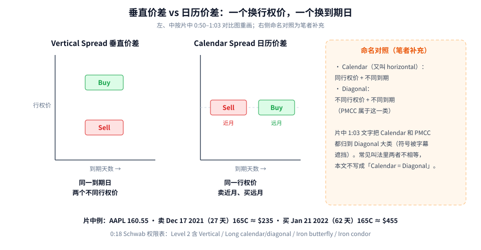
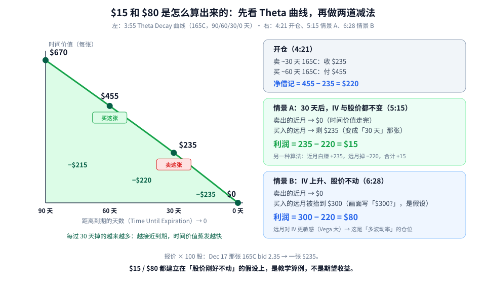
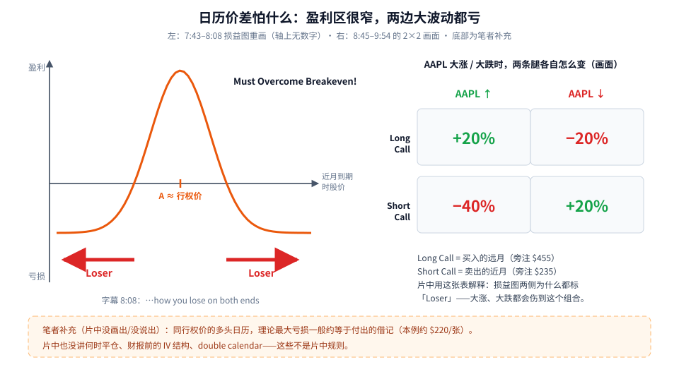

日历价差（Calendar Spread）第一次学，先记住一句话：**同一个行权价，卖一张快到期的，买一张晚到期的——你赚的是「近月时间价值掉得比远月快」这个差，外加一点「波动率上升」的好处。**

这篇用片中 AAPL 的例子，一步步拆：

1. 日历价差长什么样，和垂直价差差在哪；
2. 先看 Theta 衰减曲线，再把片中的 **$15** 和 **$80** 两个利润数字一笔一笔算出来；
3. 损益图为什么是一个「尖尖的小山」——盈利区窄，两边大波动都亏；
4. 实盘为什么还要看近月和远月的 IV 差（链接到期限结构那篇）。

素材为完整看过画面的教学视频，时间戳为视频内时间。所有价格都是**片中 2021 年的教学数字**，不是报价，也不是荐股。

---

## 1. 结构：换的是到期日，不是行权价



**读图**

- **左：垂直价差**（片中 0:50 对比图）。纵轴是行权价，横轴是到期天数。Buy 和 Sell 在**同一条竖线上**——同一到期日，上下两个行权价。
- **中：日历价差**。Sell 和 Buy 在**同一条横线上**——同一行权价，**左边卖近月、右边买远月**。
- **右：命名对照（笔者补充）**。片中 1:03 的文字把 Calendar 和 PMCC 都归到「Diagonal」一类（中间的符号被字幕挡住）。更常见的叫法是：**同行权价、不同到期 = calendar（也叫 horizontal）；不同行权价、不同到期 = diagonal**，PMCC 属于后者。所以本文不写成「Calendar = Diagonal」。
- **底部是片中的具体腿**：AAPL 现价 160.55；卖 Dec 17 2021（27 天）165 call，约 $235（2:27，bid 2.35 / ask 2.39）；买 Jan 21 2022（62 天）165 call，约 $455（3:32）。165 比现价高，是虚值（片中写 *Out of the Money Strike = $165*）。
- 0:18 的 Schwab 权限表里，*Long calendar/diagonal* 和 Vertical、Iron condor 一样放在 Level 2。

> 小提醒：期权报价是「每股」，一张合约 = 100 股。链上 2.35 → 一张 $235。下文所有 $ 都是「每张」。

---

## 2. $15 和 $80：两道减法



**读图**

- **左边是片中 3:55 的 Theta Decay 曲线**（同一个 165 call，不同剩余天数的时间价值）：**90 天 $670 → 60 天 $455 → 30 天 $235 → 0 天 $0**。
- 每过 30 天掉多少：$670 − $455 = **$215**；$455 − $235 = **$220**；$235 − $0 = **$235**。越接近到期，掉得越多——这就是「近月时间价值掉得更快」。（片中原图画成一条弯曲的曲线；本图按这四个数字如实描点，所以看起来接近直线，但三段的跌幅确实在变大。）
- 图上标了「卖这张」（30 天那张）和「买这张」（60 天那张）。

**开仓（4:21 画面：*Sell a call for $235 / Buy a call for $455*）**

```text
卖 ~30 天 165C：收 $235
买 ~60 天 165C：付 $455
净借记（你实际掏的钱）= 455 − 235 = $220
```

**情景 A：30 天后，IV 和股价都没变（5:15 画面）**

时间往右走 30 天：

- 卖出的那张从「30 天」走到「0 天」，时间价值归零 → **$0**（画面：*Sold call = $0*）；
- 买入的那张从「60 天」走到「30 天」，按曲线剩 **$235**（画面：*Bought call = $235*）。

```text
平仓能拿回：$235（远月）− $0（近月要买回的成本）= $235
利润 = 235 − 220（开仓借记）= $15     ← 画面：Profit = $15
```

换个角度算，结果一样：卖出的近月，$235 全部收下（+235）；买入的远月从 $455 掉到 $235（−220）。合计 **+$15**。

**情景 B：IV 上升、股价不动（6:28 画面）**

- 卖出的近月照样归零 → **$0**；
- 买入的远月因为 IV 升高被抬到 **$300**（画面上写的是「$300?」，带问号——这是作者的假设，不是算出来的）。

```text
利润 = 300 − 220 = $80     ← 画面：Profit = $80
```

和情景 A 相比多出来的 $65（$300 − $235，笔者推算）全部来自 IV 上升。远月期权对 IV 更敏感（Vega 大），所以日历价差是一个「**多波动率**」的仓位。

> 作者在 7:30 自己吐槽：*Why would you hope for IV to spike and for the share price to not move?*——一边盼着波动率涨、一边盼着股价不动，本身就有点拧巴。

**所以 $15 / $80 是什么？** 是在「股价正好停在原地」这个理想假设下的教学算例，**不是期望收益**。

---

## 3. 损益图：一座窄窄的小山



**读图**

- **左边是片中 7:43–8:08 的损益图**（横轴 = 近月到期时的股价，轴上没有数字）。只有股价停在 **A 点（行权价附近）** 时才赚钱，形成一个尖峰；往两边走，很快跌到亏损区并走平。
- 画面上写着 *Must Overcome Breakeven!*，两侧各一个红箭头 **Loser**；字幕：*…how you lose on both ends*。
- **右边是片中 8:45–9:54 的 2×2 画面**：AAPL 大涨时，Long Call（买的远月，旁注 $455）**+20%**、Short Call（卖的近月，旁注 $235）**−40%**；AAPL 大跌时，Long Call **−20%**、Short Call **+20%**。作者用这张表解释损益图两侧为什么都是 Loser。
- **底部橙框是笔者补充**（片中没画出、没说出）：同行权价的多头日历，理论最大亏损一般约等于付出的借记，本例约 **$220/张**。片中也没讲何时平仓、财报前的 IV 结构、double calendar——这些都不是片中规则。

一句话：**日历价差怕大行情**。你预期股价会大涨或大跌，就别用它。

---

## 4. 片中没讲、但实盘绕不开的一环：近月和远月的 IV 差

第 2 节的情景 A 假设「IV 不变」，情景 B 假设「远月 IV 涨了」。但真实市场里，**近月和远月的 IV 本来就不一样**，而且这个差会变。这条「不同到期日的 IV 连成的线」叫 **IV 期限结构**：

- 近月 IV 比远月低、线往右上斜（Contango），是常态；
- 近月 IV 比远月高、线往右下斜（Backwardation），多出现在市场有压力的时候。

它直接决定你卖的那张有多贵、买的那张有多贵，也就是日历价差的借记是多少。这部分单独写了一篇：[IV 期限结构：Contango 是常态，Backwardation 是「恐慌模式」](./2026-10-06-IV期限结构：Contango是常态，Backwardation是恐慌模式.md)。

---

## 5. 一张开仓前的 Checklist

```text
1. 行权价 ≈ 你预计近月到期时股价会停留的位置
2. 借记 = 远月价 − 近月价；按笔者补充，它基本就是最坏情况
3. 先看期限结构：近月 / 远月 IV 各是多少？现在 IV 偏低、可能上升，对 calendar 有利；IV 已高、可能回落，不利
4. 预期有大行情？别做 calendar，它两边都怕
5. 近月到期前要处理（平仓或滚动），别拖到被指派
```

---

## 价值判断：留下什么、丢掉什么

| 做法 | 建议 |
|------|------|
| 用片中算例理解「卖时间 + 多 Vega」：借记 $220 → 情景 A 利润 $15、情景 B 利润 $80；作为低波动、区间市的工具来理解 | **采用** |
| 实盘要看近月 / 远月 IV 差（期限结构）再决定，本片没覆盖 → 见 [IV 期限结构](./2026-10-06-IV期限结构：Contango是常态，Backwardation是恐慌模式.md) | **观望** |
| 把 $15 / $80 当期望收益；「Calendar = Diagonal」这种说法 | **弃用** |

自检一句：我的借记是多少？股价到期时离行权价多远我就开始亏？现在近月和远月的 IV 谁高？

---

## 小结

1. 日历价差 = 同一行权价，**卖近月、买远月**；垂直价差是同一到期、换行权价。
2. 借记 = $455 − $235 = **$220**。
3. IV、股价都不变：30 天后近月 $0、远月 $235 → 利润 **$235 − $220 = $15**。
4. IV 上升、股价不动：远月假设到 $300 → 利润 **$300 − $220 = $80**；这是「多 Vega」的来源。
5. 损益图盈利区窄，两边大波动都亏；作者个人结论（10:34）是不太看好 calendar，欢迎观众反驳。

延伸阅读：同一到期、换行权价的结构见 [垂直价差：Debit-Credit、IV-Rank 分段与 Delta 选腿](./2026-09-17-垂直价差：Debit-Credit、IV-Rank分段与Delta选腿.md)。

---

## 参考来源

1. Jake Broe, *Calendar Spreads Explained – Advanced Options Trading Strategy*（https://www.youtube.com/watch?v=o6tHCsW_Plw ；浏览器完整观看至 10:48/10:48。画面时间点：0:18 Schwab Level 2 权限表；0:50–1:03 Vertical vs Calendar 对比图与 Diagonal 归类文字；2:27 AAPL 160.55、Dec 17 2021（27 天）165C ≈ $235；3:32 Jan 21 2022（62 天）165C ≈ $455；3:55 Theta Decay $670 / $455 / $235 / $0；4:21 Sell $235 / Buy $455；5:15 Profit = $15；6:28 Bought call = $300、Profit = $80；7:30 作者吐槽；7:43–8:08 损益图与 Loser；8:45–9:54 2×2；10:34 作者结论）。片中 1:23–2:20 的「Stock=$50, IV=20%」钟形图与期权费构成页在观看时看到但未存图，本文不画。
2. 配图：`cal-vertical-vs-calendar.svg`、`cal-theta-15-80.svg`、`cal-payoff-and-risk.svg`，依据上述画面重画的教学示意；命名对照与「最大亏损≈借记」为笔者补充，已在图中标注。

*仅供学习，不构成投资建议。期权有到期归零、指派、保证金与流动性风险；片中数字为 2021 年教学演示，不是当前报价。*
