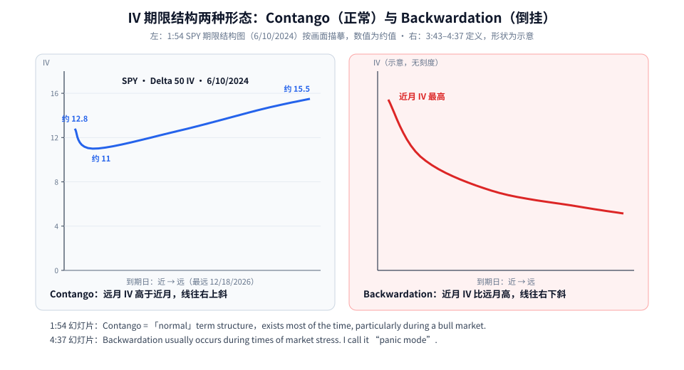
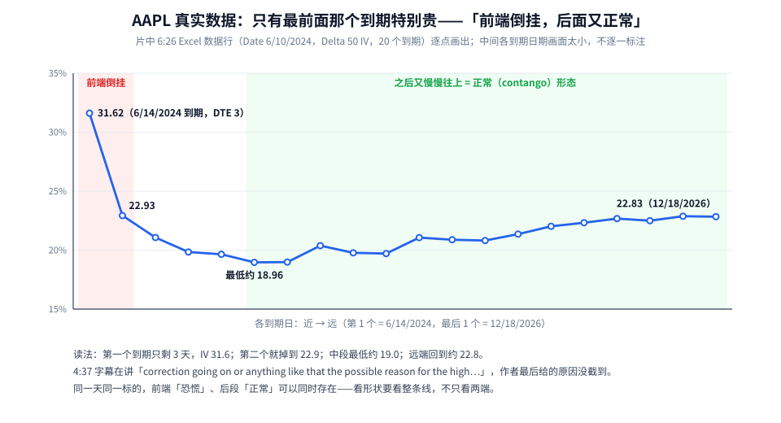
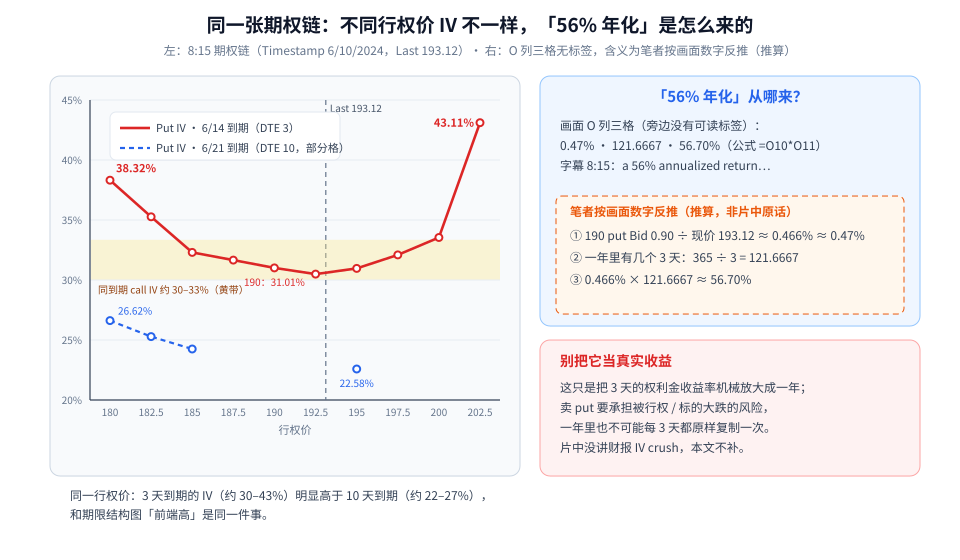

IV 期限结构第一次学，先记住一句话：**把同一个标的、不同到期日的隐含波动率（IV）连成一条线，看它往哪边斜——这条线就是市场对「近期会多晃 vs 远期会多晃」的报价。**

这篇按三步走：

1. 两种形态：Contango（正常，右上斜）和 Backwardation（倒挂，右下斜）；
2. 片中 AAPL 的真实数据：只有最前面那个到期特别贵——「前端倒挂、后面又正常」；
3. 同一张期权链上 IV 怎么随行权价变化，以及片中那个「56% 年化」到底怎么来的、为什么不能当真。

素材为完整看过画面的教学视频（Barchart Excel 插件演示），时间戳为视频内时间。片中数据都是 2024-06-10 的历史快照，不是现在的报价，也不是荐股。

---

## 0. 先认识这条线

- **横轴**：一个个到期日，从近到远。
- **纵轴**：每个到期日的 IV。片中统一取 **Delta 50**，也就是大约平值那一档的 IV（5:32 的插件对话框里 *Delta: 50*）。
- 为什么固定 Delta 50？因为同一个到期日里，不同行权价的 IV 也不一样（第 3 节会看到），固定一档才能公平地比「不同到期」。

---

## 1. 两种形态



**读图**

- **左：Contango（正常形态）**。片中 1:54 的幻灯片原话：*Contango: This is what we would call "normal" term structure and exists most of the time, particularly during a bull market.* ——**大部分时间都是这样，尤其牛市**。
  - 下方是 SPY（S&P 500 SPDR）6/10/2024 的期限结构图，纵轴 0–18：第一个到期约 **12.8**，第二个到期跌到约 **11**，之后一路缓慢升到约 **15.5**（最远 12/18/2026）。这些是按画面描摹的**约值**。
  - 直觉（笔者补充）：时间越长，能发生的事越多，远月 IV 略高很正常。
  - 细心的话会发现 SPY 最前面那一点比第二点略高，画面没解释；笔记猜测是很近到期的小事件溢价或数据噪声（**笔者猜测**，非片中内容）。
- **右：Backwardation（倒挂）**。3:43 幻灯片：*An inverted term structure with higher volatility in the short-term options.* 4:37 加了一条：*Usually occurs during times of market stress. I call it "panic mode".* ——**近月 IV 比远月高，通常出现在市场有压力的时候，作者叫它「恐慌模式」**。右图只是形状示意，没有刻度。
- 补充一个容易混的点（笔者补充）：期货市场也用 contango / backwardation 描述**价格**曲线；这里说的是**期权隐含波动率**曲线，两者别混。

---

## 2. AAPL 真实数据：前端倒挂，后面又正常



**读图**

- 数据来自片中 6:26 Excel 里生成的一行（Date **6/10/2024**，各到期 Delta 50 IV，共 20 个值），图上逐点画出：
  - 第 1 个到期 **6/14/2024**（只剩 3 天）：**31.61707**；
  - 第 2 个：**22.93137**；
  - 中段最低：**18.96431**；
  - 最远 **12/18/2026**：**22.83482**。
- **红色区域 = 前端倒挂**：只有最前面那一个到期特别贵，第二个就掉了将近 9 个点（笔者按图上两数相减）。
- **绿色区域 = 之后又慢慢往上**，回到正常的 contango 形状。
- 所以同一天、同一个标的，「前端恐慌」和「后段正常」可以同时存在——**看期限结构要看整条线**，不能只看两端。
- 为什么 AAPL 前端这么高？4:37 字幕只截到 *…correction going on or anything like that the possible reason for the the high…*，**作者最终给的原因没截到**，本文不替他补。

---

## 3. 同一张期权链：IV 还会随行权价变，「56% 年化」从哪来



**读图**

- **左图是 8:15 的期权链**（Timestamp 6/10/2024，AAPL Last **193.12**）：
  - 红线：**6/14 到期（DTE 3）的 put IV**，从 180 的 **38.32%**，到中间 190 的 **31.01%**、192.5 的 **30.49%**，再到 202.5 的 **43.11%**——两头高、中间低。同到期的 call IV 约 30–33%（黄带）。
  - 蓝点：**6/21 到期（DTE 10）**画面上能读到的几格 put IV：180 → 26.62%、182.5 → 25.28%、185 → 24.25%、195 → 22.58%。
  - **同一个行权价，3 天到期的 IV（约 30–43%）明显高于 10 天到期（约 22–27%）**——这和第 2 节「前端高」是同一件事，只是换了个角度看。
- **右上：「56% 年化」从哪来？**
  - 画面上表格右侧 O 列有三格：**0.47% / 121.6667 / 56.70%**，选中格公式 **=O10\*O11**；字幕 8:15：*a 56% annualized return so very very high return for selling*。
  - **这三格旁边没有可读的标签**。下面是笔者按画面数字反推的（**推算，非片中原话**）：
    1. 190 put 的 Bid **0.90**（画面上高亮的那格）÷ 现价 **193.12** ≈ **0.466% ≈ 0.47%**；
    2. 一年里有几个 3 天：**365 ÷ 3 = 121.6667**；
    3. **0.466% × 121.6667 ≈ 56.70%**。
  - 三个数和画面对得上，所以大概率是「3 天的权利金收益率 × 一年里有多少个 3 天 = 年化」。
- **右下红框：别把它当真实收益。** 这只是把 3 天的收益机械放大成一年：卖 put 要承担被行权、标的大跌的风险，一年里也不可能每 3 天都原样复制一次。片中没有讲财报前后的 IV 变化（IV crush），本文也不补。

---

## 4. 这条线和日历价差有什么关系

前一篇 [日历价差：同一行权价卖近月买远月，$15 和 $80 是怎么算出来的](./2026-10-05-日历价差：同一行权价卖近月买远月，15和80是怎么算出来的.md) 里，片中算 $15 / $80 时都假设了 IV 怎么变，却没讲**近月和远月的 IV 本来就不一样**——当时那篇把「看近远月 IV 差」列为观望项。

期限结构正好补上「怎么看」这一环。以下几点是**笔记里的「我的补充」，不是本片内容**：

- 日历价差 = **卖近月、买远月**。前端倒挂（近月 IV 高、远月低）时，你卖出的那张更贵、买入的那张相对便宜，**借记更低**，入场价格更友好；contango 很陡时则相反，借记更高。
- 但倒挂往往意味着「近期有事」：近月到期前标的大幅波动的概率也更高，而日历价差最怕的就是大波动；事件过后如果远月 IV 也跟着下来，买入的远月（Vega 大）会亏。所以「倒挂 = calendar 稳赚」**不成立**，只是定价更便宜。
- 本片给了「怎么看」（Delta 50 IV 按到期连线），但**没给 calendar 的进出场规则**；9:09 字幕提到 *diagonal spread so maybe we're more neutral on the price*，具体怎么搭也没截到。

---

## 5. 工具层：片中用的是 Barchart Excel 插件

- 5:32「Insert Volatility Analysis」对话框：可选 *Implied Volatility Indexes / Term Structure / Implied Volatility Curves / Risk Reversal / Skew By Delta / Butterfly / Gamma Levels*；按到期的 **30 / 60 / 90 / 120 / 150 / 180 / 270 / 360 / 720 Day IV**，以及对应天数的 HV；**Delta: 50**。
- 7:21「Insert Options Chain」：Side-by-side，**10 strikes around the money**。
- 10:04 TSLA 例：**Compare To：1D / 7D / 1M / 3M / 6M / Custom Date**，可以把今天的期限结构和过去某天叠在一起比（字幕提到 March the 1st）。对比结果图没截到。
- 对话框里还有 Risk Reversal、Skew By Delta 等，但截图里没演示。Barchart Excel 是付费工具，用免费的期权链 / IV 曲线也能自己拉这条线（需要自己验证）。

---

## 6. 一张交易前 Checklist

```text
1. 先拉一条「到期 × Delta 50 IV」的线：右上斜（contango）还是前端翘起 / 整体右下斜（backwardation）？
2. 倒挂 → 先问「近期有什么事？」（市场压力、个股事件），别只因为 IV 高就去卖
3. 卖方：前端 IV 高 = 近月贵、收得多，但也代表市场预期近期波动大；先算清最坏情况
4. 做日历价差：看近远月 IV 差；倒挂时借记便宜，但要防事件后的大波动和远月 IV 回落（笔者补充）
5. 用 Compare To 和过去比：现在这条线是正常还是异常？
6. 同一到期内再看各行权价 IV：两头是不是特别贵？
7. 「年化收益率」只是换算，不是预期收益
```

---

## 价值判断：留下什么、丢掉什么

| 做法 | 建议 |
|------|------|
| 期权交易前先看期限结构：contango 是常态，backwardation 是压力信号（片中「panic mode」）；AAPL 6/10/2024 那行数据（31.6 → 22.9 → 19.0 → 22.8）当教学例子 | **采用** |
| 用期限结构挑具体策略（卖 put、diagonal、calendar）的规则：片中只点到为止，没有进出场和风控 → 和 [日历价差](./2026-10-05-日历价差：同一行权价卖近月买远月，15和80是怎么算出来的.md) 一起看，仍需自己验证 | **观望** |
| 把 3 天期权的「56% 年化」当真实可得收益；把 IV 倒挂直接等同于「卖方必赚」 | **弃用** |

自检一句：我现在看的这个到期，在整条线上是偏贵还是偏便宜？贵的原因我知道吗？

---

## 小结

1. 期限结构 = 同一标的、不同到期日的 IV（片中取 Delta 50）连成的线。
2. Contango：远月 IV 高、右上斜，是常态，尤其牛市；Backwardation：近月 IV 高、右下斜，多在市场压力期，作者叫它「panic mode」。
3. AAPL 6/10/2024：只有 3 天到期那一个特别高（31.6），后面回落再缓升——前端倒挂、后段正常可以同时存在。
4. 同一张链上 IV 还随行权价变（两头贵）；「56% 年化」是 3 天收益率 × 365/3 的机械换算（推算），不是真实收益。

延伸阅读：从「晃不晃」到波动率曲面的整体框架，见 [波动率五级：从「晃不晃」到曲面与 VRP](./2026-09-16-%E6%B3%A2%E5%8A%A8%E7%8E%87%E4%BA%94%E7%BA%A7%EF%BC%9A%E4%BB%8E%E3%80%8C%E6%99%83%E4%B8%8D%E6%99%83%E3%80%8D%E5%88%B0%E6%9B%B2%E9%9D%A2%E4%B8%8EVRP.md)。

---

## 参考来源

1. Barchart（Options Trading IQ 主讲）, *Options Volatility Term Structure Explained*（https://www.youtube.com/watch?v=txreI2RK9Hg ；浏览器完整观看至 10:49/10:49。画面时间点：0:59 Getting Started With Barchart Excel；1:54 Contango 定义 + SPY 6/10/2024 期限结构图（约 12.8 → 11 → 15.5）；3:43 Backwardation 定义；4:37「panic mode」+ AAPL 期限结构图；5:32 Insert Volatility Analysis（Delta 50、30–720 Day IV）；6:26 AAPL 数据行 31.61707 … 22.83482；7:21 Insert Options Chain；8:15 AAPL 期权链（Last 193.12，6/14 DTE 3 与 6/21 DTE 10 的 IV，O 列 0.47% / 121.6667 / 56.70%，字幕「56% annualized return」）；9:09 字幕 diagonal spread；10:04 TSLA Compare To 1D/7D/1M/3M/6M/Custom）。截图按视频时间约每 54 秒一帧，帧与帧之间的画面可能有遗漏。
2. 配图：`ivts-contango-vs-backwardation.svg`、`ivts-aapl-front-inverted.svg`、`ivts-chain-skew-annualized.svg`，依据上述画面重画；SPY 曲线为描摹约值，Backwardation 右图为无刻度示意；O 列三格含义为笔者推算，已在图中用虚线框标注。

*仅供学习，不构成投资建议。期权有到期归零、指派、保证金与流动性风险；片中数据为 2024-06-10 的历史快照。*
