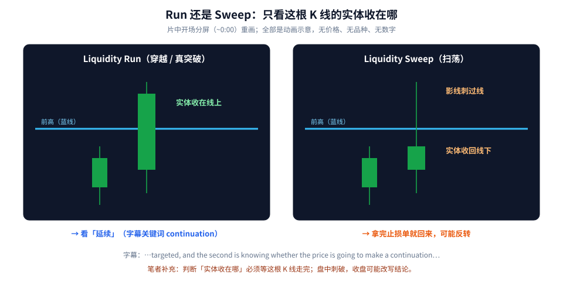
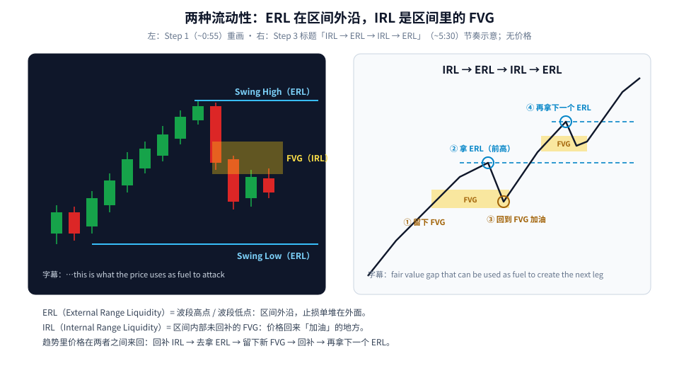
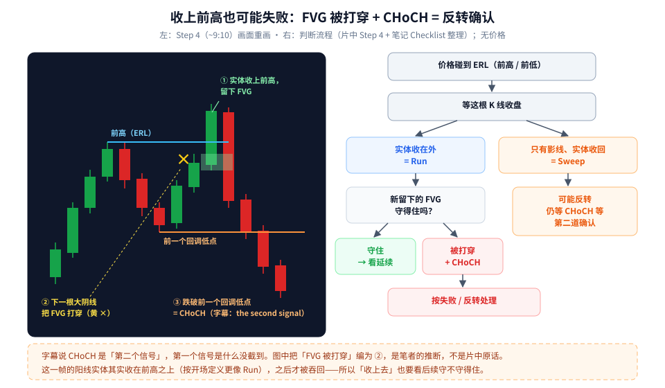

价格冲过前高，到底是「真突破、要继续涨」，还是「扫一下止损就回来」？第一次学，先记住一句话：**等这根 K 线收盘，看实体收在哪——实体收在外面叫 Run（穿越），只有影线刺过去、实体收回来叫 Sweep（扫荡）。**

这篇按三步走：

1. Run 和 Sweep 的区别；
2. 两种流动性：ERL（区间外沿的波段高低点）和 IRL（区间里面的 FVG），以及它们之间来回走的节奏；
3. 「收上去了也可能失败」：FVG 被打穿 + CHoCH 才算反转确认。

素材为完整看过画面的教学视频，时间戳为视频内时间（前 11 张截图播放条被隐藏，带「~」的时间是估计值）。**片中全部是动画示意 K 线，没有价格、没有品种、没有任何数字**（只有「4H FVG」一处周期字样），所以本文的图也全部不带刻度。

---

## 0. 先弄懂「流动性」在这里指什么

在这套说法里（属于 ICT / SMC 体系），「流动性」可以粗略理解成**一堆挂着的单子**，尤其是止损单：做空的人把止损放在前高上面，做多的人把止损放在前低下面。价格去碰前高 / 前低，就会触发这些单子——这就叫「拿流动性」。（这段是笔者为初学者写的背景说明。）

片中开场字幕点了两个问题：一是知道价格会去「瞄准（targeted）」哪里，二是判断价格拿完之后会**延续（continuation）**还是不会。

---

## 1. Run 还是 Sweep：只看实体



**读图**

- 按片中开场分屏（~0:00）重画，蓝线都是前高。
- **左：Liquidity Run**。一根阳线的**实体收在蓝线之上**——不只是碰到，而是收盘站在上面。读法：看**延续**。
- **右：Liquidity Sweep**。一根阳线只有**上影线刺过蓝线**，**实体收回线下**。读法：拿完上面的止损单就回来了，**可能反转**。
- 底部橙字（笔者补充）：判断「实体收在哪」必须**等这根 K 线走完**。盘中看到刺破，收盘前随时可能被改写——刚刺破时既不是 run 也不是 sweep，只是「还没收」。

> 同样是「过了前高」，影线过和实体过是两回事。初学者最容易犯的错，就是看到盘中刺破就急着追或急着反手。

---

## 2. 两种流动性：ERL 和 IRL



**读图**

- **左边是片中 Step 1（~0:55）重画**：一段上涨后回落，顶部线标 **Swing High（ERL）**，底部线标 **Swing Low（ERL）**，中间黄色框标 **Fair Value Gap（IRL）**。字幕：*…for fair value gaps this is what the price uses as fuel to attack*——FVG 是价格进攻的**燃料**。
  - **ERL（External Range Liquidity，外部区间流动性）**= 波段高点、波段低点，在区间外沿，止损单堆在外面。
  - **IRL（Internal Range Liquidity，内部区间流动性）**= 区间里面还没被回补的 FVG。
- **右边是 Step 3（~5:30）的节奏示意**，片中标题是「IRL ▸ ERL ▸ IRL ▸ ERL」：
  - ① 一段上涨留下 FVG；
  - ② 去拿前高（ERL）；
  - ③ 回到 FVG（IRL）「加油」；
  - ④ 再去拿下一个高点（ERL）……如此循环。字幕：*fair value gap that can be used as fuel to create the next leg*。
- 底部三行是笔记整理的定义和节奏。

### FVG 是什么？（笔者补充）

片中没有给 FVG 的画法定义。常见画法是：看连续三根 K 线，**第 1 根的高点和第 3 根的低点之间没有重叠的那段空档**（上涨时），就是一个看涨 FVG；下跌时反过来。价格走得太快、中间那段几乎没怎么成交，后面常会回来「补」一下。这是 SMC 的通用说法，**不是本片内容**。

### Step 2 说的「摆动结构」

片中 Step 2（~1:50–3:40）用折线标出每个新高和回调低点（上涨），或新低和反弹高点（下跌）。两句字幕值得留意：*liquidity was ran through when this new swing was created*（新摆动形成时流动性被穿越），以及 *this time instead of creating a higher low…*（这次没有做出更高的低点）——也就是结构**有没有被破坏**。这是下一节 CHoCH 的铺垫。

---

## 3. 收上去也可能失败：FVG 被打穿 + CHoCH



**读图**

- **左边是片中 Step 4（~9:10）重画**：
  - ① 一根阳线**实体收在前高（蓝线）之上**，并留下一个看涨 FVG（灰绿框）；
  - ② 紧接着一根大阴线把价格**打回框下方**，框左边画了**黄色 ×**；
  - ③ 之后继续下跌，**跌穿橙线（前一个回调低点）**。字幕：*…would create a change of character which is the second signal for the…*
- **CHoCH（Change of Character，性质改变）**：上涨结构里，价格跌破前一个回调低点，说明「更高的低点」这个上涨特征没了。
- **右边是判断流程**（片中 Step 4 + 笔记 Checklist 整理）：碰到 ERL → 等收盘 → 实体在外 = Run，再看新 FVG 守不守得住：守住看延续；被打穿 + CHoCH，按失败 / 反转处理。只有影线、实体收回 = Sweep，可能反转，但仍等 CHoCH 这类第二道确认。
- **底部橙框（重要的标注）**：
  - 字幕说 CHoCH 是「**第二个**信号」，**第一个信号是什么没截到**。图中把「FVG 被打穿」编为 ②，是**笔者的推断**，不是片中原话。
  - 这一帧的阳线实体其实是收在前高之上的——按开场的定义它更像 Run。笔记的理解（**笔者推断**）是：作者想说的是「即使看起来是 Run，如果留下的 FVG 马上被打穿、再出 CHoCH，就该按失败处理」。

### Step 4 的另外两帧

- ~7:20：一根大阳线**实体收在 ERL 之上**，并在突破处留下新的看涨缺口——标准的 Run，看延续。
- ~8:15：前高处一根阴线的上影线顶点画出 ERL 线，字幕：*…here we have another swing high as our draw on liquidity*——前高就是价格接下来要去拿的目标（draw on liquidity）。

### Step 5：三个示意例（10:32–12:04）

- 10:32：一张大字「**4H FVG**」，说明作者提到了 4 小时级别的缺口。
- 11:03：下跌途中，一根小阴线**下影线刺破低点、实体收在线上**（扫低点），旁边有红色看跌缺口，最后一根大阳线**收在红框之上**。
- 11:33：上涨途中，高点后一根大阴线回落**进入绿色看涨缺口**，接着长下影小 K 和小阳线停在框内（回补 IRL）。
- 12:04：下跌途中，大阴线**实体跌穿前低**（Run）并留下新的看跌缺口，价格再创新低后反弹，阳线**回到缺口里**。

这三帧**没有字幕、也没有画入场 / 止损框**，所以片中具体怎么下单不可知；~9:10–10:32 之间是中插广告和续播，**这一段没有教学截图**，本文不补。「高周期 FVG 定方向、低周期找扫荡和 CHoCH 入场」是常见的 ICT 做法，但那是**笔者的背景知识**，片中只出现了「4H FVG」几个字。

---

## 4. 一张读图 Checklist

```text
1. 先标 ERL：最近的波段高点、波段低点（止损单堆在外面）
2. 再标 IRL：区间内部还没回补的 FVG
3. 判断节奏：刚拿完 ERL → 预期回 IRL 回补；回补 IRL 守住 → 预期去拿下一个 ERL
4. 价格碰到 ERL 时等 K 线收盘：实体收在外 = Run（看延续，找新 FVG 回踩）；只有影线、实体收回 = Sweep（看反转）
5. 反转要第二道确认：新 FVG 被打穿 + CHoCH（跌破前一个回调低点 / 升破前一个反弹高点）
6. 止损放在扫荡影线外，手数按风险算；动画图没有数字，自己回测之前别实盘
```

---

## 价值判断：留下什么、丢掉什么

| 做法 | 建议 |
|------|------|
| 「Run vs Sweep 只看实体收盘在哪」；ERL（波段高低点）↔ IRL（FVG）来回走的节奏地图；「拿完流动性 + FVG 失守 + CHoCH」作为反转的多重确认 | **采用** |
| 整套属于 ICT / SMC 体系，片中全是事后理想化动画、没有真实图表和统计；FVG 画法、哪个摆点算「有效 ERL」主观性强，需要自己盲标 + 回测 | **观望** |
| 每次影线刺破都当反转信号、一刺破就反手；不等收盘就判断 Run / Sweep | **弃用** |

自检一句：这根 K 线收盘了吗？实体在线的哪一边？刚留下的 FVG 守住了没有？

---

## 小结

1. Run = 实体收过前高 / 前低，看延续；Sweep = 只有影线刺过、实体收回，可能反转。判断前先等收盘。
2. ERL = 区间外沿的波段高低点；IRL = 区间内的 FVG；趋势里价格在两者之间来回（IRL ▸ ERL ▸ IRL ▸ ERL）。
3. 收上去也可能失败：新 FVG 被打穿 + 跌破前一个回调低点（CHoCH，片中说是「second signal」），按失败处理。

延伸阅读：「刺破区间高 / 低再收回」的思路，在 [日内先看会话：Asia Sweep → London Push → NY 第二次动量](./2026-09-16-日内先看会话：Asia%20Sweep%20→%20London%20Push%20→%20NY%20第二次动量.md) 里也出现过；威科夫的 Spring / UTAD 是同一类「假突破」（笔者补充的类比），见 [威科夫入门：三大定律加一张事件顺序图，读懂吸筹与出货](./2026-10-05-威科夫入门：三大定律加一张事件顺序图，读懂吸筹与出货.md)；SMC 的取舍见 [SMC 我只留 top-down 与破位换偏见](./2026-09-15-SMC我只留top-down与破位换偏见.md)。

---

## 参考来源

1. Trader Tips, *Liquidity Sweep Trading Strategy Explained*（https://www.youtube.com/watch?v=Skn0eSmryO8 ；浏览器完整观看至 12:28/12:28，约 10:00 中插广告已跳过且不计入内容。画面时间点：~0:00 Liquidity Run / Liquidity Sweep 分屏；~0:55 Step 1 Swing High（ERL）/ Fair Value Gap（IRL）/ Swing Low（ERL）、字幕「fuel to attack」；~1:50–~3:40 Step 2 摆动结构；~4:35–~5:30 Step 3「IRL ▸ ERL ▸ IRL ▸ ERL」、字幕「fuel to create the next leg」；~6:25 STEP 4 过场卡；~7:20 实体收在 ERL 之上留下缺口；~8:15「draw on liquidity」；~9:10 FVG 被打穿（黄色 ×）+ 跌破回调低点、字幕「change of character … second signal」；10:32「4H FVG」；11:03 / 11:33 / 12:04 Step 5 三个示意例）。带「~」的时间取自截图文件名估计（±10–20 秒）；~9:10–10:32 无教学截图。
2. 配图：`liqsweep-run-vs-sweep.svg`、`liqsweep-irl-erl-map.svg`、`liqsweep-failed-run-choch.svg`，依据上述画面重画的无刻度示意，不含任何价格数字；「第一个信号 = FVG 被打穿」为笔者推断，已在图中标注。

*仅供学习，不构成投资建议。片中全部为理想化动画示意，没有真实行情、胜率或回测数据。*
