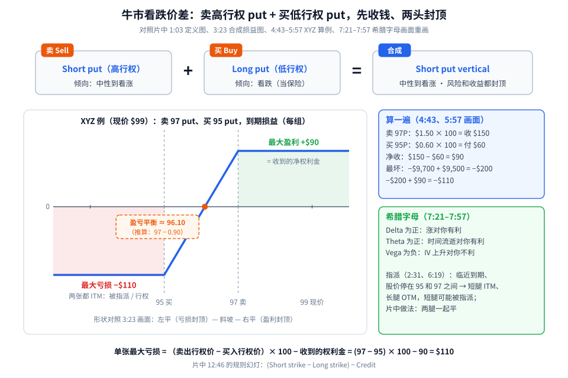
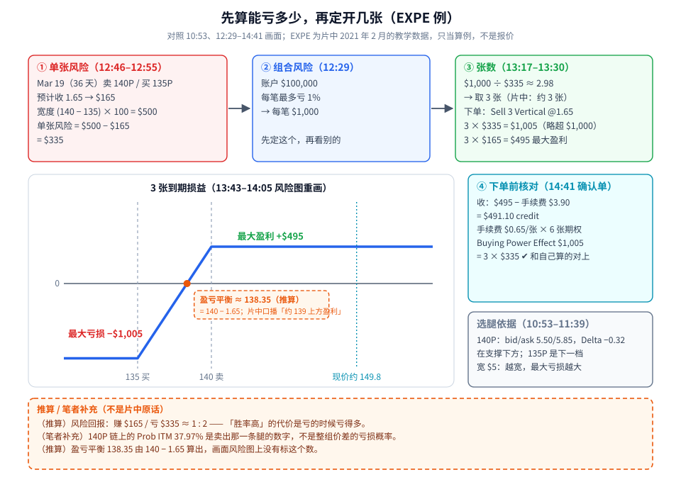
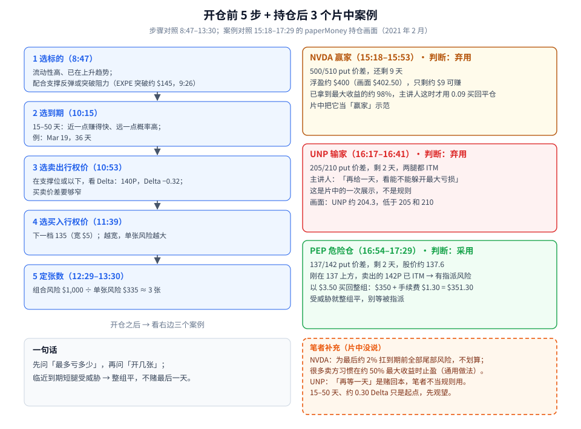

牛市看跌价差（Bull Put Spread，Schwab 叫 Short Put Vertical）第一次学，先记住一句话：**卖一张行权价高的 put，再买一张行权价低的 put 当保险，开仓先收一笔钱；只要股价到期时待在卖出的行权价上方，这笔钱就全归你。**

名字里有「看跌」（put），但它是**看涨到中性**的策略——卖 put 等于答应「跌到某个价我接货」，你希望的是它别跌下去。

这篇比结构更重要的是**仓位**：片中给了一个非常朴素、但很多人跳过的顺序——

1. 先算**单张**最多亏多少：（卖出行权价 − 买入行权价）− 收到的权利金；
2. 再定**整个账户**每笔最多亏多少：比如账户的 1%；
3. 两个一除，得到能开几张。

素材为完整看过画面的 Schwab 官方 thinkorswim 教程（18:51，全片已看完），时间戳为视频内时间。片中的 EXPE、NVDA、UNP、PEP 都是 **2021 年 2 月 paperMoney（模拟盘）的教学画面**，只当算例，不是报价，也不是推荐。

---

## 1. 结构：两张 put，一卖一买



**读图**

- **最上面一排是片中 1:03 的定义图**：卖一张 put（Short put，倾向中性到看涨）+ 买一张 put（Long put，倾向看跌）= Short put vertical（中性到看涨）。字幕：*This allows you to define your risk and your reward*——风险和收益都提前定好。
- **左下是 XYZ 例的到期损益**（XYZ 现价 $99）。4:43 画面：卖 97 put，权利金 $1.50 × 100 = **收 $150**；买 95 put，$0.60 × 100 = **付 $60**；净收 **$90**。
  - 股价到期在 97 以上：两张 put 都作废，**$90 全留下**，这就是最大盈利（右边那段平线）。
  - 股价跌破 95：两张都价内，卖出的 97P 被指派（你按 97 买股），买入的 95P 你行权（按 95 卖股）。5:57 画面：−$9,700 + $9,500 = −$200，再加回 $90 = **−$110**，这就是最大亏损（左边那段平线）。
  - 中间那段斜坡：股价在 95 和 97 之间。形状对照 3:23 画面：左平、斜坡、右平，字幕 *both the max loss and max gain are capped*。
- **橙色虚线小框是推算**：盈亏平衡 ≈ 97 − 0.90 = **96.10**。片中图上没标这个数。
- **右上蓝框**是同一笔账的算式；**右下绿框**是片中 7:21–7:57 的希腊字母：Delta 为正（涨对你有利）、Theta 为正（时间流逝对你有利）、Vega 为负（IV 上升对你不利）。
- **指派**（2:31、6:19）：临近到期、股价停在 95 和 97 之间时，卖出的 97P 价内、买入的 95P 价外——短腿可能被指派，你会突然多出一笔股票。片中做法：**两腿一起平掉**。
- **最下面一行是全篇最重要的公式**（12:46 规则幻灯 *(Short strike − Long strike) − Credit*）：单张最大亏损 = (97 − 95) × 100 − 90 = **$110**。

> 小提醒：注意盈亏不对称——最多赚 $90，最多亏 $110。「收钱的策略」不等于「低风险的策略」。

和「Call Debit 看涨」放在一起对比，可以回看 [垂直价差：Debit/Credit、IV Rank 分段与 Delta 选腿](./2026-09-17-垂直价差：Debit-Credit、IV-Rank分段与Delta选腿.md)——那篇里的 *Put Credit 也是看涨* 说的就是本篇这个结构。

---

## 2. 先算能亏多少，再定开几张（EXPE 例）



**读图**

- **① 单张风险**（12:46–12:55）：EXPE，Mar 19（36 天）卖 140P、买 135P，预计收 **1.65**（$165）。宽度 (140 − 135) × 100 = $500，单张风险 = $500 − $165 = **$335**。字幕：*For this trade that's a $5-wide spread, or $500 minus the anticipated credit of $1.65*。
- **② 组合风险**（12:29）：账户 **$100,000**，每笔最多愿意亏 **1%** → 每笔 **$1,000**。字幕：*If I'm willing to lose no more than 1%, my portfolio risk would be $1,000 per trade*。
- **③ 张数**（13:17–13:30）：$1,000 ÷ $335 ≈ 2.98 → **3 张**，下单 Sell 3 Vertical @1.65。3 × $335 = $1,005（略超 $1,000）；3 × $165 = $495 最大盈利。
- **中间损益图**（13:43–14:05 风险图重画）：140 以上最大盈利 **+$495**，135 以下最大亏损 **−$1,005**；青色点线是当时现价约 149.8。
- **橙色虚线小框是推算**：盈亏平衡 ≈ 140 − 1.65 = **138.35**；片中口播是「到期约 $139 上方即盈利」，两者吻合。
- **④ 下单前核对**（14:41 确认单）：$495 − 手续费 $3.90 = **$491.10 credit**；手续费 $0.65/张，3 组 = 6 张期权 = $3.90；**Buying Power Effect $1,005** = 3 × $335——和自己算的对上。
- **选腿依据**（10:53–11:39）：140P bid/ask 5.50/5.85，Delta −0.32，在支撑下方；买腿选下一档 135，宽 $5——越宽，单张风险越大。
- **底部橙色虚线框**：
  - （推算）风险回报：赚 $165 / 亏 $335 ≈ 1 : 2；
  - （笔者补充）链上 140P 的 Prob ITM 37.97% 是**卖出那一条腿**的数字，不是整组价差的亏损概率；
  - （推算）138.35 是算出来的，画面风险图上没有标。

**为什么一定要先算单张风险？** 因为很多人看到「收 $165」就开仓，却没算过「最坏要亏 $335」。片中的顺序反过来：**先问最多亏多少，再问开几张**——这和本博客 [风控仓位：只拿风险资本，先算手数再下单](./2026-09-16-风控仓位：只拿风险资本，先算手数再下单.md) 是同一个思路，只是这里的「止损距离」换成了「宽度 − 权利金」。

---

## 3. 开仓前 5 步 + 持仓后 3 个案例



**读图**

- **左边 1–5 步是片中的开仓流程**：
  1. 选标的（8:47）：流动性高、已在上升趋势，配合支撑反弹或突破阻力的形态（例：EXPE 日线突破约 $145 的阻力，9:26）；
  2. 选到期（10:15）：15–50 天之间——近一点赚得快、远一点概率高；例子选 Mar 19，36 天；
  3. 选卖出行权价（10:53）：在支撑位或以下，看 Delta：140P，Delta −0.32；还要看买卖价差是否够窄；
  4. 选买入行权价（11:39）：下一档 135，宽 $5；
  5. 定张数（12:29–13:30）：$1,000 ÷ $335 ≈ 3 张。
- **右边三张卡片是片中「管理」章节的三个持仓**（paperMoney 画面）：
  - **NVDA 赢家**（15:18–15:53）：500/510 put 价差，剩 9 天，浮盈约 $400（画面 P/L Open $402.50），只剩约 $9 可赚——已拿到最大收益约 98%，主讲人这时才用 0.09 买回平仓。
  - **UNP 输家**（16:17–16:41）：205/210 put 价差，剩 2 天，画面 UNP 约 204.3，两腿都价内。主讲人：*But I'll give it one more day in hopes it'll turn around and I can avoid max loss*。这是片中的一次展示，**不是规则**。
  - **PEP 危险仓**（16:54–17:29）：137/142 put 价差，剩 2 天，股价约 137.6，刚在 137 上方，卖出的 142P 已价内 → 有指派风险。以 **$3.50 买回整组**：$350 + 手续费 $1.30 = $351.30。字幕：*the vertical back at a cost of $350*。
- **卡片标题里的「采用 / 弃用」是笔者的判断**，理由在右下**橙色虚线框（笔者补充，片中没说）**：NVDA 为最后约 2% 扛到期前的全部尾部风险，不划算，很多卖方习惯在约 50% 最大收益时止盈（通用做法，不是片中规则）；UNP「再等一天」本质是赌回本，不当规则用；15–50 天、约 0.30 Delta 只是起点，先观望。

**被指派以后会怎样？** 如果你没在到期前处理、卖出的 put 被指派，你就会按行权价买进 100 股/张。把「被指派、拿股票」当成**主动的一步**来设计，就是车轮策略的思路——见 [车轮策略（The Wheel）：两个赚钱来源、两个致命风险](./2026-10-08-wheel-strategy-risks.md)。（笔者补充）区别在于：车轮卖的是**现金担保** put（账户里留足买股的钱），而本篇的价差有一张买入的 put 封住了下跌，两者的风险结构完全不同。

两边各放一组 credit vertical，就是铁鹰（Iron Condor）——见 [Iron Condor：两边 Credit Vertical，别和 Short Strangle 搞混](./2026-09-18-Iron-Condor：两边Credit-Vertical，别和Short-Strangle搞混.md)。

---

## 4. 一张开仓前的 Checklist

```text
1. 标的：流动性够吗？趋势向上吗？卖腿下面有支撑吗？
2. 到期：15–50 天之间（片中参数，先观望）
3. 卖腿：支撑位或以下，看 Delta（片中 −0.32），买卖价差够窄
4. 买腿：下一档；宽度越大，单张风险越大
5. 单张风险 = (卖出行权价 − 买入行权价) × 100 − 权利金
6. 张数 = 组合风险（如账户 1%）÷ 单张风险（片中 2.98 取 3 张，BP $1,005）
7. 下单前核对平台的 BP 占用和手续费，和自己算的对不对得上
8. 临近到期、短腿受威胁 → 整组买回，别等指派，别「再等一天」
```

---

## 价值判断：留下什么、丢掉什么

| 做法 | 建议 |
|------|------|
| 单张风险 = 宽度 − 权利金；先定组合风险（如 1%）再倒推张数 | **采用** |
| 卖腿放在支撑以下并看 Delta；临近到期短腿受威胁就整组平，别等指派（PEP 例） | **采用** |
| 开仓前核对平台 BP 占用（$1,005）和手续费（$0.65/张） | **采用** |
| 15–50 天到期、约 0.30 Delta 卖腿——合理起点，但要自己复盘验证 | **观望** |
| 赢家拿到 98% 才走（NVDA 例）；输家「再等一天」（UNP 例） | **弃用** |

自检一句：这一笔最坏亏多少？占我账户几个百分点？短腿离到期还剩几天？

---

## 小结

1. 牛市看跌价差 = 同一到期，**卖高行权 put + 买低行权 put**，先收钱，偏中性到看涨。
2. XYZ 例：97/95，收 $90 → 最大盈利 **$90**、最大亏损 **$110**。
3. 希腊字母：**Delta +、Theta +、Vega −**。
4. **单张风险 = (卖出行权价 − 买入行权价) × 100 − 权利金**；EXPE 例 $500 − $165 = **$335**。
5. **张数 = 组合风险 ÷ 单张风险**：$1,000 ÷ $335 ≈ **3 张**，平台 BP 占用 $1,005 对得上。
6. 管理：受威胁就整组平（PEP $350）；98% 才走、再等一天，不学。

---

## 参考来源

1. Charles Schwab, *How to Trade Bull Put Spreads (Short Put Verticals) | Official thinkorswim® Web Tutorial*（https://www.youtube.com/watch?v=H1saK4A2AeI ；浏览器完整观看 18:51/18:51）。画面时间点：1:03 定义图；2:31 Assigned / Exercised 图；3:23 合成损益图；4:43 XYZ 净收 $90；5:31–5:57 最大亏损 −$110；6:19 停在两行权价之间的指派风险；7:21–7:57 Delta / Theta / Vega；8:47 选标的；9:26 EXPE 日线突破约 $145；10:15 Mar 19（36 天）；10:53 140P 5.50/5.85、Δ−0.32；11:39 买腿 135；12:00 下单票 @1.60；12:29 组合风险 $1,000；12:46–12:55 单张风险公式与 $335；13:17–13:30 3 张 @1.65；13:43–14:05 风险图 $495 / $1,005；14:41 确认单 $491.10、BP $1,005、$0.65/张；14:52 成交；15:18–15:53 NVDA 98% 平仓；16:17–16:41 UNP 再等一天；16:54–17:29 PEP $3.50 买回。说明：0:00–13:07 的连续字幕记录丢失，这段口播依据截图里的字幕还原；9:30–10:15、11:00–11:40、12:00–12:30 有短句未逐字覆盖。
2. 配图：`bps-structure-payoff.svg`、`bps-expe-sizing.svg`、`bps-manage-flow.svg`，依据上述画面重画的教学示意；橙色虚线框内为笔者补充或推算（盈亏平衡 96.10 / 138.35、1 : 2 风险回报、Prob ITM 解读、50% 止盈习惯），不是片中内容。

*仅供学习，不构成投资建议。期权有到期、指派、保证金与流动性风险；EXPE、NVDA、UNP、PEP 均为片中 2021 年 2 月模拟盘的教学画面，不是当前报价，也不是推荐。*
