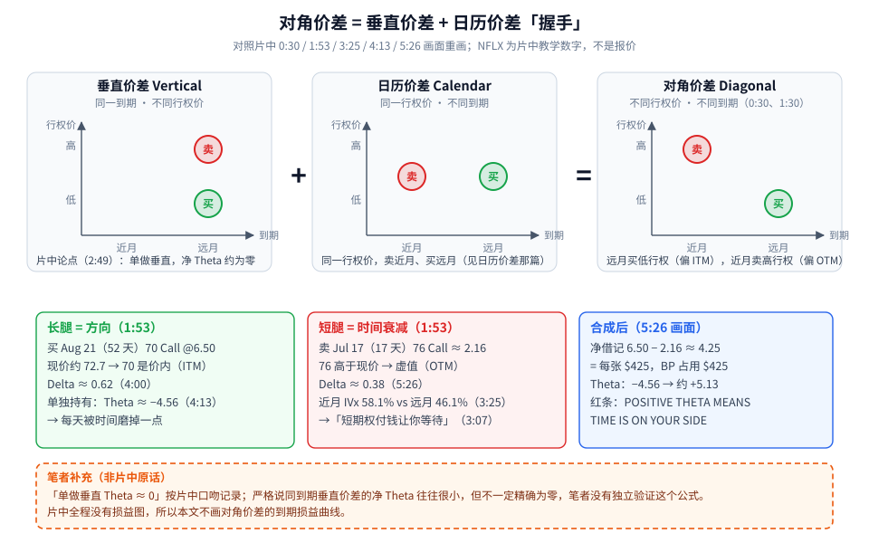
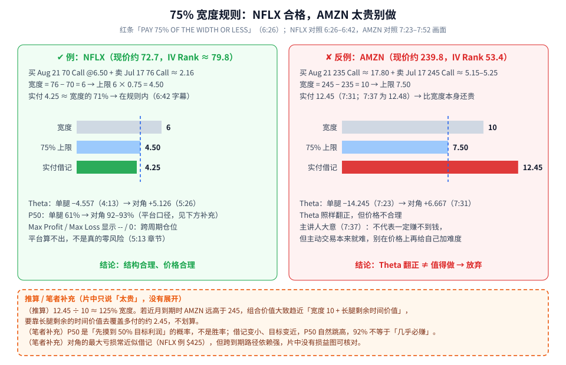
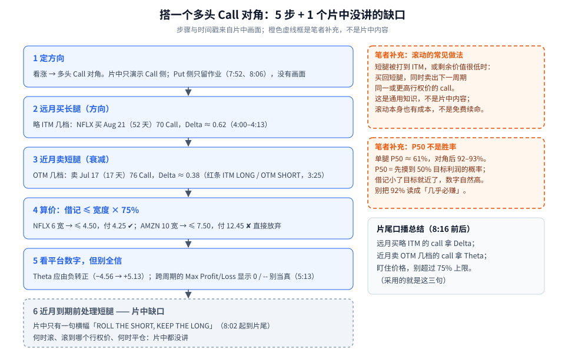

对角价差（Diagonal Spread）第一次学，先记住一句话：**一张腿负责「方向」，一张腿负责「收时间」。** 远月买一张偏价内的期权，赌方向；近月卖一张偏价外的期权，每天收一点时间价值，让整笔交易从「被时间磨」变成「时间站在你这边」。

但结构对了还不够，**价格也得对**。片中给了一把很简单的尺子：**付出的借记不要超过两腿行权价差（宽度）的 75%。** 并且用 AMZN 演示了一个「Theta 也翻正了、但就是太贵」的反例。

这篇按片中顺序拆成四块：

1. 对角价差到底是什么：垂直价差 + 日历价差「握手」；
2. NFLX 例：一步步看 Theta 怎么从负变正；
3. 75% 宽度规则：NFLX 合格、AMZN 太贵；
4. 搭一个对角的步骤，以及片中没讲的「滚动」。

素材为完整看过画面的教学视频（tastylive，8:33，全片已看完），时间戳为视频内时间。NFLX、AMZN 只是**片中的教学例子**，价格是片中录制时的画面数字，不是报价，更不是推荐。

---

## 1. 先认识结构：两种老朋友「握手」

如果你读过前面两篇，对角价差就很好理解：

- **垂直价差**：同一个到期日，换两个行权价（见 [垂直价差：Debit/Credit、IV Rank 分段与 Delta 选腿](./2026-09-17-垂直价差：Debit-Credit、IV-Rank分段与Delta选腿.md)）；
- **日历价差**：同一个行权价，卖近月、买远月（见 [日历价差：同一行权价卖近月买远月，$15 和 $80 是怎么算出来的](./2026-10-05-日历价差：同一行权价卖近月买远月，15和80是怎么算出来的.md)）；
- **对角价差**：**行权价不同、到期日也不同**——两种「换法」同时用上。片中 0:30 的红条就是这么说的：*THE DIAGONAL: A VERTICAL AND A CALENDAR SHAKE HANDS*。



**读图**

- **上排三个小坐标**：横轴是到期（近月 / 远月），纵轴是行权价（高 / 低）。垂直价差的买卖在**同一列**（同一到期）；日历价差在**同一行**（同一行权价）；对角价差**既不同行也不同列**——远月买低行权，近月卖高行权（片中 1:30 红条 *DIFFERENT STRIKES, DIFFERENT EXPIRATIONS*）。
- **左下绿框 = 长腿 = 方向**（1:53 红条 *LONG STRIKE = DIRECTION, SHORT STRIKE = TIME DECAY*）：买 Aug 21（52 天）70 Call，Bid/Ask 6.30/6.50（4:00）。NFLX 当时约 72.7，所以 70 是**价内（ITM）**，Delta 约 0.62。单独买这一张，Theta 约 **−4.56**（4:13），意思是其它不变时每天大约亏 $4.56/张的时间价值。
- **中下红框 = 短腿 = 时间衰减**：卖 Jul 17（17 天）76 Call，约 2.16，Delta 约 0.38。76 高于现价，是**价外（OTM）**。3:25 的到期列表显示近月 IVx 58.1%、远月 46.1%——近月更「贵」，卖它收得更多。3:07 红条：*THE SHORT OPTION PAYS YOU TO WAIT*。
- **右下蓝框 = 合成后**（5:26 画面）：净借记约 **4.25**，即每张 **$425**，BP 占用也是 $425；Theta 从约 −4.56 翻到约 **+5.13**。红条：*POSITIVE THETA MEANS TIME IS ON YOUR SIDE*。
- **底部橙色虚线框是笔者补充**：片中 2:49 的论点是「单做垂直价差，净 Theta 约为零」。笔者按片中口吻记录，但严格说同到期垂直价差的净 Theta 往往很小、不一定精确为零，**未独立验证**。另外片中全程没有损益图，所以本文**不画**对角价差的到期损益曲线。

> 小提醒：期权报价是「每股」，一张合约 = 100 股。4.25 → 每张 $425。

---

## 2. NFLX 例：为什么说「时间站在你这边」

把片中的三个画面串起来看：

```text
第 1 步（4:13）只买远月 Aug 21 70 Call @6.50
        Theta ≈ −4.557   POP 36%   P50 61%   Max Loss −$650   BP $650
第 2 步（5:26）再卖近月 Jul 17 76 Call ≈ 2.16
        净借记 ≈ 6.50 − 2.16 ≈ 4.25（$425/张）
        Theta ≈ +5.126   P50 92%   BP $425
第 3 步（6:26–6:30）同一结构，报价小跳动
        P50 93%   Theta ≈ 5.107   组合 mid 4.26
```

换成人话：

- 只买远月 call，你每天都在「付租金」（Theta 为负），必须靠股价往上走才能赚回来；
- 卖一张近月、价外的 call，卖出的那张每天替你收时间价值（片中：*THE SHORT OPTION PAYS YOU TO WAIT*），抵掉长腿的损耗还有剩，组合 Theta 变正——数字就是上面的 −4.56 → +5.13；
- 片中红条 *COUPLE STRIKES ITM WITH LONG, OTM WITH SHORT*（3:25–4:13）：长腿价内几档、短腿价外几档。（笔者补充）为什么短腿要放价外：股价如果涨得太猛、冲过 76，卖出的那张会拖累你，放在价外几档等于给上涨留出空间。

**平台上两个数字别当真：**

- **Max Profit / Max Loss 显示 `--` / `0`**：5:13 起的章节标题就是 *Why max profit shows zero on multi-cycle trades*。两条腿到期日不同，软件算不出跨到期的极值，所以显示成 0 或空白——**不是零风险**。
- **P50 92%**（笔者补充）：P50 是平台估算的「先摸到 50% 目标利润」的概率，**不是胜率**。借记变小、目标变近，这个数自然跳高。别把 92% 读成「几乎必赚」。

---

## 3. 75% 宽度规则：NFLX 合格，AMZN 太贵

6:26 起，红条换成 *PAY 75% OF THE WIDTH OR LESS*，章节标题 *The 75% rule: never pay more than 75% of the width*。

**宽度**就是两腿行权价之差。规则一句话：**净借记 ≤ 宽度 × 0.75。**



**读图**

- **左边绿色 = 正例 NFLX**。宽度 76 − 70 = **6**，上限 6 × 0.75 = **4.50**；实付 **4.25**，约宽度的 71%，落在规则内。6:42 字幕：*75% of $6 is … around $4.50 … debit paid of about four and a quarter*。蓝色竖虚线就是 75% 那条线，绿条没过线。
- **右边红色 = 反例 AMZN**（约 6:50 起切换，现价约 239.8，IV Rank 53.4）：买 Aug 21 235 Call（约 17.80，7:15–7:23）+ 卖 Jul 17 245 Call（约 5.15–5.25）。宽度 **10**，75% 上限应该是 **7.50**，实付却是 **12.45**（7:31；7:37 画面为 12.48）——**比宽度本身还贵**。红条远远越过蓝线。
- **两边的 Theta 都翻正了**：NFLX −4.557 → +5.126；AMZN −14.245（7:23 单腿）→ +6.667（7:31 对角）。这正是反例想说的：**Theta 翻正 ≠ 价格合理**。
- 主讲人 7:37 的大意：*这不代表一定赚不到钱，但主动交易本来就难，别在价格上再给自己加难度。*（字幕原句：*actually paying $12 for. Now, does this mean that I can't make money? No.*）
- **底部橙色虚线框是推算和笔者补充**，片中只说了「太贵」，没有展开：
  - （推算）12.45 ÷ 10 ≈ 125% 宽度。若近月到期时 AMZN 远高于 245，组合价值大致趋近「宽度 10 + 长腿剩余时间价值」，要靠长腿剩下的时间价值去覆盖多付的约 2.45，不划算；
  - （笔者补充）P50 不是胜率；
  - （笔者补充）对角的最大亏损常近似借记（NFLX 例 $425），但跨到期后路径依赖强，片中没有损益图可以核对。

**为什么是 75%？** 片中只给了这个锚点（7:52 字幕 *use that 75% anchor point*），没有推导。可以把它当成「别买太贵」的尺子。（笔者补充）借记越接近宽度，留给你的上行空间就越少；超过宽度，就像 AMZN 那样要靠长腿剩余的时间价值来补。

---

## 4. 搭一个对角的步骤（以及片中没讲的那一步）



**读图**

- **左边 1–5 步是片中内容**：定方向（片中只演示 Call 侧）→ 远月买略 ITM 的长腿 → 近月卖 OTM 的短腿 → 算价，借记 ≤ 宽度 × 75%，超过就放弃 → 看平台 Theta 是否翻正，但别信跨周期的 Max Profit/Loss。
- **第 6 步是灰色虚线框 = 片中缺口**：8:02 起的红条 *ROLL THE SHORT, KEEP THE LONG* 一直挂到片尾——近月短腿到期就滚到下一周期，远月长腿留着。但**何时滚、滚到哪个行权价、何时平仓，片中都没讲**。
- **右上橙色虚线框是笔者补充**：滚动的常见做法是，短腿被打到 ITM 或剩余价值很低时，买回短腿、同时卖出下一周期同一或更高行权价的 call。这是通用知识，**不是片中内容**；滚动本身也有成本，不能当免费续命。
- **右中橙色虚线框是笔者补充**：P50 不是胜率（同上）。
- **右下灰框**是片尾口播总结（8:06–8:16 前后）：远月买略 ITM 的 call 拿 Delta，近月卖 OTM 几档的 call 拿 Theta，盯住价格，别超过 75% 上限。
- **Put 对角**：7:52 章节 *Same principles work on the put side*，8:06 章节 *Homework: set up a put diagonal on your own*——只留了作业，**片中没有任何 Put 对角画面**，所以本文也不画。

一张开仓前的自检清单：

```text
1. 方向：我看涨吗？（多头 Call 对角 = 远月低行权买 + 近月高行权卖）
2. 两腿到期与 IVx：近月是不是更贵？（片中 58.1% vs 46.1%）
3. 宽度 = 短腿行权价 − 长腿行权价；借记 ≤ 宽度 × 0.75？
   NFLX：6 宽 → ≤ 4.50，付 4.25 ✔    AMZN：10 宽 → ≤ 7.50，付 12.45 ✘
4. 组合 Theta 是否由负转正？（−4.56 → +5.13）
5. 平台的 Max Profit/Loss 显示 0 / --、P50 很高：都不当真
6. 近月到期前怎么处理短腿？片中没讲 → 先自己定好规则再开仓
```

---

## 价值判断：留下什么、丢掉什么

| 做法 | 建议 |
|------|------|
| 对角 = 方向腿 + 衰减腿的结构直觉；ITM long / OTM short；用短腿把 Theta 翻正 | **采用** |
| 借记 ≤ 宽度 75% 的锚点；AMZN 教训——Theta 翻正不代表价格合理，借记超过宽度直接放弃 | **采用** |
| 滚动短腿的具体规则、IV 回落时的表现、Put 对角——片中没讲透，要找别的素材 | **观望** |
| 把平台上的 Max Loss = 0 当真；把 P50 92% 当「几乎必赚」 | **弃用** |

自检一句：我的借记占宽度多少？短腿到期前我打算怎么办？

---

## 小结

1. 对角价差 = **不同行权价 + 不同到期**，是垂直价差和日历价差的「握手」。
2. **长腿 = 方向**（远月、略 ITM），**短腿 = 时间衰减**（近月、OTM）。
3. NFLX：买 Aug 21 70C @6.50 + 卖 Jul 17 76C ≈ 2.16 → 借记 **4.25**；Theta **−4.56 → +5.13**。
4. **借记 ≤ 宽度 × 75%**：NFLX 6 宽上限 4.50，付 4.25 合格；AMZN 10 宽付 12.45，比宽度还贵，**Theta 翻正也别做**。
5. 跨周期仓位的平台 Max Profit/Loss 不可信；P50 ≠ 胜率（笔者补充）。
6. 「滚动短腿、保留长腿」片中只有一句横幅，具体做法是缺口。

延伸阅读：[日历价差：同一行权价卖近月买远月，$15 和 $80 是怎么算出来的](./2026-10-05-日历价差：同一行权价卖近月买远月，15和80是怎么算出来的.md)（同行权价、不同到期）；[IV 期限结构：Contango 是常态，Backwardation 是「恐慌模式」](./2026-10-06-IV期限结构：Contango是常态，Backwardation是恐慌模式.md)（近月 / 远月 IV 差）。

---

## 参考来源

1. tastylive, *Calculated Risk — The Strategy That Gives You Direction and Decay at the Same Time*（The Diagonal Spread, Explained；https://www.youtube.com/watch?v=Zk67ei7zBtQ ；浏览器完整观看 8:33/8:33，10/7 看到 6:28，10/8 补看 6:21–8:33）。画面时间点：0:30 *A VERTICAL AND A CALENDAR SHAKE HANDS*；1:30 *DIFFERENT STRIKES, DIFFERENT EXPIRATIONS*；1:53 *LONG STRIKE = DIRECTION, SHORT STRIKE = TIME DECAY*；2:49 章节 *Why verticals alone have zero theta*；3:07 *THE SHORT OPTION PAYS YOU TO WAIT*；3:25 NFLX 到期列表（Jul 17 17d IVx 58.1%、Aug 21 52d IVx 46.1%，IV Rank 79.7）；4:00 Aug 21 70C 6.30/6.50、Δ0.62；4:13 单腿 Theta −4.557、P50 61%、Max Loss −$650；5:13 章节 *Why max profit shows zero on multi-cycle trades*；5:26 对角成型，借记 4.25、Theta +5.126、P50 92%、BP $425；6:26 *PAY 75% OF THE WIDTH OR LESS*；6:42 *$4.25 on a $6 spread: under 75*；约 6:50–7:15 AMZN 链与到期列表（6:44 后约 40 秒播放器时钟隐藏，按字幕推定，误差几秒）；7:23 AMZN 单腿 235C Theta −14.245；7:31 AMZN 对角 12.45、Theta +6.667；7:37 12.48 与主讲人点评；7:52 *Same principles work on the put side*；8:02 *ROLL THE SHORT, KEEP THE LONG*；8:06 Put 对角作业。
2. 配图：`diag-structure.svg`、`diag-75pct-nflx-vs-amzn.svg`、`diag-steps-flow.svg`，依据上述画面重画的教学示意；橙色虚线框内为笔者补充或推算，不是片中内容。

*仅供学习，不构成投资建议。期权有到期归零、指派、保证金与流动性风险；NFLX、AMZN 仅为片中教学例子，数字为片中录制时的画面，不是当前报价。*
