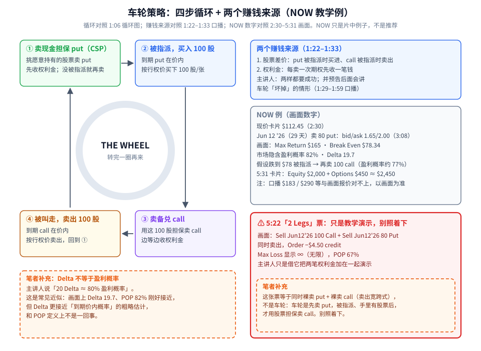
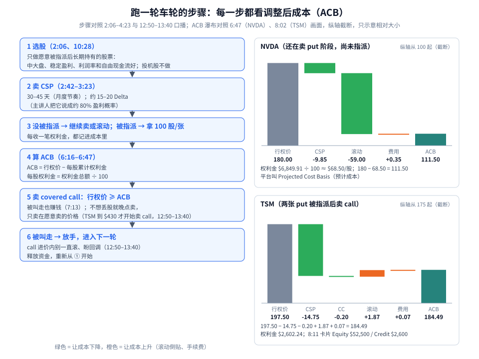
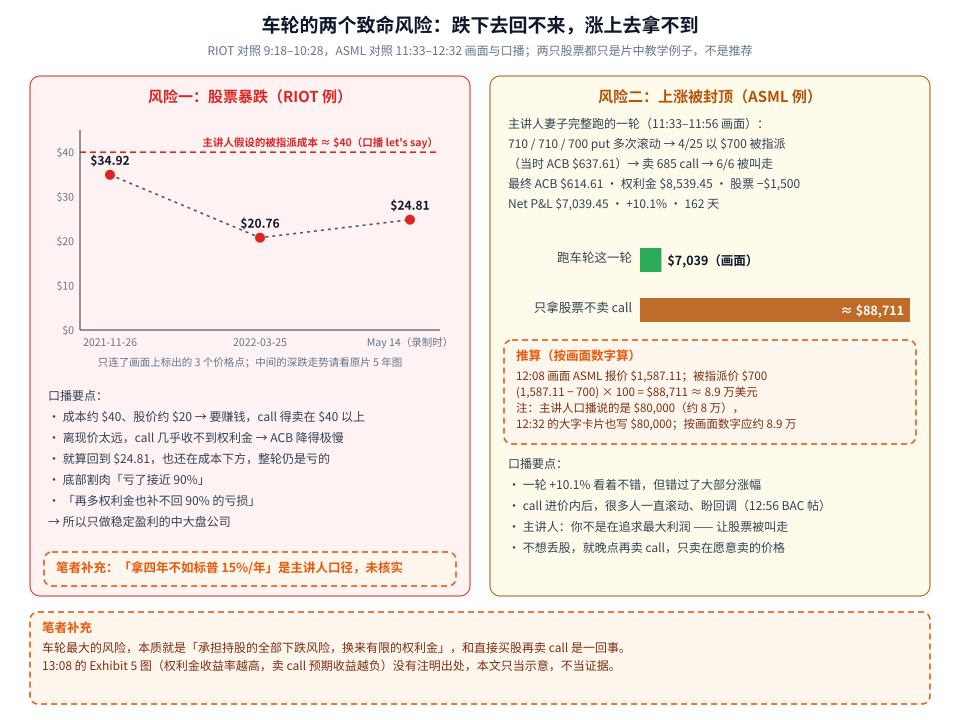

车轮策略（The Wheel）第一次学，先记住一句话：**先卖 put 收钱，被指派就拿股票；拿着股票再卖 call 收钱，被叫走就卖掉股票；然后重来。** 它被很多人叫作「收租策略」，听起来像稳稳的被动收入。

但这支视频真正有价值的部分是后半段：**车轮有两个赚钱来源，也就对应两个致命风险。**

- 赚钱来源：① 卖期权收的**权利金**；② 股票低买高卖的**差价**。主讲人说，两样都要成功。
- 风险一：**股票暴跌**——差价这一项亏到权利金根本补不回来（片中 RIOT 例）。
- 风险二：**上涨被封顶**——股票大涨，你却在 call 的行权价被叫走，错过大部分涨幅（片中 ASML 例）。

素材为完整看过画面的教学视频（Credit Spread Investing，14:35，全片已看完），时间戳为视频内时间。片中的 NOW、NVDA、TSM、RIOT、ASML 都只是**教学例子**，不是推荐；片中演示用的 Premium Insights 是频道自家产品，本文不评价。

---

## 1. 四步循环和两个赚钱来源



**读图**

- **左边四个框对照片中 1:06 的循环图**（*A repeatable options strategy to generate income*）：
  - ① 卖现金担保 put（Cash-Secured Put，CSP）：挑一只你**不介意持有**的股票卖 put，先收权利金；账户里留足「行权价 × 100」的现金，被指派时买得起。没被指派就继续卖。
  - ② 被指派，买入 100 股：到期时 put 在价内，你按行权价买下 100 股/张。
  - ③ 卖备兑 call（Covered Call）：用手里这 100 股做担保卖 call，边等边收权利金。
  - ④ 被叫走，卖出 100 股：到期时 call 在价内，股票按行权价卖掉，回到 ①。
- **右上蓝框：两个赚钱来源**（1:22–1:33 口播）：股票差价 + 权利金，*we have to succeed in both aspects*。
- **右中灰框：NOW 例的画面数字**。现价卡片 $112.45（2:30）；Jun 12 '26（29 天）卖 80 put，bid/ask 1.65/2.00（3:08）。右侧面板：Max Return **$165**、Break Even **$78.34**、市场隐含盈利概率 **82%**、Delta **19.7**。假设跌到 $78 被指派，再卖 100 call（盈利概率约 77%）。5:31 卡片：**Equity $2,000 + Options $450 ≈ $2,450**。口播里的 $183、$290 等数字和画面报价对不上，本文以画面为准。
- **右下红框：5:22 的「2 Legs」票——只是教学演示，别照着下。** 画面上是 *Sell Jun12'26 100 Call* + *Sell Jun12'26 80 Put* **同时卖出**，Order −$4.50 credit，**Max Loss 显示 ∞（无限）**，POP 67%。主讲人只是借这张票把两笔权利金加在一起演示。
- **红框里的橙色虚线框是笔者补充**：这张票等于**同时裸卖 put + 裸卖 call**（卖出宽跨式，Short Strangle），**不是车轮**——车轮是先卖 put，被指派、手里有了股票之后，才用股票担保去卖 call。**别照着这张票下单。**
- **左下橙色虚线框是笔者补充**：主讲人说「20 Delta ≈ 80% 盈利概率」。这是常见近似，画面上 Delta 19.7、POP 82% 刚好接近，但 Delta 更接近「到期价内概率」的粗略估计，和 POP 定义上不是一回事。

> ⚠️ **再强调一次：5:22 的「2 Legs」票（同时裸卖 put + call，Max Loss ∞）只是片中把权利金加总的教学演示，不是车轮的操作方式，别照着下。**

**选股和参数（片中做法）**：只做愿意被指派后长期持有的股票，主讲人强烈建议中大盘、基本面稳、有盈利的公司（2:06）；到期 30–45 天，月度节奏（2:42）；put 侧约 15–20 Delta（主讲人口径「约 80% 盈利概率」）。

---

## 2. 跑一轮的步骤：每一步都看调整后成本（ACB）

车轮里最重要的一个数字叫**调整后成本**（Adjusted Cost Basis，ACB）：把一路收的权利金摊到每股上，从行权价里扣掉，得到「实际每股成本」。

```text
ACB = 行权价 − 每股累计权利金
每股累计权利金 = 权利金总额 ÷ 100
```



**读图**

- **左边 1–6 步**：选股（2:06、10:28）→ 卖 CSP（30–45 天、约 15–20 Delta）→ 没被指派就继续卖或滚动，被指派就拿 100 股/张 → 算 ACB（6:16–6:47）→ 卖 covered call，**行权价 ≥ ACB**（7:13：卖在成本以上，被叫走也赚钱）→ 被叫走就放手，进入下一轮。
- 第 5 步还有一个变通（12:50–13:40 口播）：**不想丢股，就晚点再卖 call**，只卖在自己愿意卖的价格。主讲人的 TSM 是涨到 $430 才开始卖 call。
- **右上：NVDA**（6:00–6:47 画面，还在卖 put 阶段、尚未被指派）。瀑布：行权价 180 → CSP −9.85 → 滚动 −59.00 → 费用 +0.35 → **ACB 111.50**。累计权利金 $6,849.91 ÷ 100 ≈ $68.50/股，180 − 68.50 = 111.50。平台把它叫 *Projected Cost Basis*（预计成本），因为还没真的买到股票。（口播说「$69,000」是自动字幕念错，画面是 $6,849.91。）
- **右下：TSM**（7:34–8:11 画面，195 和 200 两张 put 被指派后在卖 call）。瀑布：197.50 → CSP −14.75 → CC −0.20 → 滚动 +1.87 → 费用 +0.07 → **ACB 184.49**。权利金合计 $2,602.24；8:11 卡片 Equity $52,500 / Credit $2,600。（推算）$52,500 = 200 股 × (460 − 197.50)，即两张合约按 460 call 被叫走时的股票差价。口播里「$105」是字幕念错，画面是 $184.49。
- **绿色 = 让成本下降，橙色 = 让成本上升**（滚动倒贴、手续费）。纵轴截断，只示意相对大小。

ACB 的意义：它告诉你 **covered call 的行权价下限**。卖在 ACB 以上，就算被叫走，整轮也是赚的。

---

## 3. 两个致命风险：跌下去回不来，涨上去拿不到



**读图**

- **左边：风险一，股票暴跌（RIOT 例，9:18–10:28）**。
  - 图上只连了**画面上标出的 3 个价格点**：5 年图高点 **$34.92**（2021-11-26，9:18）、**$20.76**（2022-03-25，9:31）、录制时 **$24.81**（May 14，10:09）。中间的深跌走势请看原片，本图不臆造。
  - 红色虚线是主讲人**假设**的被指派成本 **≈ $40**——口播原话是 *Let's just say $40 a share*，是举例口径，不是画面数字。
  - 口播逻辑：成本约 $40、股价约 $20 → 要赚钱，call 得卖在 $40 以上 → 离现价太远，几乎收不到权利金 → ACB 降得极慢。就算回到 $24.81，也还在成本下方，整轮仍是亏的。底部割肉「亏了接近 90%」，*no amount of premium … is going to make back that 90% loss*。
  - 结论（10:28）：只在稳定、盈利的公司上卖 put 跑车轮，最好是有利润率和大额自由现金流的中大盘公司。11:09 还展示了一个 Reddit 帖「Stock is dropping」：买入当天卖 OTM call，次日跌 14%，纠结要不要卖低于买价的 call——同一个困境。
  - **橙色虚线框是笔者补充**：主讲人说「拿四年还不如放标普，按 15%/年」，这个年化数是他的口径，笔者没有核实。
- **右边：风险二，上涨被封顶（ASML 例，11:33–12:32）**。
  - 主讲人妻子完整跑的一轮（11:33–11:56 画面）：710 / 710 / 700 put 多次滚动 → 4/25 以 **$700** 被指派（当时 ACB $637.61）→ 卖 685 call → 6/6 被叫走。最终 ACB **$614.61**（↓$85.39）；权利金 **$8,539.45**；股票 700 买、685 卖，**−$1,500**；**Net P&L $7,039.45，+10.1%，162 天**。
  - 绿色短条：这一轮实际赚的 **$7,039**（画面数字）。
  - 棕色长条：如果被指派后**只拿股票、不卖 call**，按画面数字算能多赚多少——**≈ $88,711（约 8.9 万美元）**。
  - **橙色虚线框是推算（按画面数字算）**：12:08 画面 ASML 报价 **$1,587.11**，被指派价 **$700**，(1,587.11 − 700) × 100 = **$88,711 ≈ 8.9 万美元**。**注意：主讲人口播说的是「$80,000」（约 8 万美元），12:32 的大字卡片也写的是 $80,000；按画面上的报价和行权价算，应约 8.9 万美元。** 本文一律用 $88,711。（推算）若按 685 的叫走价算，约 $90,211。
  - 口播要点：一轮 +10.1% 看着不错，但错过了大部分涨幅；call 进价内以后，很多人一直滚动、盼着回调（12:56 展示 Reddit「Should I roll or leave it be?」，BAC 两张 covered call 深度亏损 −121% / −136%）；主讲人：*you are not trying to maximize profit here*——让股票被叫走，释放资金进入下一轮；不想丢股就晚点卖 call。
- **底部橙色虚线框是笔者补充**：车轮最大的风险，本质是「承担持股的全部下跌风险，换来有限的权利金」，和直接买股再卖 call 是一回事；13:08 的 *Exhibit 5: Toy Model* 图（权利金收益率越高，卖 call 的预期收益越负，约 0% → −1.7%）没有注明出处，本文只当示意，不当证据。

两个风险放在一起看，就很清楚了：**车轮的收益上限被 call 封住，下跌却几乎没有保护。** 所以片中反复强调——**选股是第一位的**。

---

## 4. 一张开仓前的 Checklist

```text
1. 这只股票我愿意被指派、长期拿着吗？中大盘、稳定盈利、现金流好？
2. 卖 put：30–45 天、约 15–20 Delta（片中参数，先观望）；现金留足「行权价 × 100」
3. 记账：每一笔权利金、滚动、手续费都记进 ACB
4. 卖 call：行权价 ≥ ACB；不想丢股，就等涨到愿意卖的价格再卖
5. call 进价内：让它被叫走，不要无限滚动盼回调
6. 股票跌到 ACB 远下方：承认权利金补不回来，别指望「慢慢把成本降回去」
7. 绝不照着 5:22 那张同时裸卖 put + call 的演示票下单
```

如果你想要「卖 put 收钱、但下跌有封底」的版本，可以回看 [牛市看跌价差（Short Put Vertical）：单张风险 = 宽度 − 权利金，先算能亏多少再定张数](./2026-10-08-bull-put-spread-risk-sizing.md)——（笔者补充）它多买了一张更低行权价的 put，把最大亏损锁死在「宽度 − 权利金」，代价是被指派时不会像车轮那样顺势拿到股票。

---

## 价值判断：留下什么、丢掉什么

| 做法 | 建议 |
|------|------|
| 选股是车轮的第一位：只做愿意长期持有、基本面稳的中大盘股 | **采用** |
| 用 ACB 决定 covered call 的行权价下限；接受上涨封顶，让股票被叫走，不死滚价内 call | **采用** |
| 不想丢股就晚点卖 call，只卖在自己愿意卖的价格 | **采用** |
| 30–45 天、15–20 Delta 的参数——合理起点，要自己复盘；Premium Insights（频道自家工具，未独立评估） | **观望** |
| 5:22 那种同时裸卖 put + call 的演示票（教学演示，别照着下） | **弃用** |
| 指望权利金把暴跌股的成本「慢慢降回来」（RIOT 例正好反证） | **弃用** |

自检一句：这只股票跌一半我还愿意拿着吗？涨一倍我被叫走会不会后悔？

---

## 小结

1. 车轮 = 卖 CSP → 被指派 → 卖 covered call → 被叫走 → 重来。
2. 两个赚钱来源：**权利金 + 股票差价**，两样都要成功。
3. **ACB = 行权价 − 每股累计权利金**；NVDA 180 − 68.50 = **111.50**，TSM 197.50 → **184.49**；call 卖在 ACB 以上。
4. 风险一 RIOT：成本远高于股价时 call 收不到钱，口播「亏接近 90%，权利金补不回来」。
5. 风险二 ASML：一轮赚 **$7,039（+10.1%）**，只拿股票按画面数字算可多赚 **约 $88,711（≈ 8.9 万美元）**；口播和卡片说的是 $80,000（约 8 万）。
6. 5:22 同时裸卖 put + call 的票只是演示，**别照着下**。

---

## 参考来源

1. Credit Spread Investing, *The Wheel Strategy Explained in 14 Minutes (with Real Examples)*（https://www.youtube.com/watch?v=3KXa3raIn80 ；浏览器完整观看 14:35/14:35；9:05–10:09 首次播放漏记，已倒回 9:03 重看补上）。章节：0:00 Intro · 0:33 What is the Wheel Strategy? · 1:22 How Do We Make Money? · 2:01 Beginner Wheel Strategy · 5:44 Real Examples · 6:16 Adjusted Cost Basis Explained · 8:29 Risks That We Need to Understand。画面时间点：0:39–0:57 四步分屏；1:06 循环图；2:30 NOW $112.45；3:08 80 put 1.65/2.00、POP 82%、Delta 19.734；3:27 85 put 约 74%；5:02 100 call 约 77%；5:22「2 Legs」票（−$4.50 credit、Max Loss ∞、POP 67%）；5:31 Equity $2,000 / Options $450；6:00–6:47 NVDA ACB $111.50；7:34–8:11 TSM ACB $184.49、Equity $52,500 / Credit $2,600；9:18–10:09 RIOT $34.92 / $20.76 / $24.81；11:09 Reddit「Stock is dropping」；11:33–11:56 ASML 一轮 ACB $614.61、Net P&L $7,039.45、+10.1%、162 天；12:08 ASML $1,587.11；12:32 $80,000 卡片；12:56 Reddit BAC「Should I roll or leave it be?」；13:08 Exhibit 5 图。口播中 $69,000、$105、$80,000 等为自动字幕或口误，本文以画面数字为准。
2. 配图：`wheel-cycle-income.svg`、`wheel-acb-flow.svg`、`wheel-riot-asml-risks.svg`，依据上述画面重画的教学示意；橙色虚线框内为笔者补充或推算（$88,711、$90,211、$52,500 拆解、Delta ≠ POP、5:22 票的性质、标普年化未核实、Exhibit 5 不当证据），不是片中内容。

*仅供学习，不构成投资建议。卖出期权有指派、持股下跌与保证金风险；NOW、NVDA、TSM、RIOT、ASML 均为片中教学例子，不是推荐，数字为片中录制时的画面。*
